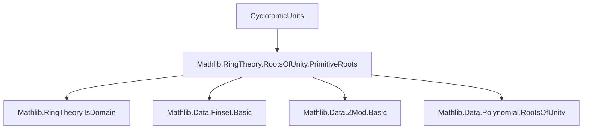

**Technical Brief: CyclotomicUnits.lean**

---

### 1. **Key Definitions & Theorems**

| Name | Type / Signature | Purpose |
|------|------------------|---------|
| `IsPrimitiveRoot` | Class (from `Mathlib.RingTheory.RootsOfUnity.PrimitiveRoots`) | Encodes that `ζ` is a primitive `n`-th root of unity in a domain `A`. |
| `associated_sub_one_pow_sub_one_of_coprime` | `IsPrimitiveRoot ζ n → j.Coprime n → Associated (ζ - 1) (ζ ^ j - 1)` | Shows that for primitive `n`-th root `ζ`, `ζ - 1` and `ζ^j - 1` are associated when `j` is coprime to `n`. |
| `associated_pow_sub_one_pow_of_coprime` | `IsPrimitiveRoot ζ n → i.Coprime n → j.Coprime n → Associated (ζ ^ i - 1) (ζ ^ j - 1)` | Extends previous result: all `ζ^k - 1` with `k` coprime to `n` are mutually associated. |
| `associated_sub_one_map_sub_one` | `IsPrimitiveRoot ζ n → (σ : A ≃ₐ[R] A) → Associated (ζ - 1) (σ (ζ - 1))` | Shows `ζ - 1` is associated to its Galois conjugates. |
| `associated_map_sub_one_map_sub_one` | `IsPrimitiveRoot ζ n → (σ τ : A ≃ₐ[R] A) → Associated (σ (ζ - 1)) (τ (ζ - 1))` | Any two Galois conjugates of `ζ - 1` are associated. |
| `geom_sum_isUnit` | `IsPrimitiveRoot ζ n → 2 ≤ n → j.Coprime n → IsUnit (∑ i ∈ range j, ζ ^ i)` | The geometric sum `∑_{k=0}^{j-1} ζ^k` is a unit when `j` is coprime to `n` and `n ≥ 2`. |
| `geom_sum_isUnit'` | Same as above, but replaces `2 ≤ n` with `IsUnit (j : A)`. | Handles degenerate cases (e.g., `n = 1`) via unit assumption on `j`. |
| `pow_sub_one_eq_geom_sum_mul_geom_sum_inv_mul_pow_sub_one` | Explicit unit relation: `ζ^j - 1 = u * v⁻¹ * (ζ^i - 1)` | Gives concrete unit linking two cyclotomic differences. |
| `associated_pow_add_sub_sub_one` | `IsPrimitiveRoot ζ n → 2 ≤ n → j.Coprime n → Associated (ζ - 1) (ζ^(i+j) - ζ^i)` | Relates `ζ - 1` to “twisted” differences `ζ^(i+j) - ζ^i`. |
| `ntRootsFinset_pairwise_associated_sub_one_sub_of_prime` | For prime `p`, all pairwise differences of distinct `p`-th roots are associated to `ζ - 1`. | Key structural property for cyclotomic fields: all nontrivial root differences are equivalent up to units. |

---

### 2. **Naming Conventions**

- **Prefixes**:
  - `associated_...`: results about *associated* elements (i.e., equal up to unit multiples).
  - `geom_sum_...`: results about geometric sums involving roots of unity.
  - `pow_sub_one_...`: expressions of the form `ζ^k - 1`.
  - `ntRootsFinset_...`: results about sets of roots of unity (`nthRootsFinset`).

- **Suffixes**:
  - `_of_coprime`: condition involves coprimality.
  - `_map_sub_one`: involves application of algebra automorphisms.
  - `_pairwise_...`: pairwise relations on finite sets.

- **Variables**:
  - `ζ`: primitive root of unity.
  - `n`: order of root.
  - `i, j`: exponents, often coprime to `n`.
  - `p`: prime (often order of root).
  - `A`: ambient ring/field.
  - `R`: base ring for algebra structure.

---

### 3. **Tactic Stack**

- **Core tactics**:
  - `grind`: custom tactic (likely from `Mathlib.Tactic`) for simplifying arithmetic and ring equalities.
  - `simp_rw`: rewriting with simplification (used implicitly via `grind`).
  - `match n with ... =>`: structural induction on natural numbers.
  - `obtain ⟨...⟩`: destructuring existential/and proofs.
  - `wlog`: “without loss of generality” for symmetry arguments.
  - `convert`, `apply`, `refine`: standard proof construction.
  - `rw [← ...]`: rewriting using reversed lemmas (e.g., `pow_mod_orderOf`).
  - `simp [sub_one_ne_zero]`, `simp [mul_neg_geom_sum]`: targeted simplification.

- **Domain-specific automation**:
  - `ZMod.val_coe_unit_coprime`: bridges units in `ℤ/nℤ` and coprimality.
  - `autToPow_spec`: connects Galois automorphisms to exponentiation by units mod `n`.

---

### 4. **Proof Logic**

- **Inductive structure**:
  - Many proofs proceed by **case analysis on `n`** (0, 1, ≥2), leveraging `match n with`.
  - For `n ≥ 2`, use existence of multiplicative inverse modulo `n` (via `exists_mul_mod_eq_one_of_coprime`) to construct the unit linking expressions.

- **Common pattern**:
  1. Use `pow_sub_one_mul_geom_sum_eq_pow_sub_one_mul_geom_sum` (a known identity) to express `ζ^j - 1` as `(ζ - 1) * geom_sum`.
  2. Show the geometric sum is a unit (via `geom_sum_isUnit` or `geom_sum_isUnit'`).
  3. Conclude *associated* via `associated_of_dvd_dvd` or direct construction of unit.

- **Galois-theoretic arguments**:
  - Use `autToPow_spec` to identify automorphisms with powers `ζ ↦ ζ^j`, where `j` is coprime to `n`.
  - Then apply `associated_sub_one_pow_sub_one_of_coprime`.

- **Prime case**:
  - Use structure of `nthRootsFinset p 1` (all `p`-th roots of unity) and parametrize them as `ζ^i`.
  - Reduce to `associated_pow_add_sub_sub_one` via index differences and coprimality.

---

### 5. **Imports**

- **Primary dependency**:
  ```lean
  Mathlib.RingTheory.RootsOfUnity.PrimitiveRoots
  ```
  Provides:
  - `IsPrimitiveRoot` class.
  - `orderOf`, `pow_mod_orderOf`, `autToPow`, `nthRootsFinset`.
  - Key identities like `pow_sub_one_mul_geom_sum_eq_pow_sub_one_mul_geom_sum`.

- **Implicit imports** (via `Mathlib`):
  - `Mathlib.RingTheory.IsDomain`
  - `Mathlib.Algebra.Module.Basic`
  - `Mathlib.Data.Finset.Basic`
  - `Mathlib.Data.ZMod.Basic` (for `ZMod.val_coe_unit_coprime`)
  - `Mathlib.Data.Polynomial.RootsOfUnity` (via `nthRootsFinset`)

---

### 6. **Mermaid Diagrams**

#### **Dependency Graph (Module-Level)**



#### **Overview of Theory Flow**

```mermaid
flowchart LR
  A[IsPrimitiveRoot ζ n] --> B[ζ - 1 ~ ζ^j - 1  (j ⊥ n)]
  A --> C[ζ^i - 1 ~ ζ^j - 1  (i,j ⊥ n)]
  A --> D[σ(ζ - 1) ~ ζ - 1]
  B --> E[∑_{k=0}^{j-1} ζ^k is unit]
  E --> F[Explicit unit: ζ^j - 1 = u·v⁻¹·(ζ^i - 1)]
  C & F --> G[ζ - 1 ~ ζ^{i+j} - ζ^i]
  A & Prime p --> H[All η₁ - η₂ ~ ζ - 1 for η₁ ≠ η₂ ∈ μ_p]
```

Where `~` denotes *associated*.

---

### 7. **Domain-Specific Insights**

- **Cyclotomic units** are defined as geometric sums `∑ ζ^i`, which are units under mild conditions.
- The theory shows that *all* nontrivial differences of roots of unity are equivalent up to units — a key step in understanding the unit group of cyclotomic rings.
- The use of `Associated` (instead of equality or explicit units) reflects a *coarse* but robust equivalence for arithmetic in Dedekind domains (e.g., rings of integers in cyclotomic fields).
- The `ntRootsFinset_pairwise_associated_sub_one_sub_of_prime` lemma is foundational for proving properties of the different or discriminant of cyclotomic extensions.

--- 

Let me know if you'd like a formalized dependency graph (e.g., `.lean`-level imports) or a proof sketch for a specific theorem.
