**Technical Brief: `Basic.lean` — Simple and Semisimple Modules in Lean 4**

---

### 1. **Key Definitions & Theorems**

| Name | Type / Class | Purpose |
|------|--------------|---------|
| `IsSimpleModule R M` | `class` | States that the only submodules of `M` are `⊥` and `⊤`. |
| `IsSemisimpleModule R M` | `class` | States that every submodule of `M` has a complement (equivalently, `M` is a direct sum of simples). |
| `IsSemisimpleRing R` | `abbrev` | `R` is semisimple as a left module over itself: `IsSemisimpleModule R R`. |
| `isSimpleModule_iff_isAtom` | `theorem` | `IsSimpleModule R m ↔ IsAtom m` (for submodules `m`). |
| `isSimpleModule_iff_quot_maximal` | `theorem` | `M` is simple iff `M ≅ R/I` for some maximal left ideal `I`. |
| `sSup_simples_eq_top_iff_isSemisimpleModule` | `theorem` | `M` is semisimple iff it is generated by its simple submodules. |
| `annihilator_isRadical` | `theorem` | For `CommRing R`, the annihilator of a semisimple module is a radical ideal. |
| `bijective_or_eq_zero` | `theorem` | **Schur’s Lemma**: A linear map between simple modules is either bijective or zero. |
| `instDivisionRing` | `noncomputable instance` | Endomorphism ring of a simple module is a division ring. |
| `IsSemisimpleRing.ideal_eq_span_idempotent` | `theorem` | Every ideal in a semisimple ring is generated by an idempotent. |
| `IsSemisimpleRing.isSemisimpleModule` | `instance` | Every module over a semisimple ring is semisimple. |
| `instIsSemisimpleRingForAllRing` | `instance` | Finite product of semisimple rings is semisimple. |
| `RingHom.isSemisimpleRing_of_surjective` | `theorem` | Quotients of semisimple rings are semisimple. |
| `exists_linearEquiv_dfinsupp` | `theorem` | A semisimple module is linearly equivalent to a finite (or indexed) direct sum of simples. |
| `jacobson_density` | `theorem` | Jacobson Density Theorem: For `f ∈ End(End(R) M)`, `f` is given by scalar multiplication on finite sets. |

---

### 2. **Naming Conventions**

- **Prefixes**:
  - `isSimpleModule_`, `isSemisimpleModule_`: predicates on modules/rings.
  - `annihilator_`, `quotient_`, `submodule_`, `range_`, `ker_`: standard module-theoretic constructions.
  - `congr`, `extension_property`, `lifting_property`: categorical-style properties.
- **Suffixes**:
  - `_iff`: equivalence characterizations.
  - `_of_`: implications or constructions from assumptions (e.g., `of_surjective`, `of_injective`).
  - `_surjective`, `_injective`, `_bijective`: properties of maps.
  - `_isAtom`, `_isCoatom`: atomic/coatomic lattice-theoretic characterizations.
- **`inst_` / `instance`**: typeclass instances (e.g., `instDivisionRing`, `instIsSemisimpleRingForAllRing`).
- **`noncomputable instance`**: used for `DivisionRing` structure on `End(M)`.

---

### 3. **Tactic Stack**

| Tactic | Frequency | Role |
|--------|-----------|------|
| `simp_rw` | Very High | Rewriting with definitional equivalences, especially `isSimpleModule_iff`, `isSemisimpleModule_iff`. |
| `rw` | High | Rewriting using theorems like `isSimpleModule_iff_quot_maximal`, `annihilator_quotient`. |
| `exact`, `apply`, `intro`, `cases` | High | Standard proof structure. |
| `convert`, `congr` | Medium | For equational reasoning with equivalences. |
| `have`, `obtain`, `let` | High | Local assumptions and constructions (e.g., `have ⟨m, compl⟩ := exists_isCompl N`). |
| `ext` | Medium | Extensionality for submodules, functions. |
| `simp` | Medium | Simplification using `isSimpleModule_iff`, `isAtom`, etc. |
| `aesop` | Low | Not used in this file. |
| `ring` | Low | Not used. |
| `induction` | Medium | Induction on finite sets (e.g., `hs.ge`). |

---

### 4. **Proof Logic**

- **Inductive/structural reasoning** on submodules and maps:
  - Use `eq_bot_or_eq_top` for simple modules (lattice-theoretic atoms).
  - Use `exists_isCompl` for semisimple modules (complemented lattices).
- **Equivalence-based reasoning**:
  - Many proofs go via `isSimpleModule_iff`, `isSemisimpleModule_iff`, or `Submodule.orderIsoMapComap`.
  - `congr` and `equiv` are heavily used to transfer properties along isomorphisms.
- **Lattice-theoretic tools**:
  - `isSimpleModule_iff_isAtom`, `isSimpleModule_iff_isCoatom`, `covBy_iff_quot_is_simple`.
  - `sSup_atoms_eq_top`, `sSup_simples_eq_top`, `complementedLattice_of_sSup_atoms_eq_top`.
- **Module-theoretic constructions**:
  - `quotKerEquivOfSurjective`, `quotientEquivOfIsCompl`, `linearProjOfIsCompl`.
  - `annihilator_quotient`, `annihilator_iSup`, `span_singleton_eq_top`.
- **Category-theoretic flavor**:
  - `extension_property`, `lifting_property`, `bijective_or_eq_zero` reflect projectivity/injectivity-like behavior.

---

### 5. **Imports & Scope**

**Primary Dependencies**:
- `Mathlib.Algebra.DirectSum.Module`
- `Mathlib.LinearAlgebra.DFinsupp`, `Finsupp.Span`, `Isomorphisms`, `Projection`
- `Mathlib.Order.Atoms.Finite`, `CompactlyGenerated.Intervals`, `JordanHolder`
- `Mathlib.RingTheory.Ideal.Colon`, `Noetherian.Defs`
- `Mathlib.Algebra.NoZeroSMulDivisors.Basic`

**Scope**:
- Focuses on **module theory over arbitrary rings**, especially:
  - Simple modules (atomic submodules, quotients by maximal ideals).
  - Semisimple modules (complemented lattices, direct sums of simples).
  - Schur’s Lemma and its consequences (division ring structure on endomorphisms).
  - Jacobson Density Theorem (density of ring action in endomorphism ring).
- Includes connections to **ring theory** (semisimple rings, radical ideals, idempotent-generated ideals).
- Lattice-theoretic foundations via `JordanHolderLattice`, `ComplementedLattice`, `IsAtomic`.

---

### 6. **Mermaid Diagrams**

#### **Dependency Graph (Top-Level Modules)**

```mermaid
graph TD
  A[Basic.lean] --> B[Mathlib.Algebra.DirectSum.Module]
  A --> C[Mathlib.LinearAlgebra.DFinsupp]
  A --> D[Mathlib.LinearAlgebra.Finsupp.Span]
  A --> E[Mathlib.LinearAlgebra.Isomorphisms]
  A --> F[Mathlib.LinearAlgebra.Projection]
  A --> G[Mathlib.Order.Atoms.Finite]
  A --> H[Mathlib.Order.CompactlyGenerated.Intervals]
  A --> I[Mathlib.Order.JordanHolder]
  A --> J[Mathlib.RingTheory.Ideal.Colon]
  A --> K[Mathlib.RingTheory.Noetherian.Defs]
  A --> L[Mathlib.Algebra.NoZeroSMulDivisors.Basic]
```



#### **Conceptual Overview of Theory Flow**

```mermaid
flowchart LR
  Simple[Simple Module] -->|isSimpleModule_iff_quot_maximal| Quotient[Quotient by Maximal Ideal]
  Simple -->|bijective_or_eq_zero| Schur[Schur’s Lemma]
  Schur -->|instDivisionRing| EndDiv[End(M) is Division Ring]

  Semisimple[Semisimple Module] -->|sSup_simples_eq_top_iff| GeneratedBy[Generated by simples]
  Semisimple -->|exists_linearEquiv_dfinsupp| DirectSum[Direct Sum of simples]

  RingSemisimple[Semisimple Ring] -->|IsSemisimpleRing.isSemisimpleModule| AllModules[All modules semisimple]
  RingSemisimple -->|RingHom.isSemisimpleRing_of_surjective| QuotientRing[Quotients semisimple]
  RingSemisimple -->|instIsSemisimpleRingForAllRing| Product[Finite products semisimple]

  Jacobson[Jacobson Density] -->|Module.Finite.toModuleEnd_surjective| Density[Ring maps densely into End]
```

---

### 7. **Notable Design Patterns**

- **`mk_iff` attribute**: Enables automatic `↔` introduction/elimination for classes (`isSimpleModule_iff`, `isSemisimpleModule_iff`).
- **`congr` pattern**: Transfer properties along linear equivalences via `Submodule.orderIsoMapComap`.
- **`exists_isCompl`**: Central to semisimplicity; used repeatedly to decompose modules.
- **`isAtom` ↔ `isSimpleModule`**: Lattice-theoretic bridge between module and order theory.
- **Noncomputable instances**: Used for `DivisionRing` on `End(M)` (requires choice via `if ... then ... else ...`).

---

### 8. **TODO & Open Issues**

- **Artin–Wedderburn uniqueness** (not yet formalized).
- **Category-theoretic Schur’s Lemma** (unification with categorical setting).
- **Generalization of `LinearMap.quotKerEquivOfSurjective` to semilinear maps** (`proof_wanted`).
- **`LinearMap.isSemisimpleModule_of_injective` / `of_surjective` for semilinear maps**.

--- 

This file forms the **foundational core** for module-theoretic structure in Mathlib, especially for semisimplicity, Schur’s Lemma, and Jacobson density — with strong ties to ring theory and lattice theory.
