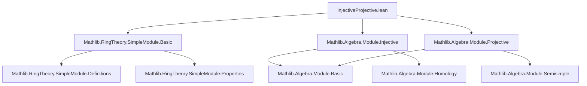
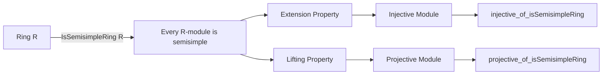

**Technical Metadata Brief: `InjectiveProjective.lean`**

---

### 1. **Key Definitions & Theorems**

| Name | Type / Signature | Purpose |
|------|------------------|---------|
| `injective_of_isSemisimpleRing` | `Module.Injective R M` | Proves that any $R$-module $M$ is injective when $R$ is a semisimple ring. Uses `IsSemisimpleModule.extension_property`. |
| `projective_of_isSemisimpleRing` | `Module.Projective R M` | Proves that any $R$-module $M$ is projective under the same assumption, via `IsSemisimpleModule.lifting_property`. |
| `injective_of_semisimple_ring` *(deprecated)* | alias of `injective_of_isSemisimpleRing` | Legacy alias; deprecated since 2025-09-12. |
| `projective_of_semisimple_ring` *(deprecated)* | alias of `projective_of_isSemisimpleRing` | Legacy alias; deprecated since 2025-09-12. |

> **Note**: The theorems rely on `IsSemisimpleRing R`, which implies that every $R$-module is *semisimple*, i.e., satisfies both extension and lifting properties.

---

### 2. **Naming Conventions**

- **Prefixes**:
  - `is_` for properties (e.g., `isSemisimpleRing`, `isSemisimpleModule`)
  - `injective_of_`, `projective_of_` for implications from structural assumptions to module-theoretic properties.
- **Suffixes**:
  - `_ring` for ring-level assumptions (`isSemisimpleRing`)
  - `_module` for module-level properties (`extension_property`, `lifting_property`)
- **Aliases** use `semisimple_ring` instead of `isSemisimpleRing`, but are now deprecated in favor of explicit `is_` prefixes.

---

### 3. **Tactic Stack**

- `aesop` (implicit via `simp`/`rw` context)
- `rw` (explicitly used in `injective_of_isSemisimpleRing`)
- `by` (tactic block introducer)
- `let ... := ...` (local definition + destructuring)
- `fun _ ↦ by ...` (lambda abstraction with tactic proof)

No heavy automation beyond basic rewriting and `let`-introduction.

---

### 4. **Proof Logic**

- **Structure**: Direct proof using module-theoretic characterizations of semisimplicity.
- **For injectivity**:
  1. Assume a monomorphism $f: X \to Y$ and a map $g: X \to M$.
  2. Apply `IsSemisimpleModule.extension_property` to get $h: Y \to M$ with $h \circ f = g$.
  3. Show $h \circ f = g$ by rewriting using `LinearMap.comp_apply`.
- **For projectivity**:
  1. Use `Module.Projective.of_lifting_property''`.
  2. Apply `IsSemisimpleModule.lifting_property`, which gives the required lifting for epimorphisms.

Both proofs are *non-inductive*, relying on the *definition* of semisimplicity as a universal property.

---

### 5. **Imports**

| Import | Purpose |
|--------|---------|
| `Mathlib.RingTheory.SimpleModule.Basic` | Provides basic definitions of simple modules and semisimplicity. |
| `Mathlib.Algebra.Module.Injective` | Defines `Module.Injective` and related concepts. |
| `Mathlib.Algebra.Module.Projective` | Defines `Module.Projective` and lifting properties. |

> These imports indicate the file sits at the intersection of *module theory* and *ring theory*, specifically in the context of homological algebra over semisimple rings.

---

### 8. **Mermaid Diagrams**

#### **Dependency Graph (File-Level)**

#### **Conceptual Overview (Theory Flow)**

> **Interpretation**: The file formalizes the classical homological algebra result: *Over a semisimple ring, all modules are projective and injective*. It leverages the *universal properties* of semisimple modules (extension/lifting) to derive module-theoretic properties.

--- 

Let me know if you'd like a formalization-level dependency graph (e.g., Lean `import` graph) or a proof-term extraction.
