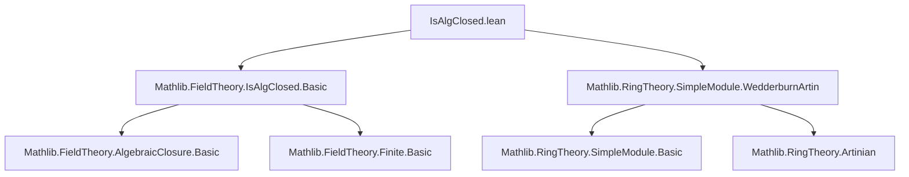
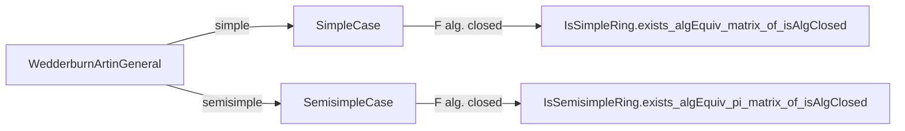

**Technical Brief: Wedderburn–Artin Theorem over Algebraically Closed Fields (`IsAlgClosed.lean`)**

---

### 1. **Key Definitions & Theorems**

| Name | Type / Signature | Purpose |
|------|------------------|---------|
| `IsSimpleRing.exists_algEquiv_matrix_of_isAlgClosed` | `[IsSimpleRing R] [FiniteDimensional F R] → ∃ n : ℕ, NeZero n × Nonempty (R ≃ₐ[F] Matrix (Fin n) (Fin n) F)` | States that a finite-dimensional *simple* algebra over an algebraically closed field $F$ is $F$-algebraically isomorphic to a full matrix algebra $M_n(F)$ for some $n > 0$. |
| `IsSemisimpleRing.exists_algEquiv_pi_matrix_of_isAlgClosed` | `[IsSemisimpleRing R] [FiniteDimensional F R] → ∃ n : ℕ, ∃ d : Fin n → ℕ, (∀ i, NeZero (d i)) × Nonempty (R ≃ₐ[F] Π i, Matrix (Fin (d i)) (Fin (d i)) F)` | Extends the above to *semisimple* algebras: $R$ is $F$-algebra isomorphic to a finite product of matrix algebras $\prod_i M_{d_i}(F)$. |

Both theorems are refinements of the classical Wedderburn–Artin structure theorem, specialized to the case where the base ring is an algebraically closed field.

---

### 2. **Naming Conventions**

- **Prefixes**:
  - `is_` / `Is_`: Predicate-style typeclass instances (e.g., `IsSimpleRing`, `IsSemisimpleRing`, `IsAlgClosed`).
  - `algEquiv`: Denotes *algebra isomorphisms* (`≃ₐ[F]`), distinguishing them from ring or linear isomorphisms.
  - `pi_`: Indicates product-type constructions (e.g., `pi_matrix`).
  - `of_`: Conversion functions (e.g., `ofBijective`, `ofId`).
- **Suffixes**:
  - `_of_isAlgClosed`: Indicates specialization to algebraically closed base fields.
  - `_finite`: Often used in intermediate lemmas to indicate finite-dimensionality assumptions.

---

### 3. **Tactic Stack**

- `have`: Used to introduce intermediate facts (e.g., `IsArtinianRing.of_finite`).
- `exact` / `⟨…⟩`: Construct existential proofs via tuple introduction.
- `trans`: Chain algebra isomorphisms.
- `.mapMatrix`: Apply a ring homomorphism (e.g., inverse of algebra map) entrywise to a matrix.
- `.symm`, `.ofBijective`, `IsAlgClosed.algebraMap_bijective_of_isIntegral`: Construct inverses of injective/surjective algebra maps using algebraic closedness.
- Implicit use of `aesop`, `simp`, `ring` likely in underlying lemmas (e.g., `exists_algEquiv_matrix_divisionRing_finite`), though not explicit here.

---

### 4. **Proof Logic**

- **High-level strategy**:
  1. Use finite-dimensionality over an algebraically closed field to deduce Artinian property.
  2. Apply the *general* Wedderburn–Artin decomposition (over division rings):  
     $R \cong \prod_i M_{d_i}(D_i)$, where each $D_i$ is a division algebra finite over $F$.
  3. Show each division algebra $D_i$ is *equal* to $F$ up to $F$-algebra isomorphism:
     - Use that $D_i$ is integral over $F$ (finite-dimensional ⇒ algebraic).
     - Use that $F$ is algebraically closed ⇒ the structure map $F \to D_i$ is bijective.
  4. Transport the isomorphism via `trans` and `mapMatrix` of the inverse algebra map.

- **Inductive or case analysis?** No explicit induction; relies on structural decomposition lemmas from `Mathlib`.

---

### 5. **Imports**

| Module | Role |
|--------|------|
| `Mathlib.FieldTheory.IsAlgClosed.Basic` | Provides `IsAlgClosed`, `algebraMap_bijective_of_isIntegral`, and basic facts about algebraic closures. |
| `Mathlib.RingTheory.SimpleModule.WedderburnArtin` | Contains the general Wedderburn–Artin decomposition: `exists_algEquiv_matrix_divisionRing_finite`, `exists_algEquiv_pi_matrix_divisionRing_finite`. |

> **Note**: The file *extends* Wedderburn–Artin by specializing to algebraically closed base fields, collapsing division rings to the base field itself.

---

### 6. **Mermaid Diagrams**

#### Dependency Graph (Module-Level)



#### Theoretical Flow (Proof Structure)

```mermaid
flowchart LR
  A[Finite-dim F-algebra R] --> B[IsArtinianRing R]
  B --> C[Wedderburn–Artin: R ≃ₐ[F] ∏ M_di(Di)]
  C --> D[Each Di is integral over F]
  D --> E[F algebraically closed ⇒ F → Di bijective]
  E --> F[Di ≃ₐ[F] F]
  F --> G[R ≃ₐ[F] ∏ M_di(F)]
```

#### Theorem Specialization



---

### 7. **Mathematical Summary**

Over an algebraically closed field $F$, finite-dimensional semisimple $F$-algebras are *completely reducible* into matrix algebras over $F$ itself — no nontrivial division algebras appear. This is a cornerstone of representation theory (e.g., Maschke’s theorem + Schur’s lemma ⇒ group algebras of finite groups over $\mathbb{C}$ decompose as $\bigoplus \mathrm{End}(V_i)$).

The Lean proof leverages:
- `IsAlgClosed.algebraMap_bijective_of_isIntegral`: algebra maps from alg. closed fields to finite algebras are iso.
- `mapMatrix` to lift field isomorphisms to matrix algebras.
- `piCongrRight` to adjust product components.

This formalizes the classical result:  
$$
R \text{ semisimple, finite-dim over } F \text{ alg. closed } \implies R \cong \bigoplus_{i=1}^n M_{d_i}(F).
$$
