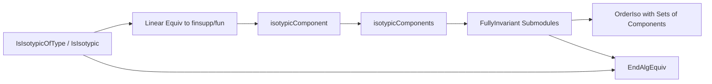

### Technical Brief: `Isotypic.lean`

---

#### **1. Key Definitions & Theorems**

| Name | Type / Signature | Purpose |
|------|------------------|---------|
| `IsIsotypicOfType R M S` | `Prop` | All simple submodules of `M` are isomorphic to `S`. |
| `IsIsotypic R M` | `Prop` | All simple submodules of `M` are pairwise isomorphic. |
| `isotypicComponent R M S` | `Submodule R M` | Sum of all submodules of `M` isomorphic to `S`. |
| `isotypicComponents R M` | `Set (Submodule R M)` | Set of all nontrivial isotypic components of `M`. |
| `Submodule.IsFullyInvariant N` | `Prop` | `N` is invariant under all `R`-linear endomorphisms of `M`. |
| `fullyInvariantSubmodule R M` | `CompleteSublattice (Submodule R M)` | Complete sublattice of fully invariant submodules. |
| `iSupIndep.ringEquiv` | `Module.End R M ≃+* Π i, Module.End R (N i)` | Ring isomorphism when `M = ⨆ Nᵢ` with fully invariant summands. |
| `iSupIndep.algEquiv` | `Module.End R M ≃ₐ[R₀] Π i, Module.End R (N i)` | Algebra isomorphism under scalar tower assumptions. |
| `IsIsotypicOfType.linearEquiv_finsupp` | `∃ ι, M ≃ₗ[R] ι →₀ S` | Semisimple + isotypic ⇒ linearly equivalent to finitely supported functions into `S`. |
| `IsIsotypic.linearEquiv_finsupp` | `∃ ι S, IsSimpleModule R S ∧ M ≃ₗ[R] ι →₀ S` | Isotypic + nontrivial ⇒ equivalent to `ι` copies of a simple module. |
| `IsSemisimpleModule.endAlgEquiv` | `Module.End R M ≃ₐ[R₀] Π c, Module.End R c.1` | Endomorphism algebra of semisimple `M` decomposes over isotypic components. |
| `isFullyInvariant_iff_isTwoSided` | `I.IsFullyInvariant ↔ I.IsTwoSided` | Fully invariant ideals = two-sided ideals. |
| `isFullyInvariant_iff_sSup_isotypicComponents` | `N.IsFullyInvariant ↔ ∃ s ⊆ isotypicComponents, N = sSup s` | Fully invariant submodules = sums of isotypic components (in semisimple case). |
| `OrderIso.setIsotypicComponents` | `Set (isotypicComponents R M) ≃o fullyInvariantSubmodule R M` | Order-isomorphism between sets of isotypic components and fully invariant submodules. |

---

#### **2. Naming Conventions**

- **Prefixes**:
  - `isIsotypicOfType_`, `isIsotypic_`: properties of modules.
  - `isotypicComponent_`, `isotypicComponents_`: constructions.
  - `fullyInvariantSubmodule_`: lattice-theoretic constructions.
  - `le_`, `bot_lt_`, `eq_`, `mem_`, `map_`, `comap_`: relational lemmas.
  - `of_`, `to_`, `of_injective`, `of_linearEquiv_type`: directionality in implications.

- **Suffixes**:
  - `_iff`: characterizations (biconditionals).
  - `_le_iff`, `_eq_iff`: equivalence with inclusion/equality conditions.
  - `_submodule_iff`, `_module_iff`: restrictions to submodules.
  - `_iff_type`, `_iff_type_type`: type-level variants.

- **Pattern**:
  - `LinearEquiv.isIsotypicOfType_iff`, `LinearEquiv.isIsotypic_iff`: invariance under linear equivalence.
  - `Submodule.isFullyInvariant_`, `Submodule.map_le_`, `Submodule.le_`: submodule-level lemmas.

---

#### **3. Tactic Stack**

Frequently used tactics:
- `simp_rw`, `simp`, `rw`: rewriting with definitional equalities and lemmas.
- `exact`, `refine`, `apply`: constructing proofs via type inference.
- `cases`, `obtain`, `rcases`: destructuring existential/universal hypotheses.
- `convert`, `ext`, `funext`: extensionality and congruence.
- `infer_instance`, `have :=`, `letI`: typeclass inference.
- `by_cases`, `by_contra`, `of_not_not`: classical reasoning.
- `aesop`, `linarith`, `ring`: automation for algebraic simplifications.
- `set`, `have h :=`, `let h :=`: local definitions and naming.

---

#### **4. Proof Logic**

- **Induction & Decomposition**:
  - Semisimplicity enables decomposition into simples or isotypic components.
  - Proofs often reduce to simple submodules via `isSimpleModule_iff_isAtom`, `eq_bot_or_exists_simple_le`.

- **Structure of Arguments**:
  1. **Reduction to simples**: Use `le_linearEquiv_of_le_sSup` or `linearEquiv_of_le_sSup` to locate a simple submodule inside a sum.
  2. **Isomorphism chaining**: Use `LinearEquiv.trans`, `congr`, `ofEq` to relate simples.
  3. **Fully invariance**: Prove via `LinearMap.le_comap_isotypicComponent` or `isFullyInvariant_iff_le_imp_isotypicComponent_le`.
  4. **Lattice-theoretic reasoning**: Use `sSupIndep`, `GaloisCoinsertion`, `OrderIso` to relate sets of components and fully invariant submodules.

- **Common Patterns**:
  - `have ⟨S, le, simple⟩ := (eq_bot_or_exists_simple_le m).resolve_left ne`
  - `have ⟨e⟩ := isIsotypicOfType_submodule_iff.mp h S le`
  - `exact e.symm.isotypicComponent_eq`

---

#### **5. Imports & Dependencies**

**Primary Dependencies**:
- `Mathlib.Algebra.Algebra.Pi`: for `Π`-modules and algebra structures.
- `Mathlib.Order.CompleteSublattice`: for `CompleteSublattice`, `GaloisCoinsertion`.
- `Mathlib.RingTheory.SimpleModule.Basic`: for `IsSimpleModule`, `isotypicComponent`, `fullyInvariant`.

**Implicit Dependencies**:
- `Mathlib.Module.Basic`, `Mathlib.Module.Semisimple`, `Mathlib.Module.Finite`, `Mathlib.Module.Finsupp`, `Mathlib.Algebra.Module.End`, `Mathlib.Algebra.Module.DFinsupp`.

---

#### **6. Theory Overview & Dependency Diagram**

##### **High-Level Theory Flow**

```
Semisimple Modules
     │
     ├─→ Simple Submodules (atoms)
     │      └─→ Isotypic Components (sums of isomorphic simples)
     │            └─→ Fully Invariant Submodules (invariant under End)
     │                  └─→ Complete Atomic Boolean Algebra (via OrderIso)
     │
     └─→ Endomorphism Algebra Decomposition
           └─→ Product over Isotypic Components (endAlgEquiv)
```

##### **Mermaid Diagrams**

**Dependency Graph (Module Structure)**

```mermaid
graph TD
  A[SemisimpleModule R M] --> B[Simple Submodules]
  A --> C[Isotypic Components]
  B --> C
  C --> D[FullyInvariantSubmodule]
  D --> E[CompleteAtomicBooleanAlgebra]
  A --> F[EndAlgEquiv]
  F --> G[Product of End(R, c)]
  C --> F
```

**Overview of File Structure**



---

#### **7. Summary**

This file formalizes the theory of **isotypic components** in module theory, especially in the context of **semisimple modules**. It connects:
- **Module structure** (simple/isotypic components),
- **Lattice theory** (fully invariant submodules as a complete atomic Boolean algebra),
- **Algebra** (endomorphism ring/algebra decomposition),
- **Model-theoretic properties** (invariance, atomicity, complementation).

It serves as a foundational module for deeper structure theory of semisimple rings and modules, especially in representation theory and noncommutative algebra.

--- 

Let me know if you'd like a formalized dependency graph (e.g., in `.lean` format) or a summary of proof automation patterns.
