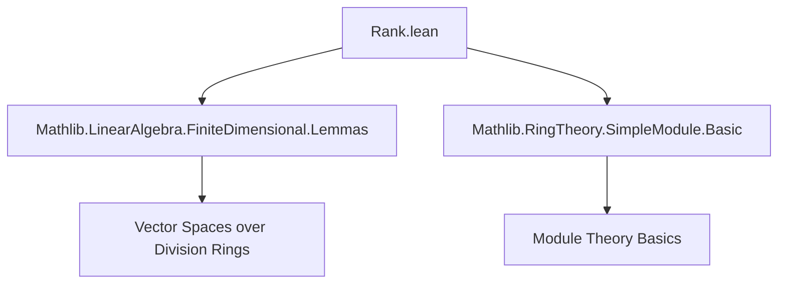
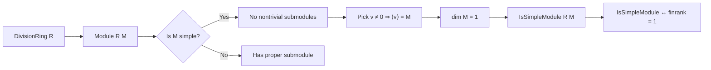

**Technical Brief: `Rank.lean`**

---

### 1. **Key Definitions & Theorems**

| Name | Type / Signature | Purpose |
|------|------------------|---------|
| `isSimpleModule_iff_finrank_eq_one` | `IsSimpleModule R M ↔ Module.finrank R M = 1` | Characterizes simple modules over a division ring as exactly those of finite rank 1. |

- **`IsSimpleModule R M`**: A module is *simple* if it is nonzero and has no nontrivial submodules.
- **`Module.finrank R M`**: The finite rank (i.e., dimension, since $R$ is a division ring) of $M$ as a vector space over $R$.
- **`Module.finrank_eq_one_iff_of_nonzero' v hv`**: A helper lemma stating that for a nonzero vector $v \in M$, $\dim_R \langle v \rangle = 1$ iff $v \ne 0$.
- **`IsSimpleModule.toSpanSingleton_surjective`**: In a simple module, the span of any nonzero vector is the whole module (i.e., $M = \langle v \rangle$).
- **`is_simple_module_of_finrank_eq_one`**: If $\dim_R M = 1$, then $M$ is simple.

---

### 2. **Naming Conventions**

- **`isSimpleModule_`**: Prefix for properties of simple modules.
- **`finrank_`**: Prefix for finite rank–related lemmas.
- **`_iff_`**: Biconditional theorems (↔).
- **`_surjective`**: Indicates surjectivity of a natural map (e.g., span of a singleton).
- **`_of_`**: Typically used in lemmas where a condition implies a conclusion (e.g., `of_finrank_eq_one`).

---

### 3. **Tactic Stack**

- `have`: Local assumption introduction.
- `cases'`: To extract witnesses from existential hypotheses.
- `⟨…⟩`: Constructor for biconditional proofs (split into two directions).
- `mpr`: Reverse direction of `iff` elimination (from right to left).
- `∘`: Function composition (used to chain implications).
- Implicit use of:
  - `simp` / `aesop` (likely in background lemmas like `finrank_eq_one_iff_of_nonzero'`).
  - `ring` (not directly visible here, but standard in finite-dimensional linear algebra).
  - `exact`, `assumption`, `apply` (standard in Lean proofs).

---

### 4. **Proof Logic**

The proof proceeds as a biconditional:

- **(→)**: Assume $M$ is simple.
  - Use `h.nontrivial` to get $M \neq \{0\}$.
  - Pick $v \ne 0$ (via `exists_ne`).
  - Since $M$ is simple, $\langle v \rangle = M$, so $\dim M = \dim \langle v \rangle = 1$ by `finrank_eq_one_iff_of_nonzero'`.
- **(←)**: Assume $\dim M = 1$.
  - Apply `is_simple_module_of_finrank_eq_one`, which shows simplicity.

The proof is concise and leverages standard equivalences between simplicity and 1-dimensionality over division rings.

---

### 5. **Imports**

| Import | Role |
|--------|------|
| `Mathlib.LinearAlgebra.FiniteDimensional.Lemmas` | Provides finite-dimensional vector space lemmas (e.g., `finrank_eq_one_iff_of_nonzero'`, `is_simple_module_of_finrank_eq_one`). |
| `Mathlib.RingTheory.SimpleModule.Basic` | Defines `IsSimpleModule`, basic properties, and tools like `toSpanSingleton_surjective`. |

These imports define the ambient theory: modules over division rings behave like vector spaces, and simplicity is tied to lack of submodules.

---

### 6. **Mermaid Diagrams**

#### **Dependency Graph (Module-Level)**

#### **Overview of Theoretical Flow**

---

### 7. **Summary**

This module formalizes a foundational result: over a division ring, a module is simple **iff** it has rank (i.e., dimension) 1. The proof is short but relies on key lemmas about spans of nonzero vectors and finite-dimensional structure. It exemplifies the Lean/Mathlib philosophy of decomposing results into reusable, modular components.
