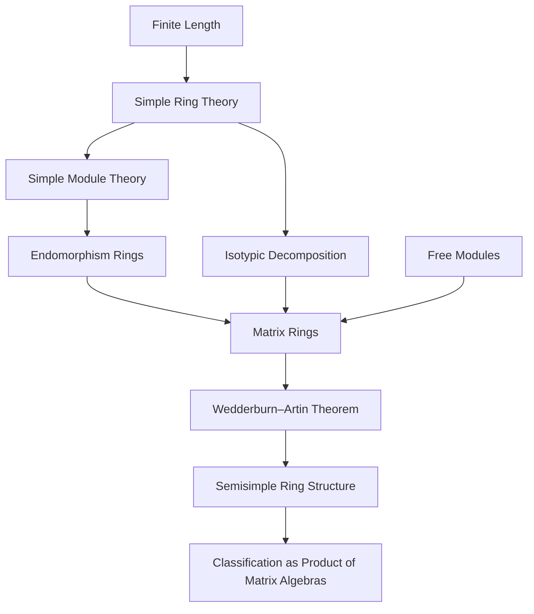

### Technical Brief: Wedderburn–Artin Theorem in Lean 4 (`WedderburnArtin.lean`)

---

#### **1. Key Definitions & Theorems**

| Name | Type / Signature | Purpose |
|------|------------------|---------|
| `IsSimpleRing.tfae` | `List.TFAE [IsSemisimpleRing R, IsArtinianRing R, ∃ I : Ideal R, IsAtom I]` | Equivalence of three conditions for a *simple* ring: semisimplicity, Artinian, existence of a minimal left ideal (atom). |
| `IsSimpleRing.isSemisimpleRing_iff_isArtinianRing` | `IsSemisimpleRing R ↔ IsArtinianRing R` | For simple rings, semisimplicity ⇔ Artinian. |
| `isSimpleRing_isArtinianRing_iff` | `IsSimpleRing R ∧ IsArtinianRing R ↔ IsSemisimpleRing R ∧ IsIsotypic R R ∧ Nontrivial R` | Characterizes *simple Artinian* rings as semisimple, isotypic, and nontrivial. |
| `exists_ringEquiv_matrix_end_mulOpposite` | `∃ n, I, IsSimpleModule I, R ≃+* Matrix n n (End R I)ᵐᵒᵖ` | Wedderburn–Artin for rings: simple Artinian ring ≅ matrix ring over opposite endomorphism ring of a simple left ideal. |
| `exists_ringEquiv_matrix_divisionRing` | `∃ n, D, DivisionRing D, R ≃+* Matrix n n D` | Same, but with division ring (since `End R I` is a division ring for simple `I`). |
| `exists_algEquiv_matrix_end_mulOpposite` | `∃ n, I, IsSimpleModule I, R ≃ₐ[R₀] Matrix n n (End R I)ᵐᵒᵖ` | Algebra version (over base `CommSemiring R₀`). |
| `exists_algEquiv_matrix_divisionRing` | `∃ n, D, DivisionRing D, Algebra R₀ D, R ≃ₐ[R₀] Matrix n n D` | Algebra version with division algebra. |
| `exists_algEquiv_matrix_divisionRing_finite` | Same as above + `Module.Finite R₀ D` | Finite-dimensional case: division algebra is finite over `R₀`. |
| `IsSemisimpleModule.exists_end_algEquiv_pi_matrix_end` | `End R M ≃ₐ[R₀] Π i, Matrix (d i) (d i) (End R (S i))` | Decomposition of endomorphism ring of a semisimple finite module into product of matrix rings over endomorphism rings of simples. |
| `IsSemisimpleModule.exists_end_algEquiv_pi_matrix_divisionRing` | Same, with division rings `D i` | Refinement: endomorphism ring ≅ product of matrix rings over division rings. |
| `IsSemisimpleRing.exists_algEquiv_pi_matrix_end_mulOpposite` | `R ≃ₐ[R₀] Π i, Matrix (d i) (d i) (End R (S i))ᵐᵒᵖ` | Wedderburn–Artin for *semisimple algebras*: product of matrix algebras over opposite endomorphism rings of simple ideals. |
| `IsSemisimpleRing.exists_algEquiv_pi_matrix_divisionRing` | `R ≃ₐ[R₀] Π i, Matrix (d i) (d i) (D i)` | Semisimple algebra ≅ product of matrix algebras over division algebras. |
| `isSemisimpleRing_iff_pi_matrix_divisionRing` | `IsSemisimpleRing R ↔ ∃ ..., R ≃+* Π i, Matrix (d i) (d i) (D i)` | Full characterization of semisimple rings as finite products of matrix rings over division rings. |

---

#### **2. Naming Conventions**

- **Prefixes**:
  - `is_`: predicate definitions (e.g., `isSimpleRing`, `isSemisimpleRing`, `isIsotypic`, `isAtom`, `isSimpleModule`)
  - `exists_`: existence theorems (e.g., `exists_algEquiv_matrix_divisionRing`)
  - `mulOpposite`: for opposite rings/algebras (`Rᵐᵒᵖ`, `.mopMatrix`, `.piMulOpposite`)
  - `end_`: endomorphism-related (`endVecAlgEquivMatrixEnd`, `moduleEndSelf`, `endAlgEquiv`)
- **Suffixes**:
  - `_ring`: ring-theoretic version (`ringEquiv`, `ringEquiv_matrix_...`)
  - `_alg`: algebra-theoretic version (`algEquiv`, `algEquiv_matrix_...`)
  - `_finite`: finite-dimensional case (`_finite`)
  - `_pi_`: product version (`_pi_matrix_`, `_pi_matrix_divisionRing`)
- **Other**:
  - `op`, `opOp`, `mopMatrix`: for opposite ring constructions and matrix transpose over opposite.
  - `conjAlgEquiv`, `conjRingEquiv`: conjugation by equivalence.

---

#### **3. Tactic Stack**

| Tactic | Usage Frequency | Purpose |
|--------|-----------------|---------|
| `tfae_have`, `tfae_finish` | High | Proving equivalence of multiple statements (TFAE). |
| `simp_rw` | Very High | Rewriting with definitional equalities and lemmas (e.g., `isIsotypic_iff_isFullyInvariant_imp_bot_or_top`). |
| `exact`, `refine`, `obtain` | High | Constructing witnesses and applying lemmas. |
| `classical` | Medium | Eliminating classical choice (e.g., for `DivisionRing` instances). |
| `convert`, `congr`, `congr'` | Medium | Matching goals via congruence. |
| `rw`, `apply`, `intro`, `cases` | Medium | Standard proof scripting. |
| `aesop`, `ring`, `linarith` | Low | Used sparingly; mostly algebraic simplifications handled by `simp_rw`. |
| `moduleEndSelf`, `endVecAlgEquivMatrixEnd`, `mopMatrix`, `.trans`, `.symm` | High (as lemmas) | Key algebraic equivalences used in constructing ring/alg isomorphisms. |

---

#### **4. Proof Logic**

- **Induction**: Not used directly; proofs rely on structural decomposition (e.g., isotypic components, simple modules).
- **Case analysis**: On `List.TFAE` (for `tfae_have`), on `isEmpty_or_nonempty n`, on `isSimpleRing_iff_isTwoSided_imp`.
- **Equivalence chaining**: Heavy use of `trans` on ring/alg equivalences (`e.trans f`, `.symm`, `.op`, `.opOp`, `.mopMatrix`, etc.).
- **Module-theoretic decomposition**:
  - For simple Artinian rings: use `isIsotypic R R` to get linear equivalence `R ≅ Vⁿ`, then apply `endVecAlgEquivMatrixEnd`.
  - For semisimple modules/rings: decompose into isotypic components `S i`, then apply `endAlgEquiv` + `piCongr`.
- **Finite case**: Use `Module.Finite.equiv` to transfer finiteness along equivalences; surjectivity of evaluation maps (e.g., `Matrix.entryLinearMap`) to extract finite division algebra structure.

---

#### **5. Imports & Dependencies**

| Module | Role |
|--------|------|
| `Mathlib.LinearAlgebra.FreeModule.Finite.Basic` | Finite free modules, matrix representations, `endVecAlgEquivMatrixEnd`. |
| `Mathlib.RingTheory.FiniteLength` | Artinian/Noetherian conditions, composition series, length. |
| `Mathlib.RingTheory.SimpleModule.Isotypic` | Isotypic components, fully invariant submodules, `isIsotypic`. |
| `Mathlib.RingTheory.SimpleRing.Congr` | Congruence properties of simple rings, `isSimpleRing_iff_isTwoSided_imp`. |
| `Mathlib.RingTheory.SimpleRing.Matrix` | Matrix rings over simple rings, `mopMatrix`, `opOp`, `piMulOpposite`. |

---

#### **6. Mermaid Diagrams**

##### **Dependency Graph (High-Level)**



##### **File Overview**

```mermaid
flowchart LR
  subgraph Theory
    A[Simple Ring] -->|TFAE| B[Semisimple ⇔ Artinian ⇔ ∃ atom]
    B --> C[Simple Artinian ⇔ Semisimple + Isotypic + Nontrivial]
    C --> D[Wedderburn–Artin: R ≅ Mₙ(D)]
    D --> E[Semisimple Ring ⇔ Π Mₙᵢ(Dᵢ)]
  end

  subgraph Implementation
    F[Ring Equiv] --> G[Algebra Equiv]
    G --> H[Finite Case]
    H --> I[Alg Closed ⇒ D = R₀]
  end

  A --> F
  D --> E
```

---

#### **7. Notes & Future Work**

- `proof_wanted` entries indicate open goals:
  - Left-right symmetry of `IsSemiprimaryRing`.
  - Left Artinian ⇒ right Noetherian ⇔ right Artinian.
- TODO: Require `D : Type u` in `exists_end_algEquiv_pi_matrix_divisionRing`.
- Future work: Extend to `IsAlgClosed` case (matrix-only classification, no division algebra).

--- 

This file formalizes the core of the **Artin–Wedderburn structure theory** for semisimple rings and algebras, with careful attention to:
- Ring vs. algebra versions,
- Finite vs. infinite-dimensional cases,
- Opposite rings for endomorphism algebras (to match standard conventions),
- Explicit construction of division rings as endomorphism rings of simple modules.
