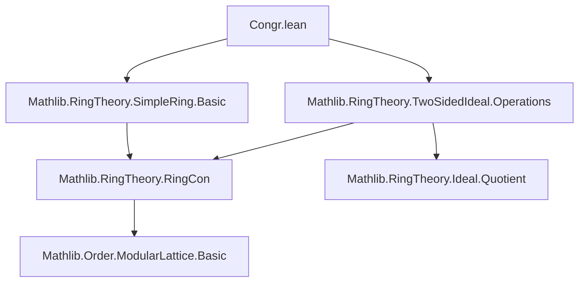
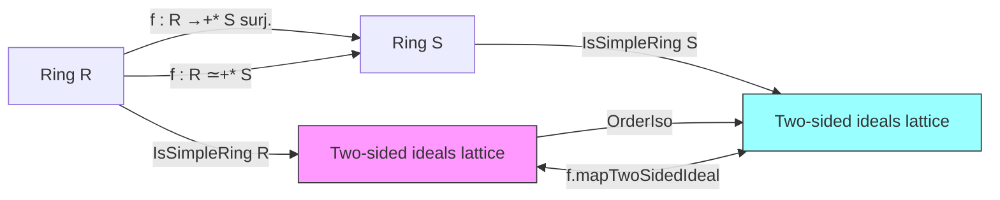
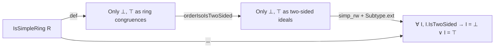

**Technical Brief: `Congr.lean` — Simplicity Preservation under Ring Homomorphisms and Equivalences**

---

### 1. **Key Definitions & Theorems**

| Name | Type / Signature | Purpose |
|------|------------------|---------|
| `IsSimpleRing` | Class (`[IsSimpleRing R]`) | States that a (non-associative, possibly non-unital) ring has exactly two two-sided ideals: `⊥` and `⊤`. |
| `of_surjective` | `{R S : Type*} [NonAssocRing R] [NonAssocRing S] [Nontrivial S] → (f : R →+* S) → IsSimpleRing R → Function.Surjective f → IsSimpleRing S` | Shows simplicity is preserved under *surjective* ring homomorphisms when the codomain is nontrivial. |
| `of_ringEquiv` | `{R S : Type*} [NonUnitalNonAssocRing R] [NonUnitalNonAssocRing S] → (f : R ≃+* S) → IsSimpleRing R → IsSimpleRing S` | Shows simplicity is preserved under *ring isomorphisms* (even for non-unital, non-associative rings). |
| `isSimpleRing_iff_isTwoSided_imp` | `[Ring R] → IsSimpleRing R ↔ Nontrivial R ∧ ∀ I : Ideal R, I.IsTwoSided → I = ⊥ ∨ I = ⊤` | Provides an equivalent characterization of simplicity for (unital) rings in terms of two-sided ideals. |

> **Note**: In Lean’s `Mathlib`, `Ideal R` usually denotes *two-sided ideals* when `R` is noncommutative; `I.IsTwoSided` is a propositional witness that `I` is two-sided. The theorem uses `orderIsoIsTwoSided` to relate ideals and two-sided ideals via an order isomorphism.

---

### 2. **Naming Conventions**

- **Prefixes**:
  - `of_`: Indicates a *transfer* result (e.g., `of_surjective`, `of_ringEquiv`) — simplicity *of the domain* implies simplicity *of the codomain*.
- **Suffixes**:
  - `_ringEquiv`, `_surjective`: Distinguish based on the type of map used for transfer.
- **Class/Propositional**:
  - `IsSimpleRing`: Standard class name for a structural property.
  - `isSimpleRing_iff_...`: Biconditional lemmas follow `isSimpleRing_iff_...` pattern.

---

### 3. **Tactic Stack**

The proofs rely heavily on:

- `simp_rw`: Rewriting with definitional equivalences (e.g., `simp_rw [isSimpleRing_iff, ...]`)
- `simp`: Simplification using lemmas like `e.forall_congr_left`, `Subtype.ext_iff`, `e.injective.eq_iff`
- `orderIso.isSimpleOrder`: A high-level lemma that transfers simplicity across order isomorphisms (applied via `.mapTwoSidedIdeal`)
- `RingEquiv.ofBijective`: Constructs a ring equivalence from a bijective ring homomorphism
- `RingHom.injective f`: Used to build the bijective pair for `RingEquiv.ofBijective`

No heavy automation (e.g., `aesop`, `linarith`) is used — the proofs are mostly *algebraic rewriting* and *order-theoretic transfer*.

---

### 4. **Proof Logic**

#### `of_surjective`:
1. From surjective `f : R →+* S`, construct a ring equivalence `R ≃+* S` using `RingEquiv.ofBijective f ⟨inj, surj⟩`.
2. Use `OrderIso.isSimpleOrder` to transfer simplicity of `R` (via its two-sided ideal lattice) to `S`.
3. The `symm.mapTwoSidedIdeal` ensures the isomorphism pulls back/forwards two-sided ideals bijectively.

#### `of_ringEquiv`:
1. Directly use `f.symm.mapTwoSidedIdeal` — ring isomorphisms induce order isomorphisms on the lattice of two-sided ideals.
2. Apply `OrderIso.isSimpleOrder` to conclude simplicity of `S`.

#### `isSimpleRing_iff_isTwoSided_imp`:
1. Start from `isSimpleRing_iff` (definition: only `⊥` and `⊤` as *ring congruences*).
2. Use `orderIsoIsTwoSided` to identify ring congruences with two-sided ideals.
3. Rewrite via `simp_rw` and `simp` to convert congruence-based simplicity to ideal-based simplicity.
4. Key steps:
   - `orderIsoRingCon.toEquiv.nontrivial_congr` ↔ `Nontrivial R`
   - `Subtype.forall` + `Subtype.ext_iff` to handle ideal membership.

---

### 5. **Imports & Dependencies**

| Import | Role |
|--------|------|
| `Mathlib.RingTheory.SimpleRing.Basic` | Defines `IsSimpleRing`, basic properties, and `isSimpleRing_iff`. |
| `Mathlib.RingTheory.TwoSidedIdeal.Operations` | Provides `TwoSidedIdeal`, `mapTwoSidedIdeal`, `orderIsoIsTwoSided`, and lattice operations. |

> These imports indicate the module sits at the intersection of *ring theory* and *order theory*, leveraging the lattice isomorphism between two-sided ideals and ring congruences.

---

### 6. **Mermaid Diagrams**

#### **Dependency Graph (Module-Level)**

#### **Theoretical Flow Overview**

#### **Proof Strategy for `isSimpleRing_iff_isTwoSided_imp`**

---

### 7. **Summary**

This module formalizes the *invariance of simplicity* under two fundamental constructions:
- **Surjective homomorphisms** (with nontrivial codomain),
- **Ring isomorphisms** (even for non-unital, non-associative rings).

It leverages the foundational result that the lattice of two-sided ideals is *order-isomorphic* to the lattice of ring congruences — a key bridge between universal algebra and ring theory. The proofs are concise and rely on high-level order-theoretic transfer (`OrderIso.isSimpleOrder`) rather than element-wise arguments.
