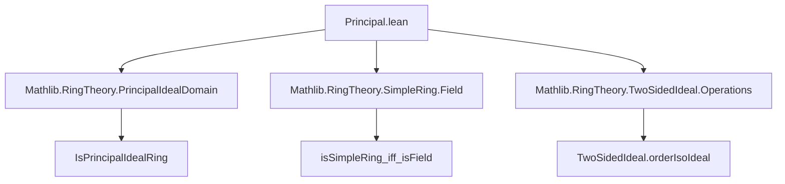

**Technical Brief: `Principal.lean`**

---

### 1. **Key Definitions & Theorems**

| Name | Type / Signature | Purpose |
|------|------------------|---------|
| `IsSimpleOrder (Ideal R)` | `instance` | Establishes that the lattice of ideals of `R` is simple (i.e., has exactly two ideals: `⊥` and `⊤`) via the isomorphism `TwoSidedIdeal.orderIsoIdeal`. |
| `IsPrincipalIdealRing.of_isSimpleRing` | `instance` | Shows that a commutative simple ring is a principal ideal ring. Proof uses equivalence `isSimpleRing_iff_isField` to deduce `R` is a field, and fields are trivially PIRs. |
| `IsDomain.of_isSimpleRing` | `instance` | Shows that a commutative simple ring is an integral domain. Again, via `isSimpleRing_iff_isField`, since fields are domains. |

> **Auxiliary lemma used**:  
> `isSimpleRing_iff_isField : IsSimpleRing R ↔ IsField R` (for `CommRing R`)

---

### 2. **Naming Conventions**

- **Prefixes**:
  - `Is...`: Typeclass names for properties (`IsSimpleRing`, `IsPrincipalIdealRing`, `IsDomain`, `IsSimpleOrder`).
  - `of_...`: Instance names for derived structure (e.g., `IsPrincipalIdealRing.of_isSimpleRing`).
- **Suffixes**:
  - `_orderIsoIdeal`: Denotes the canonical order isomorphism between two-sided ideals and ideals in a commutative ring.
  - `_symm`: Indicates use of the inverse of an equivalence/isomorphism.

---

### 3. **Tactic Stack**

- `simp_rw` (implicit via `instance` resolution and `←`/`→` rewriting in typeclass inference)
- `exact` (via `‹_›`, i.e., using the assumption `[IsSimpleRing R]`)
- `symm` (used implicitly in `.symm` on `orderIsoIdeal`)
- No explicit tactic blocks (`begin ... end`) — proof is *term-mode* and relies on Lean’s typeclass inference and `mp` (modus ponens) on equivalences.

---

### 4. **Proof Logic**

1. Assume `R` is a commutative ring and simple as a ring (`[CommRing R] [IsSimpleRing R]`).
2. Use `TwoSidedIdeal.orderIsoIdeal.symm.isSimpleOrder` to transfer simplicity from two-sided ideals to all ideals (since in commutative rings, all ideals are two-sided).
3. Apply `isSimpleRing_iff_isField` to deduce `R` is a field.
4. Use known facts:
   - Fields are principal ideal rings (`IsField R → IsPrincipalIdealRing R`)
   - Fields are integral domains (`IsField R → IsDomain R`)
5. Conclude via instance resolution.

> **Logical flow**:  
> `IsSimpleRing R` ⇒ `IsField R` ⇒ `IsPrincipalIdealRing R` and `IsDomain R`

---

### 5. **Imports**

| Module | Role |
|--------|------|
| `Mathlib.RingTheory.PrincipalIdealDomain` | Provides `IsPrincipalIdealRing`, `IsDomain`, and facts like `IsField → IsPrincipalIdealRing` |
| `Mathlib.RingTheory.SimpleRing.Field` | Contains `isSimpleRing_iff_isField` and related equivalences |
| `Mathlib.RingTheory.TwoSidedIdeal.Operations` | Provides `TwoSidedIdeal.orderIsoIdeal`, the order isomorphism between two-sided ideals and ideals in a commutative ring |

---

### 6. **Mermaid Diagrams**

#### Dependency Graph (Module-Level)



#### Theoretical Overview (Conceptual Flow)

```mermaid
flowchart LR
  R[CommRing R + IsSimpleRing R] -->|isSimpleRing_iff_isField| F[IsField R]
  F -->|IsField → IsPrincipalIdealRing| PIR[IsPrincipalIdealRing R]
  F -->|IsField → IsDomain| ID[IsDomain R]
  R -->|TwoSidedIdeal.orderIsoIdeal.symm| SIO[IsSimpleOrder (Ideal R)]
```

---

### 7. **Summary**

This file formalizes the classical algebraic result:  
> **A commutative simple ring is a field**,  
and therefore automatically a **principal ideal domain** (though strictly speaking, a field is a PID *only* if one allows the zero ring to be excluded — here `IsDomain` ensures nontriviality).

The proof is concise and leverages Lean’s typeclass inference and existing library results, avoiding explicit tactic scripting.
