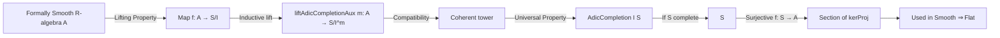

**Technical Brief: `AdicCompletion.lean`**

---

### 1. KEY DEFINITIONS & THEOREMS

| Name | Type / Signature | Purpose |
|------|------------------|---------|
| `liftAdicCompletionAux` | `(m : ℕ) → A →ₐ[R] S ⧸ (I ^ m)` | Constructs, by induction on $m$, a compatible system of algebra maps $A \to S / I^m$ using formal smoothness. Base cases $m = 0,1$ are trivial or via equivalence; step uses `FormallySmooth.lift` on the nilpotent ideal $J = I^{m+1}/I^{m+2}$. |
| `factorₐ_comp_liftAdicCompletionAux` | `factorₐ ∘ liftAdicCompletionAux (m+1) = liftAdicCompletionAux m` | Ensures compatibility of the system under the natural projections $S / I^{m+1} \to S / I^m$. |
| `factorₐ_comp_liftAdicCompletionAux_of_le` | `factorₐ ∘ liftAdicCompletionAux n = liftAdicCompletionAux m` for $m \le n$ | Generalizes compatibility to arbitrary $m \le n$, used to construct a coherent tower. |
| `exists_adicCompletionEvalOneₐ_comp_eq` | `∃ g : A →ₐ[R] AdicCompletion I S, evalOneₐ ∘ g = f` | Main lifting result: any $R$-algebra map $A \to S/I$ lifts to the adic completion $A \to \widehat{S}_I$, assuming $A$ is formally smooth over $R$. |
| `exists_mkₐ_comp_eq_of_isAdicComplete` | `∃ g : A →ₐ[R] S, mkₐ ∘ g = f` (if $S$ is $I$-adically complete) | Specialization of the above when $S \cong \widehat{S}_I$, i.e., $S$ is complete: lift lands in $S$ itself. |
| `exists_kerProj_comp_eq_id` | `∃ g : A →ₐ[R] AdicCompletion (ker f) S, kerProj ∘ g = id_A` (for surjective $f : S \to A$) | A section of the projection $\widehat{S}_{\ker f} \to A$, used in deformation-theoretic arguments (e.g., smoothness ⇒ flatness). |

---

### 2. NAMING CONVENTIONS

- **Prefixes**:
  - `liftAdicCompletionAux`: auxiliary construction for lifting through adic quotients.
  - `factorₐ`: standard notation for the canonical quotient map $S \to S / J$ as an $R$-algebra hom.
  - `mkₐ`: canonical map $S \to S / I$ as an $R$-algebra hom.
  - `kerProj`: projection $\widehat{S}_{\ker f} \to A$ induced by surjection $f$.
  - `evalOneₐ`: the canonical map $\widehat{S}_I \to S / I$ (evaluation at degree 0).
- **Suffixes**:
  - `comp_eq`: indicates a lemma about composition equality (e.g., $h \circ g = f$).
  - `of_le`: indicates dependency on a proof of $m \le n$.
- **Variable naming**:
  - `I`: ideal in $S$.
  - `f`: map $A \to S / I$.
  - `m, n`: natural numbers indexing adic powers.

---

### 3. TACTIC STACK

| Tactic | Usage |
|--------|-------|
| `simp` | Simplifying quotients, powers, subsingleton facts, and algebra hom compositions. |
| `rw` | Rewriting using equivalences like `DoubleQuot.quotQuotEquivQuotOfLEₐ`, `Ideal.map_pow`, etc. |
| `ext` | Extensionality for algebra homs (proving two maps equal by pointwise equality). |
| `apply eq_of_zero_eq_one` | For proving equality in a subsingleton (here $S / I^0 = S / \top$). |
| `induction ... using Nat.le_induction` | Structural induction on $m \le n$ to prove compatibility. |
| `congr` | Applying congruence to simplify expressions like $h(x) = f(x)$. |
| `simpa` | Simplifying using a hypothesis (e.g., `simpa using congr($hg x)`). |
| `haveI : ... := by ...` | Introducing instances (e.g., nilpotence of $J^{m+2}$) for typeclass inference. |

---

### 4. PROOF LOGIC

The logical flow follows a **coherent inductive construction**:

1. **Base Cases**:
   - $m = 0$: $S / I^0 = S / \top$ is subsingleton ⇒ unique map.
   - $m = 1$: use equivalence $S / I \cong S / I^1$.

2. **Inductive Step**:
   - Assume lift to $S / I^{m+1}$.
   - Consider the ideal $J = I^{m+1} / I^{m+2} \subseteq S / I^{m+2}$.
   - Show $J^{m+2} = 0$ (nilpotent), so formal smoothness applies.
   - Use `FormallySmooth.lift` to lift $A \to (S / I^{m+2}) / J \cong S / I^{m+1}$ to $A \to S / I^{m+2}$.

3. **Compatibility**:
   - Prove by induction that the system $(\ell_m : A \to S / I^m)_m$ is compatible under projections.
   - This yields a map into the inverse limit $\widehat{S}_I = \varprojlim S / I^m$.

4. **Completion & Surjectivity**:
   - Use universal property of adic completion to get $A \to \widehat{S}_I$.
   - If $S$ is complete, compose with $\widehat{S}_I \xrightarrow{\sim} S$.
   - For surjective $f : S \to A$, apply the main lemma to the quotient map $S \to A \cong S / \ker f$.

---

### 5. IMPORTS

| Module | Role |
|--------|------|
| `Mathlib.RingTheory.Smooth.Basic` | Defines `FormallySmooth`, basic properties of smooth/algebra maps. |
| `Mathlib.RingTheory.AdicCompletion.Algebra` | Defines `AdicCompletion`, `evalOneₐ`, `ofAlgEquiv`, `liftAlgHom`, `kerProj`, etc. |

These imports anchor the file in the theory of **formally smooth algebras** and **adic completions of rings/algebras**.

---

### 6. MERMAID DIAGRAMS

#### Dependency Graph (Module-Level)

```mermaid
graph TD
  A[AdicCompletion.lean] --> B[Mathlib.RingTheory.Smooth.Basic]
  A --> C[Mathlib.RingTheory.AdicCompletion.Algebra]
  C --> D[Mathlib.RingTheory.AdicCompletion.Basic]
  B --> E[Mathlib.RingTheory.Smooth.Basic]
  B --> F[Mathlib.RingTheory.Smooth.Lifting]
  C --> G[Mathlib.RingTheory.AdicCompletion.UniversalProperty]
  A --> H[Mathlib.RingTheory.Smooth.Flat]  %% used in proof of smooth ⇒ flat
```

#### Overview of Theory Flow



---

### 7. CONTEXT & USAGE

- **Purpose**: To establish lifting of algebra maps through adic completions under formal smoothness.
- **Key Application**: Proof that a smooth algebra over a Noetherian ring is flat (`Mathlib.RingTheory.Smooth.Flat`).
- **Assumptions**:
  - $A$ is **formally smooth** over $R$.
  - $S$ is an $R$-algebra, $I \subseteq S$ an ideal.
  - In `exists_mkₐ_comp_eq_of_isAdicComplete`, $S$ is assumed $I$-adically complete.
  - In `exists_kerProj_comp_eq_id`, $f : S \to A$ is surjective.

---

### 8. SUMMARY

This module formalizes a foundational lifting result in deformation theory: **formal smoothness implies lifting through adic completions**. It constructs a compatible system of approximations modulo $I^m$, then uses the universal property of adic completion to pass to the limit. The result is instrumental in proving that smoothness implies flatness in the Noetherian setting.
