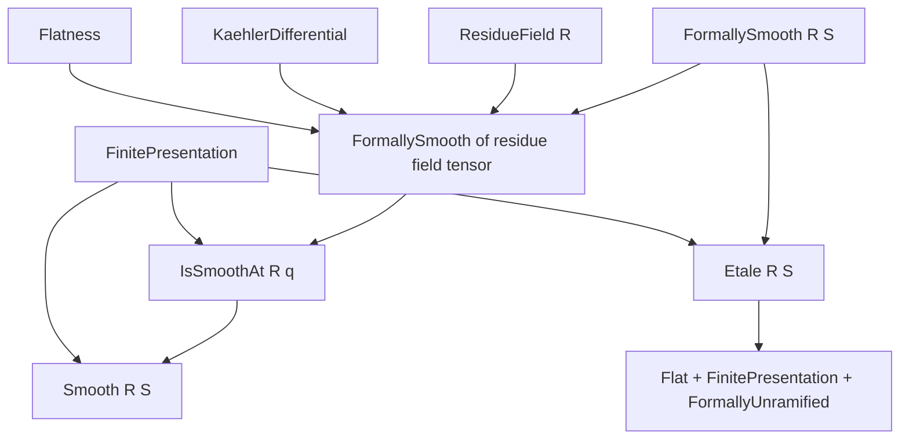
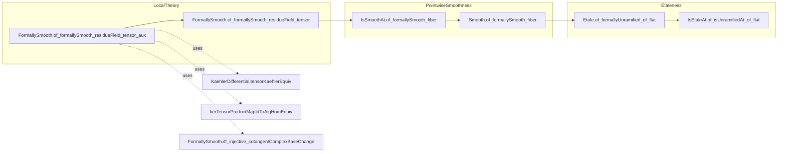

**Technical Brief: `Fiber.lean` — Flat and Smooth Fibers Imply Smoothness**

---

### **1. Key Definitions & Theorems**

| Name | Type / Signature | Purpose |
|------|------------------|---------|
| `ResidueField R` | `R → Type*` (via `Algebra R (ResidueField R)`) | Residue field at the maximal ideal of a local ring `R`. |
| `maximalIdeal R` | `Ideal R` | Maximal ideal of a local ring `R`. |
| `FormallySmooth R S` | `Prop` | `S` is *formally smooth* over `R`: lifting maps through nilpotent extensions. |
| `IsSmoothAt R q` | `Prop` | `S` is *smooth at prime* `q ⊆ S` (i.e., smooth in a neighborhood of `q`). |
| `Etale R S` | `Prop` | `S` is *étale* over `R`: flat, finitely presented, and formally unramified. |
| `I.Fiber S` | `Type*` (as `R/I`-algebra) | Fiber of `S` over prime ideal `I`: `κ(I) ⊗_R S`, where `κ(I) = ResidueField I`. |
| `Ω[S/R]` | `S-Mod` | Module of Kähler differentials. |
| `FormallySmooth.of_formallySmooth_residueField_tensor_aux` | `lemma` | Local criterion: if `S = P/I`, `P` smooth, `Ω[P/R]` finite free, and `k ⊗ S` formally smooth, then `S` is formally smooth. |
| `FormallySmooth.of_formallySmooth_residueField_tensor` | `lemma` | Extends previous to *essentially* finitely presented algebras (localizations of finite type). |
| `IsSmoothAt.of_formallySmooth_fiber` | `lemma` | Smoothness at a point follows from smoothness of the fiber over the residue field. |
| `Smooth.of_formallySmooth_fiber` | `lemma` | Global smoothness follows if all fibers over residue fields are formally smooth (plus finite presentation & flatness). |
| `Etale.of_formallyUnramified_of_flat` | `lemma` | Flat + finitely presented + formally unramified ⇒ étale. |
| `IsEtaleAt.of_isUnramifiedAt_of_flat` | `lemma` | Local version: unramified at `q` + flat + finite presentation ⇒ étale at `q`. |

---

### **2. Naming Conventions**

- **Prefixes**:
  - `FormallySmooth.*`: properties of formal smoothness.
  - `IsSmoothAt.*`: pointwise smoothness.
  - `IsEtaleAt.*`: pointwise étaleness.
  - `Smooth.*`, `Etale.*`: global properties.
- **Suffixes**:
  - `_aux`: auxiliary lemmas used in main proofs.
  - `_of_*`: implication lemmas (e.g., `of_formallySmooth_fiber`).
  - `_tensor`, `_fiber`: involve tensor products with residue fields.
- **Notation**:
  - `𝓀[R]`: `ResidueField R`
  - `𝓂[R]`: `maximalIdeal R`
  - `Ω[S/R]`: Kähler differentials.

---

### **3. Tactic Stack**

| Tactic | Usage Frequency | Purpose |
|--------|-----------------|---------|
| `algebraize` | High | Simplifies algebra maps and towers using `IsScalarTower` and algebra homs. |
| `simp` / `simp only` | Very High | Simplifies tensor products, residue fields, localization maps. |
| `rw` | High | Rewrites using equivalences, e.g., `e₀`, `e₁`, `eᵣ`, `eₗ`. |
| `convert` | Medium | Matches goals up to equivalence (e.g., injectivity under isomorphisms). |
| `induction` | Medium | Structural induction on tensor product elements (`tmul`, `add`, `zero`). |
| `dsimp` | Medium | Simplifies definitions (e.g., `kerTensorProductMapIdToAlgHomEquiv_symm_apply`). |
| `exact`, `refine`, `intro` | High | Standard proof construction. |
| `have`, `suffices` | High | Intermediate claims and reductions. |
| `ext` | Medium | Extensionality for linear maps / equivalences. |
| `apply`, `exact` | Medium | Applying lemmas (e.g., `FormallySmooth.comp`, `FormallySmooth.of_equiv`). |

---

### **4. Proof Logic**

**General Strategy**:
- **Local-to-Global Principle**: Prove smoothness/étaleness by checking fibers over residue fields.
- **Reduction to Local Case**: Use localization at primes to reduce to local rings.
- **Presentation-Based Argument**:
  - Present `S = P/I` (or localization thereof).
  - Use flatness to tensor the presentation with residue field `k = 𝓀[R]`.
  - Apply the *Jacobi criterion* (`FormallySmooth.iff_injective_cotangentComplexBaseChange`) to relate injectivity of cotangent complex maps.
- **Equivalence Chasing**:
  - Use natural isomorphisms:
    - `Ω[Pp/𝓀[R]] ≅ Pp ⊗_P Ω[P/R]` (Kähler differentials commute with flat base change).
    - `ker(φ) ≅ Pp ⊗_P ker(algebraMap P S)` (tensor preserves kernels under surjectivity).
  - Show that the induced map on cotangent complexes under these identifications matches the assumed injective map for the fiber.

**Typical Flow**:
1. Localize at relevant primes → work with local rings.
2. Choose presentation `P → S` (polynomial ring or finite type).
3. Tensor with residue field `k` → get `k ⊗ P → k ⊗ S`.
4. Use flatness to preserve exactness.
5. Apply formal smoothness of the fiber (`k ⊗ S`).
6. Use equivalence of cotangent complexes to descend smoothness to `S`.

---

### **5. Imports & Dependencies**

| Module | Role |
|--------|------|
| `Mathlib.RingTheory.Etale.Field` | Étale algebras over fields; residue field properties. |
| `Mathlib.RingTheory.Flat.Equalizer` | Flatness and equalizers (used for base change exactness). |
| `Mathlib.RingTheory.Kaehler.TensorProduct` | Kähler differentials and base change. |
| `Mathlib.RingTheory.LocalRing.ResidueField.Fiber` | Fiber constructions over local rings. |
| `Mathlib.RingTheory.Smooth.Local` | Local criteria for smoothness (e.g., `IsSmoothAt`). |
| `Mathlib.RingTheory.Etale.Locus` | Étale locus and openness. |

---

### **6. Mermaid Diagrams**

#### **Dependency Graph (High-Level)**

#### **Overview of `Fiber.lean`**

---

### **7. Summary**

This file establishes foundational results linking **smoothness/étaleness of algebras** to **smoothness/étaleness of their fibers over residue fields**, under flatness and finite presentation assumptions. It leverages:
- **Kähler differentials** and their behavior under base change,
- **Localization** to reduce to local rings,
- **Tensor product exactness** (via flatness),
- **Jacobi criterion** for formal smoothness.

The main theorems are:
- $ S $ is $ R $-smooth if $ S $ is flat, finitely presented, and $ \kappa(\mathfrak{p}) \otimes_R S $ is $ \kappa(\mathfrak{p}) $-smooth for all primes $ \mathfrak{p} \subseteq R $.
- $ S $ is $ R $-étale if it is flat, finitely presented, and formally unramified.

These results are essential for proving openness of smooth/étale loci and for descent properties in algebraic geometry.

--- 

Let me know if you'd like a formalized dependency graph (e.g., for LeanDojo) or a proof sketch of a specific lemma.
