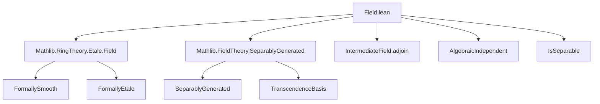

**Technical Brief: Smooth Algebras over Fields (Field.lean)**  
*Based on Lean 4 formalization in `Field.lean` (Andrew Yang, 2025)*

---

### 1. Key Definitions & Theorems

| Name | Type / Signature | Purpose |
|------|------------------|---------|
| `Algebra.FormallySmooth.adjoin_of_algebraicIndependent` | `{v : ι → L} → AlgebraicIndependent K v → Algebra.FormallySmooth K (IntermediateField.adjoin K (Set.range v))` | Shows that the $K$-subalgebra generated by an algebraically independent family is formally smooth over $K$. |
| `Algebra.FormallySmooth.of_algebraicIndependent` | `{v : ι → L} → AlgebraicIndependent K v → IntermediateField.adjoin K (Set.range v) = ⊤ → Algebra.FormallySmooth K L` | Extends formal smoothness from a transcendental extension to the whole field when the adjoin equals the full field (i.e., purely transcendental extension). |
| `Algebra.FormallySmooth.of_algebraicIndependent_of_isSeparable` | `{v : ι → L} → AlgebraicIndependent K v → Algebra.IsSeparable (IntermediateField.adjoin K (Set.range v)) L → [EssFiniteType K L] → Algebra.FormallySmooth K L` | Main result: if $L/K$ is finitely generated and separably generated (i.e., has a transcendence basis $v$ such that $L$ is separable over $K(v)$), then $L$ is formally smooth over $K$. |
| `Algebra.FormallySmooth.of_perfectField` | `[PerfectField K] [EssFiniteType K L] → Algebra.FormallySmooth K L` | Corollary: over a perfect field, any finitely generated field extension is formally smooth (since separability is automatic). |

**Auxiliary notions used:**
- `IntermediateField.adjoin K S`: the smallest subfield of $L$ containing $K$ and $S$.
- `AlgebraicIndependent K v`: the family $v$ is algebraically independent over $K$.
- `Algebra.IsSeparable A B`: the algebra $B$ is separable over $A$.
- `EssFiniteType K L`: $L$ is essentially of finite type over $K$ (i.e., a localization of a finitely generated $K$-algebra).
- `FormallyEtale A B`: $B$ is formally étale over $A$; used via equivalence with separability in the finitely generated case.

---

### 2. Naming Conventions

- **Prefixes:**
  - `of_`: constructs a result from structural assumptions (e.g., `of_algebraicIndependent`, `of_perfectField`).
  - `adjoin_`: relates to constructions via field adjoin (e.g., `adjoin_of_algebraicIndependent`).
- **Suffixes:**
  - `_of_`: emphasizes the logical dependency chain (e.g., `of_algebraicIndependent_of_isSeparable`).
- **General style:** Descriptive, modular, and aligned with Mathlib’s naming (e.g., `FormallySmooth`, `EssFiniteType`, `IntermediateField.adjoin`).

---

### 3. Tactic Stack

The proofs rely heavily on:
- `exact` / `apply` / `have`: for building intermediate lemmas.
- `rw [hb'] at this]`: rewriting using equality hypotheses.
- `convert` + `simp`: to match and simplify instances (e.g., in `of_perfectField`).
- `inferInstance`: to synthesize typeclass instances (e.g., `isSeparable`).
- `of_equiv`, `of_isLocalization`, `comp`: lemmas from `FormallySmooth` theory.
- `iff_isSeparable`: equivalence between formal étaleness and separability for essentially finite type algebras.

No heavy automation (e.g., `aesop`, `ring`, `norm_num`) is used—proofs are largely *structure-driven* and rely on pre-proved lemmas.

---

### 4. Proof Logic

The logical flow follows a *tower of smoothness* strategy:

1. **Base case**: For algebraically independent $v$, the subfield $K(v)$ is formally smooth over $K$ (via equivalence with a polynomial ring localized at nonzero divisors).
2. **Purely transcendental case**: If $L = K(v)$, then smoothness descends via equivalence.
3. **Separably generated case**: If $L$ is separable over $K(v)$, then $L$ is formally étale over $K(v)$, and composition of formally smooth and formally étale maps yields formal smoothness over $K$.
4. **Perfect field case**: Use existence of a transcendence basis $s$ such that $L$ is separable over $K(s)$ (a standard result for perfect fields), then apply the previous lemma.

Induction or case analysis is *not* used—proofs are *structural*, leveraging field-theoretic decomposition (transcendence basis + separable extension).

---

### 5. Imports & Dependencies

**Core imports:**
- `Mathlib.RingTheory.Etale.Field`: provides formal étaleness and smoothness results for field extensions.
- `Mathlib.FieldTheory.SeparablyGenerated`: supplies definitions and facts about separably generated extensions and transcendence bases.

**Typeclasses used:**
- `Field`, `Algebra`, `IntermediateField`, `AlgebraicIndependent`, `IsSeparable`, `EssFiniteType`, `PerfectField`.

**Key lemmas imported/used:**
- `FormallySmooth.of_equiv`, `FormallySmooth.of_isLocalization`, `FormallySmooth.comp`
- `FormallyEtale.iff_isSeparable`
- `exists_isTranscendenceBasis_and_isSeparable_of_perfectField`

---

### 6. Mermaid Diagrams

#### Dependency Graph (Module-Level)



#### Theoretical Flow (Main Result)

```mermaid
graph LR
  A[AlgebraicIndependent v] --> B[adjoin K (range v) is FormallySmooth over K]
  B --> C[If L = adjoin K (range v), then L is FormallySmooth]
  D[IsSeparable L / adjoin K (range v)] --> E[L is FormallyEtale over adjoin K (range v)]
  B & E --> F[L is FormallySmooth over K]
  G[PerfectField K] --> H[∃ transcendence basis s, L separable over K(s)]
  H --> F
```

---

### 7. Summary

This module establishes a foundational bridge between *field-theoretic separability* and *formal smoothness* in the context of field extensions. It leverages the decomposition of finitely generated extensions into transcendental and separable parts, and culminates in a clean corollary for perfect base fields. The formalization is modular, reusable, and aligns with Mathlib’s architecture for commutative algebra and field theory.
