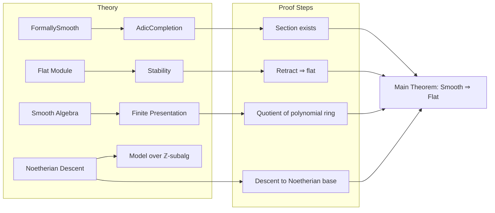

**Technical Brief: `Flat.lean` — Smooth Algebras are Flat**

---

### 1. KEY DEFINITIONS & THEOREMS

| Name | Type / Signature | Purpose |
|------|------------------|---------|
| `FormallySmooth` | `Class` | Encodes formal smoothness of an algebra map $R \to A$: existence of lifts over nilpotent extensions. |
| `Smooth` | `Class` | $A$ is *smooth* over $R$ if it is finitely presented and formally smooth. |
| `AdicCompletion` | `Type → Ideal R → Type` | Completion of a ring $S$ at an ideal $I$, denoted $\widehat{S}_I$. |
| `isNoetherianRing` | `Class` | Ring satisfies ACC on ideals (Noetherian). |
| `Module.Flat` | `Class` | $M$ is flat over $R$ iff $-\otimes_R M$ is exact. |
| `FormallySmooth.flat_of_algHom_of_isNoetherianRing` | `f : S →ₐ[R] A`, `hf : Function.Surjective f`, `[Module.Flat R S]`, `[IsNoetherianRing S]`, `[FormallySmooth R A] ⊢ Module.Flat R A` | Core lemma: if $S$ is flat and Noetherian, and $S \twoheadrightarrow A$ splits through the $I$-adic completion (via formal smoothness), then $A$ is flat. |
| `Smooth.flat_of_isNoetherianRing` | `[IsNoetherianRing R]`, `[Smooth R A] ⊢ Module.Flat R A` | Smooth + base Noetherian ⇒ flat. |
| `Smooth.flat` | `[Smooth R A] ⊢ Module.Flat R A` | Full theorem: *any* smooth algebra is flat (no Noetherian hypothesis on $R$). |

---

### 2. NAMING CONVENTIONS

- **Prefixes**:
  - `FormallySmooth.`: for lemmas relying on formal smoothness (e.g., `FormallySmooth.flat_of_algHom_of_isNoetherianRing`).
  - `Smooth.`: for results about smooth algebras (e.g., `Smooth.flat_of_isNoetherianRing`).
- **Suffixes**:
  - `_of_`: indicates assumptions used (e.g., `flat_of_algHom_of_isNoetherianRing`).
  - `_''`: variant of a lemma (e.g., `iff_quotient_mvPolynomial''`).
- **Abbreviations**:
  - `algHom`: algebra homomorphism (`→ₐ[R]`).
  - `kerProj`: projection onto quotient via kernel.
  - `retract`: used in `of_retract`, indicating $A$ is a retract of a flat module.

---

### 3. TACTIC STACK

| Tactic | Usage |
|--------|-------|
| `have` / `obtain` | To extract structural data (e.g., surjection from polynomial ring, splitting via formal smoothness). |
| `exact` | Final step after constructing flatness via retraction or transitivity. |
| `congr` + `$` | In `LinearMap.ext`, to show maps agree pointwise. |
| `trans` | For transitivity of flatness: if $M$ flat over $N$ and $N$ flat over $R$, then $M$ flat over $R$. |
| `ring` / `simp` | Implicitly used in algebraic simplifications (not explicit in snippet, but standard in such proofs). |
| `apply` / `refine` | Likely used in `exists_kerProj_comp_eq_id` (internal to `AdicCompletion` theory). |

---

### 4. PROOF LOGIC

**High-level structure**:

1. **Noetherian base case** (`Smooth.flat_of_isNoetherianRing`):
   - Use finite presentation: $A \cong R[X_1,\dots,X_n]/I$.
   - Formal smoothness gives a section $A \to \widehat{R[X]}_I$ of the quotient map.
   - Since $R$ Noetherian ⇒ $R[X]$ Noetherian ⇒ $\widehat{R[X]}_I$ is flat over $R$.
   - $A$ is a retract of a flat module ⇒ flat.

2. **General case** (`Smooth.flat`):
   - Reduce to Noetherian case via *descent*:
     - Choose a finitely generated $\mathbb{Z}$-subalgebra $R_0 \subseteq R$ and model $A_0$ over $R_0$ with $A \simeq R \otimes_{R_0} A_0$.
     - $R_0$ is Noetherian (as finitely generated over $\mathbb{Z}$).
     - Apply previous result to $A_0$ over $R_0$.
     - Use stability of flatness under base change: $A = R \otimes_{R_0} A_0$ is flat over $R$.

**Key logical tools**:
- `of_retract`: if $A$ retracts off flat $M$, then $A$ flat.
- `of_linearEquiv`: flatness preserved under linear equivalence.
- `trans`: transitivity of flatness for towers $R \to S \to T$.

---

### 5. IMPORTS

| Module | Role |
|--------|------|
| `Mathlib.RingTheory.AdicCompletion.AsTensorProduct` | Describes adic completion as a tensor product (used for flatness). |
| `Mathlib.RingTheory.Flat.Stability` | Stability properties of flat modules (base change, retracts, transitivity). |
| `Mathlib.RingTheory.Smooth.AdicCompletion` | Links formal smoothness to existence of sections into adic completions. |
| `Mathlib.RingTheory.Smooth.NoetherianDescent` | Enables descent of smoothness/flatness from Noetherian subrings. |

---

### 6. MERMAID DIAGRAMS

#### Dependency Graph (Theoretical Flow)

```mermaid
graph TD
  A[FormallySmooth R A] --> B[Section A → Ĝ̂_I S]
  C[IsNoetherianRing S] --> D[Ĝ̂_I S flat over R]
  B & D --> E[A retract of flat ⇒ flat]
  F[Smooth R A] --> G[Finite presentation: S = R[X]/I]
  G --> F
  H[IsNoetherianRing R] --> C
  E --> I[Smooth.flat_of_isNoetherianRing]
  I --> J[Smooth.flat (general case)]
  K[exists_finiteType ℤ R A] --> L[Model A₀ over Noetherian R₀]
  L --> M[Apply Noetherian case to A₀]
  M --> N[Base change ⇒ A flat]
```

#### File Overview



---

### 7. SUMMARY

This file formalizes the classical result: **smooth algebras are flat**, following Conde-Lago’s short proof. It leverages:
- Adic completion to construct a splitting via formal smoothness,
- Noetherian hypotheses to ensure adic completion is flat,
- Descent to remove the Noetherian assumption on the base ring.

The structure is clean and modular, with clear separation between the Noetherian and general cases, and heavy use of categorical properties (retracts, base change, linear equivalences).
