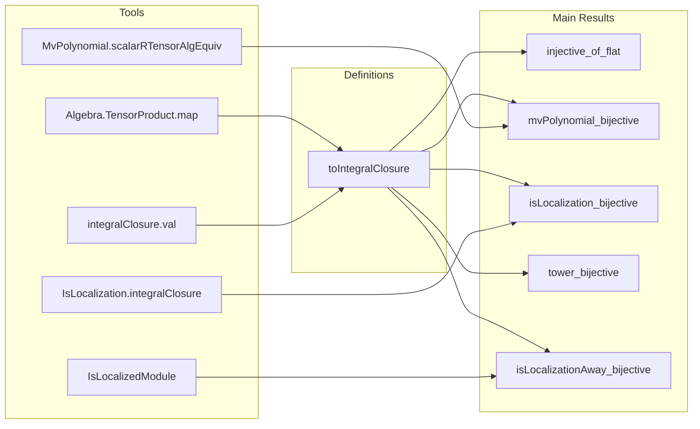

**Technical Brief: `IntegralClosure.lean` — Smooth Base Change and Integral Closure**

---

### **1. Key Definitions & Theorems**

| Name | Type / Signature | Purpose |
|------|------------------|---------|
| `TensorProduct.toIntegralClosure` | `S ⊗[R] integralClosure R B →ₐ[S] integralClosure S (S ⊗[R] B)` | Canonical $S$-algebra map comparing base-changed integral closure with integral closure of the base change. |
| `TensorProduct.toIntegralClosure_injective_of_flat` | `[Module.Flat R S] → Function.Injective (toIntegralClosure R S B)` | Proves injectivity of the comparison map under $R$-flatness of $S$. |
| `TensorProduct.toIntegralClosure_bijective_of_tower` | `{T : Type*} [IsScalarTower R S T] → Bijective (toIntegralClosure R S B) → Bijective (toIntegralClosure S T (S ⊗[R] B)) → Bijective (toIntegralClosure R T B)` | Shows stability of bijectivity under composition of scalar towers. |
| `TensorProduct.toIntegralClosure_bijective_of_isLocalizationAway` | `Ideal.span s = ⊤ → (∀ r, Bijective (toIntegralClosure R (Sᵣ r) B)) → Bijective (toIntegralClosure R S B)` | Zariski-local criterion: bijectivity can be checked after localizing at a covering set of elements. |
| `TensorProduct.toIntegralClosure_mvPolynomial_bijective` | `Function.Bijective (toIntegralClosure R (MvPolynomial σ R) B)` | Bijectivity for multivariate polynomial rings (a key case of smooth algebras). |
| `TensorProduct.toIntegralClosure_bijective_of_isLocalization` | `[IsLocalization M S] → Bijective (toIntegralClosure R S B)` | Bijectivity for localization at a submonoid $M \subseteq R$. |

---

### **2. Naming Conventions**

- **Prefixes**:
  - `TensorProduct.`: Module-scoped namespace for maps involving tensor products.
  - `is_`: Used in `IsLocalization.Away`, `IsScalarTower`, `IsLocalizedModule`.
  - `to_`: For canonical maps (e.g., `toIntegralClosure`, `toLinearMap`, `toRingEquiv`).
- **Suffixes**:
  - `_bijective`, `_injective`: For properties of maps.
  - `_of_`: For hypotheses or conditions (e.g., `of_flat`, `of_isLocalization`, `of_tower`).
  - `_commutes`, `_preserves`: For structural properties (e.g., `tower_top`, `map_integralClosure`).

---

### **3. Tactic Stack**

Frequently used tactics in proofs:

| Tactic | Role |
|--------|------|
| `simp` / `simp only` | Simplification using definitional equalities and lemmas (e.g., `map_add`, `smul_tmul'`, `integralClosure`). |
| `rw` / `congr` / `ext` | Rewriting, congruence, and extensionality reasoning (especially for algebra homomorphisms and tensor products). |
| `induction` | Structural induction on elements of `integralClosure` (via `Subtype` representation). |
| `convert` | Matching goals up to definitional equality or provable equivalences. |
| `exact`, `refine`, `intro` | Standard proof construction. |
| `have`, `let` | Local lemma/definition introduction. |
| `apply`, `apply_fun`, `funext` | Functional reasoning and extensionality. |
| `dsimp`, `change` | Definitional simplification and hypothesis transformation. |
| `apply_ite`, `congr$` | Advanced simplification and congruence closure. |

---

### **4. Proof Logic**

- **General Strategy**:
  - **Injectivity**: Lifts to linear maps and uses `Module.Flat.lTensor_preserves_injective_linearMap`.
  - **Bijectivity**:
    - For *polynomial rings*, uses `MvPolynomial.scalarRTensorAlgEquiv` to reduce to coefficient-wise integrality.
    - For *localizations*, constructs explicit algebra isomorphisms via `IsLocalization.integralClosure` and `IsLocalization.algEquiv`.
    - For *smooth algebras* (TODO), aims to combine:
      - Local triviality of smooth maps (étale locally is polynomial),
      - Stability under composition and localization,
      - Zariski-local descent.

- **Inductive Structure**:
  - Proofs often proceed by:
    1. Defining a comparison map,
    2. Showing injectivity via flatness or localization,
    3. Showing surjectivity via explicit construction or descent.

---

### **5. Imports & Dependencies**

| Import | Purpose |
|--------|---------|
| `Mathlib.RingTheory.LocalProperties.Exactness` | Tools for exactness and localization (e.g., `IsLocalizedModule`). |
| `Mathlib.RingTheory.Polynomial.IsIntegral` | Integrality criteria for multivariate polynomials (`MvPolynomial.isIntegral_iff_isIntegral_coeff`). |
| `Mathlib.RingTheory.Flat.Basic` | Flat module theory (`lTensor_preserves_injective_linearMap`). |

---

### **6. Mermaid Diagrams**

#### **Dependency Graph (High-Level)**

```mermaid
graph TD
  A[CommRing R, S, B] --> B[Algebra R S]
  A --> C[Algebra R B]
  B --> D[TensorProduct S R]
  C --> D
  D --> E[integralClosure R B]
  D --> F[S ⊗[R] B]
  E --> G[integralClosure S F]
  D --> G
  G --> H[toIntegralClosure map]
  
  I[Flat R S] -->|injective| H
  J[MvPolynomial σ R] -->|bijective| H
  K[Localization M] -->|bijective| H
  L[Tower R S T] -->|stability| H
  M[Zariski cover] -->|descent| H
```

#### **Overview of File Structure**



---

### **7. Summary**

This file formalizes the foundational theory of how integral closure interacts with base change, especially in the context of *smooth* and *local* morphisms. It establishes:

- A canonical comparison map `toIntegralClosure`,
- Injectivity under flatness,
- Bijectivity for key cases: polynomial rings, localizations, and towers,
- A Zariski-local descent principle.

The ultimate goal — proving bijectivity for *smooth* algebras — remains as a major open task, likely requiring étale-local triviality and descent techniques already partially formalized here.

--- 

Let me know if you'd like a formalization roadmap for the smooth case or a tactic-level trace of `mvPolynomial_bijective`.
