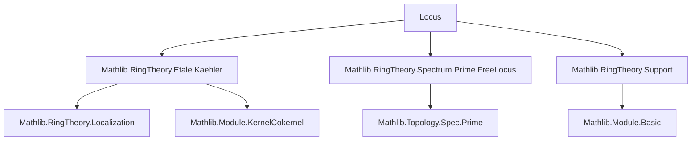
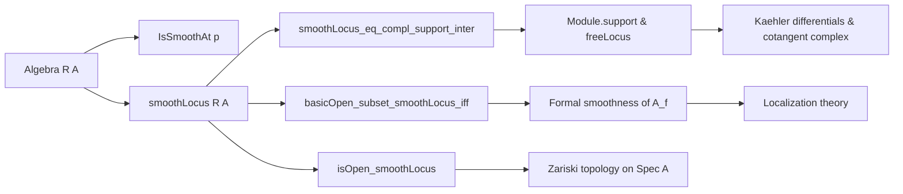

### Technical Brief: `Locus.lean` — Smooth Locus of an Algebra

---

#### **1. Key Definitions & Theorems**

| Name | Type / Signature | Purpose |
|------|------------------|---------|
| `IsSmoothAt R A p` | `p : Ideal A [p.IsPrime] → Prop` | Defines formal smoothness of the localized algebra $A_{\mathfrak{p}}$ over $R$. |
| `smoothLocus R A` | `Set (PrimeSpectrum A)` | The subset of $\operatorname{Spec} A$ where $A$ is formally smooth over $R$. |
| `smoothLocus_eq_compl_support_inter` | `[EssFiniteType R A] ⇒ smoothLocus R A = (supp(H¹(L_{A/R})))ᶜ ∩ freeLocus(Ω_{A/R})` | Characterizes smooth locus as complement of support of cotangent complex cohomology intersected with freeness locus of Kähler differentials. |
| `basicOpen_subset_smoothLocus_iff` | `[FinitePresentation R A] ⇒ D(f) ⊆ smoothLocus ↔ A_f$ is formally smooth over $R$` | Links basic open sets in $\operatorname{Spec} A$ to formal smoothness of localization. |
| `basicOpen_subset_smoothLocus_iff_smooth` | `[FinitePresentation R A] ⇒ D(f) ⊆ smoothLocus ↔ A_f$ is smooth over $R$` | Refines previous lemma using equivalence of formal smoothness and smoothness under finite presentation. |
| `smoothLocus_eq_univ_iff` | `[FinitePresentation R A] ⇒ smoothLocus = ⊤ ↔ A$ is formally smooth over $R$` | Global smoothness ⇔ smooth locus is whole spectrum. |
| `smoothLocus_eq_univ` | `[Smooth R A] ⇒ smoothLocus R A = ⊤` | Immediate corollary of above. |
| `smoothLocus_comap_of_isLocalization` | For localization $A \to A_f$, preimage of smooth locus under comap equals smooth locus of $A_f$. | Compatibility of smooth locus with localization. |
| `isOpen_smoothLocus` | `[FinitePresentation R A] ⇒ IsOpen (smoothLocus R A)` | Smooth locus is open in Zariski topology. |
| `IsSmoothAt.exists_notMem_smooth` | `[FinitePresentation R A] [IsSmoothAt R p] ⇒ ∃ f ∉ p, Smooth R A_f` | Local smoothness implies existence of a basic open neighborhood where algebra is smooth. |

---

#### **2. Naming Conventions**

- **Prefixes**:
  - `is_`: Predicate definitions (`IsSmoothAt`)
  - `smoothLocus_`: Main object-related lemmas (`smoothLocus_eq_compl_support_inter`, `smoothLocus_eq_univ_iff`)
  - `basicOpen_subset_`: Conditions for basic opens to lie inside smooth locus
- **Suffixes**:
  - `_iff`: Logical equivalences (`basicOpen_subset_smoothLocus_iff`)
  - `_smooth`: Smoothness variant (`basicOpen_subset_smoothLocus_iff_smooth`)
  - `_comap`: Behavior under ring maps (`smoothLocus_comap_of_isLocalization`)
- **Module/Geometry terms**:
  - `support`, `freeLocus`, `Ω[A⁄R]`, `H1Cotangent`: Kähler differentials and cotangent complex cohomology.

---

#### **3. Tactic Stack**

Frequently used tactics in proofs:

| Tactic | Role |
|--------|------|
| `rw` / `simp only` | Rewriting definitions and simplifying goals using equivalences |
| `congr!` | Congruence reasoning with multiple subgoals |
| `exact`, `refine`, `apply` | Constructing proofs from known lemmas |
| `have`, `let` | Introducing intermediate facts and constructions |
| `ext` | Extensionality for sets/functions |
| `rw [← ...]` | Rewriting backwards to match known lemmas |
| `infer_instance` | Solving typeclass constraints |
| `simp` / `simp_rw` | Simplification with custom lemmas |
| `aesop` (implied via `have := ...`) | Possibly used for automation in supporting lemmas (not explicit here) |

---

#### **4. Proof Logic**

The logical flow across most proofs follows this pattern:

1. **Reduction to local properties**:
   - Use localization isomorphisms (`IsLocalizedModule.iso`) to reduce global statements to localized settings.
2. **Equivalence transformations**:
   - Apply lemmas like `formallySmooth_iff`, `basicOpen_subset_freeLocus_iff`, and `support_eq_zeroLocus`.
3. **Module-theoretic characterizations**:
   - Translate smoothness conditions into freeness of $\Omega_{A/R}$ and vanishing of $H^1(L_{A/R})$.
4. **Topological arguments**:
   - Use basis of basic opens and openness of `freeLocus` to prove openness of `smoothLocus`.
5. **Inductive/constructive extraction**:
   - Extract witness $f \notin \mathfrak{p}$ such that $A_f$ is smooth (via `isOpen_smoothLocus` and basis lemma).

Most proofs rely on:
- Finite presentation assumptions to apply localization-based equivalences.
- Module-theoretic characterizations of smoothness (via Kähler differentials and cotangent complex).
- Properties of localization (e.g., `IsLocalization.Away.finitePresentation`, `IsLocalization.atUnits`).

---

#### **5. Imports & Dependencies**

Primary dependencies:

| Module | Purpose |
|--------|---------|
| `Mathlib.RingTheory.Etale.Kaehler` | Kähler differentials and their behavior under localization |
| `Mathlib.RingTheory.Spectrum.Prime.FreeLocus` | Theory of free locus of modules over spectra |
| `Mathlib.RingTheory.Support` | Support of modules and its topological properties |

Also implicitly uses:
- `Mathlib.RingTheory.Localization` (via `Localization.Away`, `AtPrime`)
- `Mathlib.RingTheory.FormallySmooth`
- `Mathlib.Module.FinitePresentation`, `Flat`, `Projective`
- `Mathlib.Topology.Spec.Prime` (Zariski topology on $\operatorname{Spec}$)

---

#### **6. Mermaid Diagrams**

##### **Dependency Graph (Module-Level)**



##### **Overview of File Structure**



##### **Proof Strategy Flow (Example: `isOpen_smoothLocus`)**

```mermaid
flowchart TD
  Start[Assume x ∈ smoothLocus] --> Step1[Use basis lemma to get f ∉ x with D(f) ⊆ smoothLocus]
  Step1 --> Step2[Show smoothLocus R (A_f) is open]
  Step2 --> Step3[Use localization isomorphisms to reduce to support & freeLocus]
  Step3 --> Step4[Apply openness of freeLocus and closedness of zeroLocus]
  Step4 --> Step5[Pull back openness via comap and localization map]
  Step5 --> End[Existence of open nbhd around x]
```

---

#### **7. Summary**

This file formalizes the *smooth locus* of an algebra $A/R$, a central notion in algebraic geometry. It connects:
- **Homological algebra** (cotangent complex $L_{A/R}$),
- **Module theory** (support, freeness, projectivity),
- **Localization theory**, and
- **Topology on spectra**.

It establishes foundational properties:
- Openness of smooth locus under finite presentation,
- Local characterization via basic opens,
- Equivalence between formal smoothness and smoothness in this context.

The proofs are highly structured, leveraging:
- Isomorphisms of localized modules (e.g., Kähler differentials, cotangent complex),
- Module-theoretic criteria for smoothness,
- Topological arguments using the Zariski basis.

This aligns closely with the Stacks Project’s treatment (e.g., [00TB](https://stacks.math.columbia.edu/tag/00TB)) and provides a robust foundation for further development in deformation theory, étale cohomology, and moduli problems.
