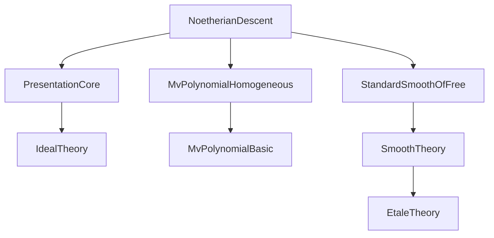

### Technical Brief: `NoetherianDescent.lean`

---

#### **1. Key Definitions & Theorems**

| Name | Type / Signature | Purpose |
|------|------------------|---------|
| `DescentAux` | `structure` | Encodes descent data for constructing a model over a finitely generated subalgebra: presentation `P`, section `σ`, homogeneous lifts `h`, `p`, `q` satisfying compatibility conditions. |
| `DescentAux.subalgebra` | `Subalgebra R A` | The finitely generated `R`-subalgebra generated by coefficients of presentation data (`P.coeffs`, `h`, `q`, `p`). |
| `DescentAux.hasCoeffs` | `D.P.HasCoeffs (D.subalgebra R)` | Ensures the presentation coefficients lie in the constructed subalgebra. |
| `DescentAux.exists_kerSquareLift_comp_eq_id` | `∃ σ₀, ...` | Constructs a lift `σ₀` of the identity on the model over the subalgebra, modulo square of kernel — key for descent. |
| `Algebra.Smooth.exists_subalgebra_fg` | `∃ A₀ B₀, A₀.FG ∧ Smooth A₀ B₀ ∧ B ≃ₐ[A] A ⊗[A₀] B₀` | Main descent result for smooth algebras: smoothness descends to a finite type subalgebra. |
| `Algebra.Smooth.exists_finiteType` | `∃ A₀ B₀, Function.Injective (A₀ → A) ∧ FiniteType R A₀ ∧ ...` | Variant with injective structure map `A₀ → A`. |
| `Algebra.IsStandardSmoothOfRelativeDimension.exists_subalgebra_fg` | Same as `exists_subalgebra_fg`, but preserves *standard smoothness of relative dimension `n`*. |
| `Algebra.Etale.exists_subalgebra_fg` | `∃ A₀ B₀, A₀.FG ∧ Etale A₀ B₀ ∧ B ≃ₐ[A] A ⊗[A₀] B₀` | Descent for étale algebras (via `Etale.iff_isStandardSmoothOfRelativeDimension_zero`). |

---

#### **2. Naming Conventions**

- **Prefixes**:
  - `DescentAux.`: Implementation details for descent construction.
  - `coeffs_`: Lemmas about coefficient containment in subalgebras.
  - `fg_`: Proofs of finite generation (`fg_subalgebra`).
  - `exists_`: Existence lemmas (e.g., `exists_kerSquareLift_comp_eq_id`).
- **Suffixes**:
  - `_fg`: Finite generation (`A₀.FG`).
  - `_ofHasCoeffs`: Model of presentation over a subalgebra with coefficients.
  - `_tensorModelEquiv`: Equivalence between base-changed model and original algebra.

---

#### **3. Tactic Stack**

Frequently used tactics in proofs:
- `grind`: Simplifies set-theoretic inclusions (e.g., coefficient containment).
- `simp_rw`, `simp`: Rewriting with definitional equalities and algebraic properties.
- `choose`: Axiom of choice for selecting witnesses (e.g., homogeneous lifts).
- `obtain ⟨...⟩`: Destructuring existential quantifiers.
- `apply`, `exact`, `convert`: Proof construction.
- `ring`, `aesop`: For commutative ring identities (used implicitly in `grind`/`simp`).
- `map_injective`, `FaithfulSMul.algebraMap_injective`: To prove injectivity of polynomial maps.

---

#### **4. Proof Logic**

The proof follows a **constructive descent strategy**:

1. **Start with finite presentation** of `B` over `A`:  
   Use `Presentation.ofFinitePresentation A B` to get `P : Presentation A B vars rels`.

2. **Lift the identity section modulo square of kernel**:  
   From smoothness (`FormallySmooth.iff_split_surjection`), get a section  
   `σ : B →ₐ[A] MvPolynomial vars A ⧸ ker(f)^2`.

3. **Extract homogeneous representatives**:
   - Lift `σ(P.val i)` to `h i ∈ MvPolynomial vars A`.
   - Lift relations `P.relation j` to `p j ∈ MvPolynomial rels (MvPolynomial vars A)` homogeneous of degree 2.
   - Lift differences `h i - X i` to `q i ∈ MvPolynomial rels P.Ring` homogeneous of degree 1.

4. **Define descent subalgebra** `A₀ = Algebra.adjoin R (coeffs ∪ ...)` — finitely generated due to finite `vars`, `rels`.

5. **Show coefficients lie in `A₀`** via lemmas `coeffs_h_subset`, `coeffs_p_subset`, `coeffs_q_subset`.

6. **Construct lifted section `σ₀` over `A₀`** using `Ideal.Quotient.liftₐ` and homogeneous lifts.

7. **Verify `σ₀` splits the kernel-square lift**, yielding descent isomorphism.

8. **Conclude smoothness/étaleness descent** via base change and equivalence `B ≃ A ⊗[A₀] B₀`.

---

#### **5. Imports & Dependencies**

| Import | Role |
|--------|------|
| `Mathlib.RingTheory.Extension.Presentation.Core` | Core theory of presentations of algebras. |
| `Mathlib.RingTheory.MvPolynomial.Homogeneous` | Homogeneous components, evaluation, maps. |
| `Mathlib.RingTheory.Smooth.StandardSmoothOfFree` | Smoothness, standard smoothness, relative dimension. |

Key dependencies:
- `Presentation`, `FormallySmooth`, `Smooth`, `Etale`, `IsStandardSmoothOfRelativeDimension`.
- `MvPolynomial`, `TensorProduct`, `Ideal.Quotient`, `Subalgebra`.

---

#### **6. Mermaid Diagrams**

##### **Dependency Graph (Module Level)**



##### **Overview of File Structure**

```mermaid
flowchart LR
  A[Finite Presentation P] --> B[Section σ mod ker²]
  B --> C[Homogeneous lifts h, p, q]
  C --> D[Subalgebra A₀ = adjoin coeffs]
  D --> E[Descent data D]
  E --> F[Lifted section σ₀ over A₀]
  F --> G[Isomorphism B ≃ A ⊗[A₀] B₀]
  G --> H[Smooth/Etale descent]
```

##### **Theoretical Flow (Main Theorem)**

```mermaid
flowchart LR
  Smooth A B -->|finite presentation| P
  P -->|formally smooth| σ : B → MvPol vars A ⧸ ker²
  σ -->|choose lifts| h, p, q
  h, p, q -->|coeffs generate A₀| A₀.FG
  A₀ -->|construction| B₀ = P.ModelOfHasCoeffs A₀
  B₀ -->|tensor base change| B ≃ A ⊗[A₀] B₀
  B ≃ A ⊗[A₀] B₀ -->|stability| Smooth A₀ B₀
```

---

#### **7. Notes on Technical Quirks**

- **`quotPrecheck false`**: Used to bypass reducibility issues in `RingHom.ker` vs `Ideal.ker`.
- **`stacks` tags**: Links to Stacks Project (e.g., `00TP`, `00U2 "(8)"`).
- **`fg` vs `finiteType`**: `Subalgebra.FG` ↔ `FiniteType R A₀` via `Subalgebra.fg_iff_finiteType`.
- **Homogeneity conditions**: Critical for lifting relations and differences modulo square of ideal.

--- 

This file formalizes a foundational *descent* result in commutative algebra: smoothness (and étaleness) descends along arbitrary ring extensions through finite type models. It is a key ingredient in globalizing local properties in algebraic geometry.
