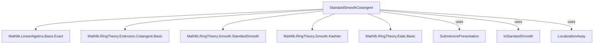
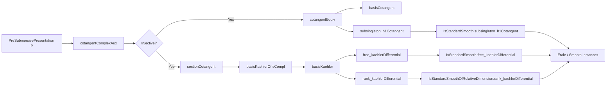

**Technical Brief: `StandardSmoothCotangent.lean`**

---

### 1. **Key Definitions & Theorems**

| Name | Type / Signature | Purpose |
|------|------------------|---------|
| `cotangentComplexAux` | `P.cotangentComplexAux : P.toExtension.Cotangent →ₗ[S] σ → S` | Auxiliary linear map encoding the action of derivations on relations; key to constructing the cotangent isomorphism. |
| `cotangentEquiv` | `P.cotangentEquiv : P.toExtension.Cotangent ≃ₗ[S] σ → S` | Isomorphism of $S$-modules showing $I / I^2$ is free on classes of relations $P.\text{relation}\ i$. |
| `basisCotangent` | `P.basisCotangent : Basis σ S P.toExtension.Cotangent` | Explicit basis of $I / I^2$ given by classes of $P.\text{relation}\ r$. |
| `sectionCotangent` | `P.sectionCotangent : P.toExtension.CotangentSpace →ₗ[S] P.toExtension.Cotangent` | Section of the cotangent complex map; used to split the exact sequence. |
| `basisKaehlerOfIsCompl` | `P.basisKaehlerOfIsCompl : Basis κ S Ω[S⁄R]` | Basis of Kähler differentials indexed by a complement of $\text{range}(P.\text{map})$ in $\iota$. |
| `basisKaehler` | `P.basisKaehler : Basis ((\text{range}(P.\text{map}))^c) S Ω[S⁄R]` | Basis of $\Omega_{S/R}$ indexed by the complement of the relation indices. |
| `free_cotangent` | `Module.Free S P.toExtension.Cotangent` | $I / I^2$ is a free $S$-module. |
| `free_kaehlerDifferential` | `Module.Free S Ω[S⁄R]` | Kähler differentials are free over $S$. |
| `rank_kaehlerDifferential` | `Module.rank S Ω[S⁄R] = P.dimension` | Rank of $\Omega_{S/R}$ equals the dimension of the presentation $P$. |
| `subsingleton_h1Cotangent` | `Subsingleton P.toExtension.H1Cotangent` | $H^1(L_{S/R}) = 0$ for submersive presentations. |
| `cMulXSubOneCotangent` | `Generators.cMulXSubOneCotangent : (localizationAway S r).toExtension.Cotangent` | Generator of cotangent module for localization away from $r$. |
| `basisCotangentAway` | `Generators.basisCotangentAway : Module.Basis Unit S ...` | Basis for cotangent of localization (unit-indexed). |

**Corollaries for standard smooth algebras:**

| Name | Type | Purpose |
|------|------|---------|
| `IsStandardSmooth.free_kaehlerDifferential` | `Module.Free S Ω[S⁄R]` | Kähler differentials free for standard smooth algebras. |
| `IsStandardSmooth.subsingleton_h1Cotangent` | `Subsingleton (H1Cotangent R S)` | Vanishing of $H^1(L_{S/R})$ for standard smooth. |
| `IsStandardSmoothOfRelativeDimension.rank_kaehlerDifferential` | `Module.rank S Ω[S⁄R] = n` | Rank matches relative dimension. |
| `IsStandardSmoothOfRelativeDimension.iff_of_isStandardSmooth` | `IsStandardSmoothOfRelativeDimension n R S ↔ Module.rank S Ω[S⁄R] = n` | Characterization of relative dimension via rank. |
| `IsStandardSmoothOfRelationDimension.subsingleton_kaehlerDifferential` | `Subsingleton Ω[S⁄R]` | Zero-dimensional standard smooth ⇒ trivial Kähler differentials. |
| `instance [IsStandardSmooth R S] : Smooth R S` | `Smooth R S` | Standard smooth ⇒ smooth (formally smooth + f.p.). |
| `instance [IsStandardSmoothOfRelativeDimension 0 R S] : Etale R S` | `Etale R S` | Zero-dimensional standard smooth ⇒ étale. |

---

### 2. **Naming Conventions**

- **Prefixes:**
  - `cotangentComplexAux`, `cotangentEquiv`, `basisCotangent`: cotangent-related constructions.
  - `sectionCotangent`, `cotangentSpaceBasis`: splitting / basis for cotangent space.
  - `basisKaehler`, `basisKaehlerOfIsCompl`: Kähler differentials.
  - `cMulXSubOneCotangent`, `basisCotangentAway`: localization-specific.
  - `isStandardSmooth`, `IsStandardSmoothOfRelativeDimension`: properties of algebras.

- **Suffixes:**
  - `_aux`: auxiliary constructions (e.g., `cotangentComplexAux`).
  - `_equiv`, `_basis`: equivalence / basis definitions.
  - `_away`: localization away from an element.
  - `_of_...`: parameterized constructions (e.g., `basisKaehlerOfIsCompl`).

- **Notation:**
  - `P.map`, `P.relation`, `P.val`, `P.dimension`: standard fields of a presentation.
  - `I = ker(R[X] → S)` is implicit in all lemmas about `Cotangent`, `CotangentSpace`.

---

### 3. **Tactic Stack**

- **Core tactics:**
  - `simp`, `rw`, `simp_rw`, `ext`, `apply`, `intro`, `exact`, `refine`, `convert`
- **Algebraic simplification:**
  - `ring`, `aesop`, `grind` (custom tactic for Gröbner-style reasoning)
- **Module/Linear algebra:**
  - `apply_instance`, `inferInstance`, `exact_mod_cast`, `rw [Module.free_of_basis]`
- **Equivalence reasoning:**
  - `LinearEquiv.ofBijective`, `Basis.map_apply`, `LinearMap.ext`
- **Set-theoretic:**
  - `rw [Subtype.range_coe_subtype]`, `simp [Set.compl_eq]`, `rw [IsCompl.symm]`

---

### 4. **Proof Logic**

- **Inductive structure:** Proofs proceed by:
  1. **Unfolding definitions** (e.g., `cotangentComplexAux`, `cotangentEquiv`).
  2. **Reducing to pointwise equalities** via `funext`, `Pi.ext`, `LinearMap.ext`.
  3. **Using properties of derivations** (`pderiv` Leibniz rule, `aeval` evaluation).
  4. **Applying linear independence** (`linearIndependent_iff''`) to deduce coefficients vanish.
  5. **Using exactness / splitting lemmas** (`sectionCotangent_comp`, `ofSplitExact`) to construct bases.
  6. **Lifting to localization** via definitional equality of underlying extensions.

- **Typical flow for main theorems:**
  - *Injectivity* of `cotangentComplexAux`: reduce to membership in $I^2$ via derivation conditions.
  - *Surjectivity*: show image spans $\bigoplus_{i \in \sigma} S$ using `basisDeriv.span_eq`.
  - *Basis construction*: use `Basis.ofSplitExact` with `sectionCotangent` as splitting.
  - *Rank computation*: `rank_eq_card_basis` + `card_compl_set`.

---

### 5. **Imports & Dependencies**

| Import | Role |
|--------|------|
| `Mathlib.LinearAlgebra.Basis.Exact` | Exact sequences, splitting lemmas (`ofSplitExact`). |
| `Mathlib.RingTheory.Extension.Cotangent.Basic` | Cotangent complex, $I/I^2$, $H^1(L_{S/R})$. |
| `Mathlib.RingTheory.Smooth.StandardSmooth` | Standard smooth algebras, presentations. |
| `Mathlib.RingTheory.Smooth.Kaehler` | Kähler differentials, derivations, `Ω[S/R]`. |
| `Mathlib.RingTheory.Etale.Basic` | Étale algebras, formally étale/smooth/unramified. |

---

### 6. **Mermaid Diagrams**

#### **Dependency Graph (Module-Level)**

#### **Overview of Theory Flow**

---

### 7. **Notational Conventions Recap**

- `P : SubmersivePresentation R S ι σ`: presentation with:
  - `ι`: total generators,
  - `σ`: relations,
  - `P.map : σ → ι`: inclusion of relations into generators,
  - `P.relation : σ → MvPolynomial ι R`: defining relations,
  - `P.val : MvPolynomial ι R → S`: quotient map,
  - `I = ker(P.val)`.
- `P.dimension = Fintype.card ι - Fintype.card σ`.
- `Ω[S/R]`: Kähler differentials.
- `Cotangent = I / I²`, `CotangentSpace = ⨁_{i ∈ ι} S dxᵢ`.

---

This file formalizes foundational results in *smooth* and *standard smooth* algebra, especially the structure of the cotangent complex and Kähler differentials. It serves as a bridge between *presentation-based* arguments (submersive presentations) and *intrinsic* properties (smoothness, étaleness, freeness).
