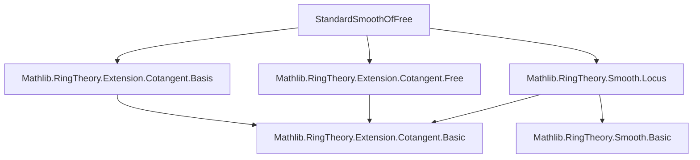
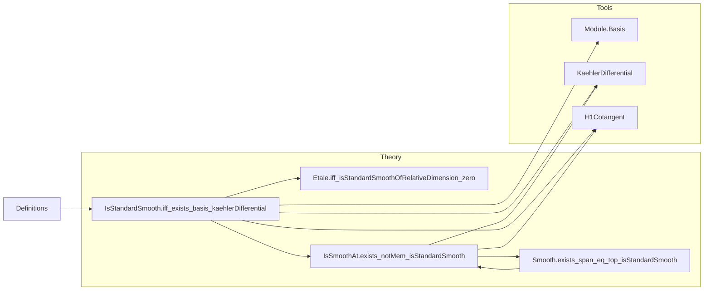

Here is the structured technical metadata extracted from `StandardSmoothOfFree.lean`:

---

### **1. Key Definitions & Theorems**

| Name | Type / Signature | Purpose |
|------|------------------|---------|
| `IsStandardSmooth.of_basis_kaehlerDifferential` | `[FinitePresentation R S] → Subsingleton (H1Cotangent R S) → Module.Basis I S (Ω[S⁄R]) → Set.range b ⊆ Set.range (D R S) → IsStandardSmooth R S` | Proves standard smoothness from existence of a basis of Kähler differentials consisting of exact differentials, assuming $H^1(S/R) = 0$. |
| `IsStandardSmooth.iff_exists_basis_kaehlerDifferential` | `[FinitePresentation R S] → IsStandardSmooth R S ↔ Subsingleton (H1Cotangent R S) ∧ ∃ I b, Module.Basis I S (Ω[S⁄R]) ∧ Set.range b ⊆ Set.range (D R S)` | Main equivalence: standard smoothness ⇔ $H^1 = 0$ + $\Omega^1$ free on exact differentials. |
| `Etale.iff_isStandardSmoothOfRelativeDimension_zero` | `Etale R S ↔ IsStandardSmoothOfRelativeDimension 0 R S` | Characterizes étale algebras as standard smooth algebras of relative dimension 0. |
| `IsSmoothAt.exists_notMem_isStandardSmooth` | `[FinitePresentation R S] → p.IsPrime → IsSmoothAt R p → ∃ f ∉ p, IsStandardSmooth R (Localization.Away f)` | Local-to-global: smoothness at a prime implies standard smoothness on some basic open neighborhood. |
| `Smooth.exists_span_eq_top_isStandardSmooth` | `[Smooth R S] → ∃ s, Ideal.span s = ⊤ ∧ ∀ x ∈ s, IsStandardSmooth R (Localization.Away x)` | Global version: smoothness implies existence of a cover by standard smooth localizations. |

**Notation & auxiliary terms**:
- `Ω[S⁄R]`: Kähler differentials module.
- `D R S : S →ₗ[R] Ω[S⁄R]`: universal derivation.
- `H1Cotangent R S`: first cotangent homology, i.e., $H^1(S/R)$.
- `IsStandardSmooth R S`: standard smoothness (finitely presented + Jacobian condition).
- `IsStandardSmoothOfRelativeDimension n R S`: standard smooth of relative dimension $n$.
- `SubmersivePresentation`, `PreSubmersivePresentation`: presentations satisfying Jacobian-like conditions.

---

### **2. Naming Conventions**

- **Prefixes**:
  - `isStandardSmooth`: predicate-style naming for properties.
  - `of_`, `iff_`: for introduction/characterization theorems.
  - `exists_`: for existence lemmas (often local-to-global).
- **Suffixes**:
  - `_of_basis_kaehlerDifferential`: indicates reliance on basis of Kähler differentials.
  - `_of_relativeDimension_zero`: specifies dimension condition.
- **Module-theoretic terms**:
  - `basis`, `repr`, `bijective`, `linearCombination`, `Finsupp`, `mapExtendScalars`: standard module/linear algebra vocabulary.
- **Geometric terms**:
  - `basicOpen`, `Localization.Away`, `PrimeSpectrum`: reflects scheme-theoretic context.

---

### **3. Tactic Stack**

Frequently used tactics in proofs:
- `nontriviality`: to assume $S \neq 0$ when needed.
- `obtain ⟨…⟩`: destructuring existential/universal hypotheses.
- `choose`: for choice functions (e.g., lifting basis elements to preimages under $D$).
- `simp` / `simp_rw`: simplification using algebraic identities (e.g., `hb`, `hcomp`, `map_linearCombination`).
- `rw [← …]`: rewriting using equivalences or module isomorphisms.
- `ext`: extensionality for functions/morphisms.
- `grind`: custom tactic (likely from Mathlib’s `Grind` module) for routine goal solving.
- `apply`, `refine`, `exact`: standard proof construction.
- `convert`, `trans`: for transitivity chains or approximate equality.

---

### **4. Proof Logic**

**General proof strategy**:
- **Forward direction** (`IsStandardSmooth → ∃ basis`):  
  Use the definition of standard smoothness (existence of a *submersive presentation*), then extract the basis of $\Omega^1$ from the cotangent module via `P.basisKaehler`, and verify it lies in the image of $D$.

- **Backward direction** (`∃ basis → IsStandardSmooth`):  
  Construct a *submersive presentation* from the given basis:
  1. Lift basis elements to preimages under $D$.
  2. Extend to a presentation $P$.
  3. Show the cotangent restriction map is bijective using the basis condition.
  4. Apply `isUnit_jacobian_of_cotangentRestrict_bijective` to upgrade to a *submersive* presentation.
  5. Conclude via `P''.isStandardSmooth`.

- **Smooth ⇒ locally standard smooth**:
  - Reduce to global smoothness via localization.
  - Use flatness + finite presentation to get a local basis of $\Omega^1$.
  - Extend this basis to a neighborhood $D(g)$ using finite presentation.
  - Apply the previous equivalence on $S[1/g]$.

- **Étale ⇔ standard smooth dim 0**:
  - Use that étale implies smooth + relative dimension 0.
  - In dim 0, $\Omega^1 = 0$, so basis is empty; $H^1 = 0$ automatically.

---

### **5. Imports**

| Import | Purpose |
|--------|---------|
| `Mathlib.RingTheory.Extension.Cotangent.Basis` | Module-theoretic basis tools for cotangent modules. |
| `Mathlib.RingTheory.Extension.Cotangent.Free` | Free module structure on Kähler differentials in presentations. |
| `Mathlib.RingTheory.Smooth.Locus` | Local properties of smooth morphisms (e.g., `IsSmoothAt`, `Smooth`). |

---

### **6. Mermaid Diagrams**

#### **Dependency Graph (Module-Level)**

#### **Overview of File Structure**

---

Let me know if you'd like a formalized dependency graph for the *proof terms* or a visualization of the presentation construction used in `of_basis_kaehlerDifferential`.
