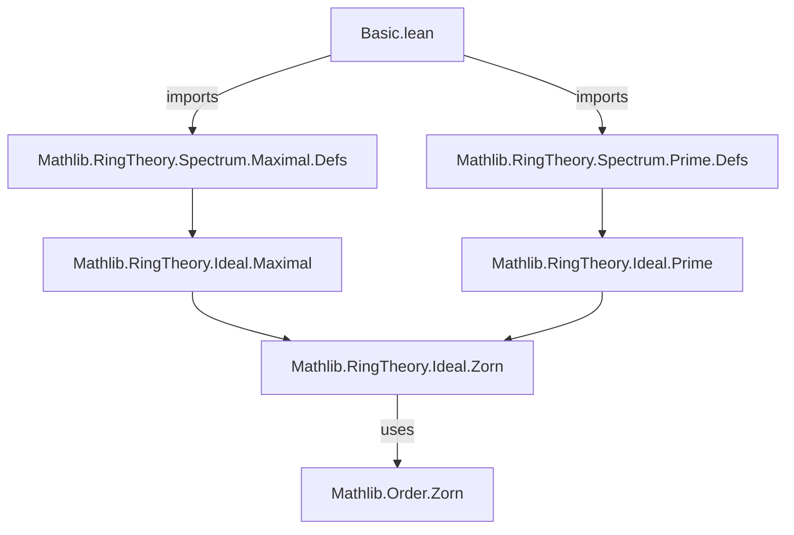

**Technical Brief: `Basic.lean` — Maximal Spectrum of a Commutative Semiring**

---

### 1. **Key Definitions & Theorems**

| Name | Type / Signature | Purpose |
|------|------------------|---------|
| `equivSubtype` | `MaximalSpectrum R ≃ {I : Ideal R // I.IsMaximal}` | Establishes a bijection between the maximal spectrum (as a type of maximal ideals) and the subtype of maximal ideals in `R`. |
| `range_asIdeal` | `Set.range MaximalSpectrum.asIdeal = {J : Ideal R | J.IsMaximal}` | Shows that the image of `asIdeal` (the underlying ideal projection) is precisely the set of maximal ideals. |
| `toPrimeSpectrum` | `MaximalSpectrum R → PrimeSpectrum R` | Embeds a maximal ideal into the prime spectrum via the fact that maximal ideals are prime. |
| `toPrimeSpectrum_injective` | `Injective toPrimeSpectrum` | Proves the embedding into the prime spectrum is injective. |
| `instance [Nontrivial R] : Nonempty (MaximalSpectrum R)` | `Nonempty (MaximalSpectrum R)` | Guarantees existence of at least one maximal ideal in any nontrivial commutative semiring (uses `Ideal.exists_maximal`). |

---

### 2. **Naming Conventions**

- **Prefixes**:
  - `asIdeal`: Projects a maximal spectrum point to its underlying ideal.
  - `toPrimeSpectrum`: Indicates a canonical map *to* the prime spectrum.
- **Suffixes**:
  - `equivSubtype`: Suffix `subtype` indicates equivalence with a subtype (here, maximal ideals).
- **General pattern**:
  - `isMaximal`, `isPrime`: Predicates on ideals.
  - `mk`: Used implicitly in `⟨I, hI⟩` style constructors.

---

### 3. **Tactic Stack**

Frequently used tactics in proofs:
- `simps`: For generating `simp` lemmas about constructors/projections.
- `ext`, `ext_iff`: For extensionality (equality of ideals/points).
- `Set.ext`: To prove equality of sets via extensionality.
- `mem_range`, `mem_setOf`: For unfolding membership in range/set-of.
- `let ... in`: Local definition + rewriting.
- `by simpa only [...] using ...`: For targeted simplification using an existing fact.

No heavy automation (e.g., `aesop`, `ring`, `linarith`) appears—proofs are mostly structural and rely on `simp`-based reasoning.

---

### 4. **Proof Logic**

- **Structure**: Mostly direct, case-insensitive reasoning.
- **Typical flow**:
  1. Unfold definitions (`Set.ext`, `mem_range`, `mem_setOf`).
  2. Use `let` or `obtain` to extract witnesses.
  3. Apply properties like `isMaximal.isPrime` or `Ideal.exists_maximal`.
  4. Use `simpa` or `simp` with `mk.injEq`/`PrimeSpectrum.ext_iff` to finish equality goals.
- **No induction** or transfinite arguments—relies on algebraic existence results (`Ideal.exists_maximal`) and type-theoretic equivalences.

---

### 5. **Imports**

- `Mathlib.RingTheory.Spectrum.Maximal.Defs`: Defines `MaximalSpectrum` and basic infrastructure.
- `Mathlib.RingTheory.Spectrum.Prime.Defs`: Defines `PrimeSpectrum`, used for comparison/embedding.

> These imports indicate this file is part of the *spectrum* hierarchy in Mathlib, specifically focusing on the *maximal* variant.

---

### 6. **Dependency & Theory Overview (Mermaid Diagrams)**

#### **Module Dependency**


#### **Theoretical Overview**
```mermaid
graph LR
  A[CommSemiring R] --> B[MaximalSpectrum R]
  A --> C[PrimeSpectrum R]
  B -->|toPrimeSpectrum| C
  B <-->|equivSubtype| D[{I // I.IsMaximal}]
  C <-->|equivSubtype| E[{I // I.IsPrime}]
  D -->|inclusion| E
```

- `MaximalSpectrum R` is defined as a subtype of `Ideal R` (maximal ideals).
- It injects into `PrimeSpectrum R` (since maximal ⇒ prime).
- Both spectra are equivalent to their respective subtypes of ideals, enabling algebraic reasoning.

---

### 7. **Summary**

This file formalizes foundational facts about the **maximal spectrum** of a commutative semiring:
- It identifies `MaximalSpectrum R` with the subtype of maximal ideals.
- It constructs the natural injection into the prime spectrum.
- It proves nonemptiness under `Nontrivial R`, relying on Zorn’s Lemma (via `Ideal.exists_maximal`).

It serves as a minimal but rigorous base for further development (e.g., topology on spectra, structure sheaves, etc.).

--- 

Let me know if you'd like a formalization of the Zariski topology on `MaximalSpectrum R` next.
