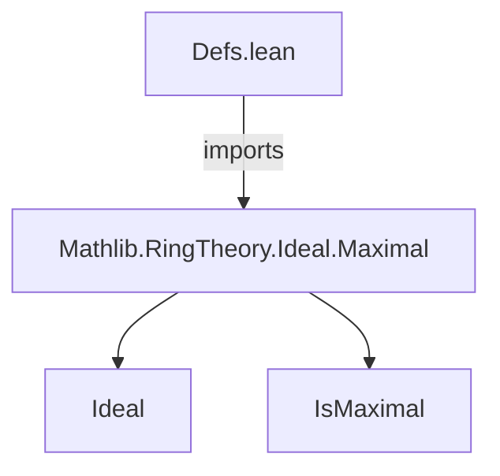
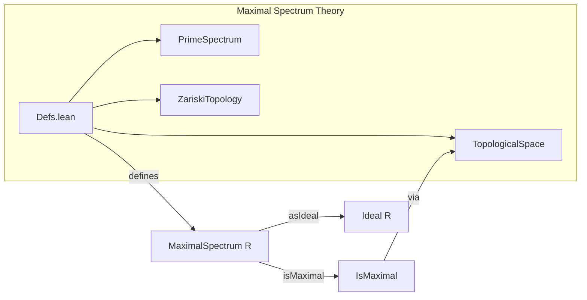

**Technical Brief: `Defs.lean` — Maximal Spectrum of a Commutative (Semi)ring**

---

### 1. **Key Definitions & Theorems**

| Name | Type / Signature | Purpose |
|------|------------------|---------|
| `MaximalSpectrum` | `CommSemiring R → Type*` | A structure representing a maximal ideal of a commutative semiring `R`. It bundles an ideal `asIdeal : Ideal R` with a proof `isMaximal : asIdeal.IsMaximal`. |
| `MaximalSpectrum.isMaximal` | `[instance]` | Instance attribute marking the `isMaximal` field as an instance, enabling typeclass inference for maximality. |
| `MaximalSpectrum.ext` | `[ext]` | Extensionality instance: two maximal spectra are equal if their underlying ideals are equal. |

> **Note**: No named theorems are defined in this file; it only introduces the core definition and attributes.

---

### 2. **Naming Conventions**

- **Structure name**: `MaximalSpectrum` — camelCase with capitalized components, descriptive of mathematical object.
- **Field names**:
  - `asIdeal` — indicates the underlying mathematical object (an ideal).
  - `isMaximal` — predicate-style name (`is_` prefix) for the property (maximality) of the ideal.
- **Attribute annotation**: `@[ext]`, `@[instance]` — standard Lean naming for attributes (no suffix/prefix convention beyond standard syntax).

---

### 3. **Tactic Stack**

- **None used in this file** — the file contains only a structure definition and attribute annotations. No proofs or tactic scripts appear.

---

### 4. **Proof Logic**

- **Not applicable** — this file is purely definitional; no proofs or logical reasoning steps are present.

---

### 5. **Imports**

| Module | Purpose |
|--------|---------|
| `Mathlib.RingTheory.Ideal.Maximal` | Provides the definition of `Ideal.IsMaximal`, needed to express the maximality condition in `MaximalSpectrum`. |

> This import ensures access to the notion of maximal ideals in the context of commutative semirings.

---

### 8. **Mermaid Diagrams**

#### **Dependency Graph**

#### **Overview of File & Theory Context**

> **Explanation**:  
> - `Defs.lean` defines the foundational type `MaximalSpectrum R`.  
> - It relies on `Mathlib.RingTheory.Ideal.Maximal` for the `IsMaximal` predicate.  
> - Future developments (not in this file) will likely equip `MaximalSpectrum R` with a topology (subspace of `PrimeSpectrum R` with the Zariski topology), hence the dashed dependency to `TopologicalSpace` and `ZariskiTopology`.

--- 

Let me know if you'd like the next file (`Topologies.lean` or similar) analyzed similarly.
