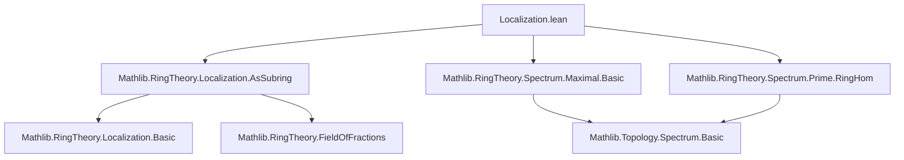
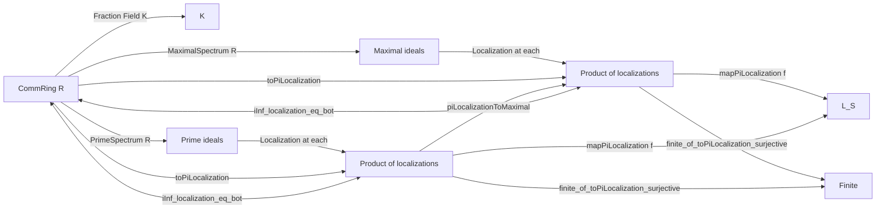

### Technical Brief: Localization.lean — Maximal and Prime Spectrum Localization Results

---

#### **1. Key Definitions & Theorems**

| Name | Type / Signature | Purpose |
|------|------------------|---------|
| `MaximalSpectrum.PiLocalization R` | `Type _` | Product of localizations of `R` at all maximal ideals, viewed as subalgebras of a common overring (e.g., fraction field). |
| `MaximalSpectrum.toPiLocalization R` | `R →+* PiLocalization R` | Canonical ring map into the product of localizations at maximal ideals; always injective. |
| `MaximalSpectrum.toPiLocalization_injective` | `Function.Injective (toPiLocalization R)` | Proof that the canonical map is injective. |
| `MaximalSpectrum.mapPiLocalization f hf` | `PiLocalization R →+* PiLocalization S` | Functoriality of `PiLocalization` for bijective ring maps `f : R →+* S`. |
| `MaximalSpectrum.mapPiLocalization_naturality` | `(mapPiLocalization f hf).comp (toPiLocalization R) = (toPiLocalization S).comp f` | Naturality square commutes. |
| `MaximalSpectrum.mapPiLocalization_bijective` | `Function.Bijective (mapPiLocalization f hf)` | `mapPiLocalization` preserves bijectivity. |
| `MaximalSpectrum.iInf_localization_eq_bot` | `⨅ v : MaximalSpectrum R, Localization.subalgebra.ofField K _ ... = ⊥` | Integral domain = intersection of localizations at maximal ideals inside its fraction field. |
| `MaximalSpectrum.finite_of_toPiLocalization_surjective` | `Surjective (toPiLocalization R) → Finite (MaximalSpectrum R)` | Surjectivity of canonical map implies only finitely many maximal ideals. |
| `PrimeSpectrum.PiLocalization R` | `Type _` | Product of localizations at *all* prime ideals. |
| `PrimeSpectrum.toPiLocalization R` | `R →+* PiLocalization R` | Canonical map into product over all primes; always injective. |
| `PrimeSpectrum.piLocalizationToMaximal R` | `PiLocalization R →+* MaximalSpectrum.PiLocalization R` | Projection from prime-based product to maximal-based product. |
| `PrimeSpectrum.piLocalizationToMaximal_surjective` | `Surjective (piLocalizationToMaximal R)` | Projection is surjective. |
| `PrimeSpectrum.piLocalizationToMaximalEquiv h` | `PiLocalization R ≃+* MaximalSpectrum.PiLocalization R` | Isomorphism when Krull dimension ≤ 0 (i.e., all primes are maximal). |
| `PrimeSpectrum.isMaximal_of_toPiLocalization_surjective` | `Surjective (toPiLocalization R) → I.1.IsMaximal` | If canonical map is surjective, every prime ideal is maximal. |
| `PrimeSpectrum.finite_of_toPiLocalization_surjective` | `Surjective (toPiLocalization R) → Finite (PrimeSpectrum R)` | Surjectivity ⇒ finite prime spectrum. |

---

#### **2. Naming Conventions**

- **Prefixes**:
  - `toPiLocalization`: canonical map into product of localizations.
  - `piLocalizationTo*`: projection or equivalence between products over different spectra.
  - `mapPiLocalization`: induced map on products under ring homomorphism.
  - `iInf_localization_eq_bot`: intersection (infimum) of localizations equals zero (i.e., intersection of subalgebras is trivial).

- **Suffixes**:
  - `_injective`, `_surjective`, `_bijective`: properties of maps.
  - `_naturality`, `_id`, `_comp`: categorical properties.
  - `_equiv`, `_isMaximal`: structural consequences (e.g., equivalence, maximality).

- **Variables**:
  - `R`, `S`, `P`: commutative semirings/rings.
  - `I`, `J`, `max`, `v`: maximal/prime ideals or points in spectra.
  - `K`: fraction field (when `R` is a domain).
  - `ι`: indexing type for products.

---

#### **3. Tactic Stack**

Frequently used tactics in proofs:

| Tactic | Usage |
|--------|-------|
| `ext` | Extensionality for functions/ideals/submodules. |
| `rw [← ...]` | Rewriting using algebra/map properties. |
| `simp_rw` | Simplify with rewrite rules (e.g., `Localization.localRingHom_mk'`). |
| `congr` | Congruence closure for function equality. |
| `funext` | Extensionality for functions. |
| `have/hyp` / `obtain` | Intermediate lemma construction. |
| `rcases` / `cases` | Destruct existential/universal quantifiers. |
| `simpa` | Simplify and discharge goal using assumptions. |
| `contrapose!` | Contrapositive + classical reasoning. |
| `ring` / `linarith` | Arithmetic reasoning (implicit in `simpa`, `ring` may be used in background). |
| `exact` / `assumption` | Direct proof steps. |

---

#### **4. Proof Logic**

- **Structure of proofs**:
  - **Injectivity**: Use ideal-theoretic arguments: assume `r ≠ 0`, find maximal ideal avoiding denominator, derive contradiction.
  - **Surjectivity ⇒ finiteness**:
    - Lift surjectivity through `mapPiLocalization` (bijective).
    - Reduce to product case (`Π i, R i`) using naturality.
    - Use `toPiLocalization_not_surjective_of_infinite` (contrapositive).
  - **Intersection = bot**:
    - For maximal case: use denominator ideal, extend to maximal ideal, use localization description.
    - For prime case: reduce to maximal case via inclusion of spectra.
  - **Krull dimension 0 ⇒ equivalence**:
    - Define inverse using `if ... then ... else 0` (classical choice).
  - **Every prime maximal under surjectivity**:
    - Assume not, embed into maximal ideal, construct function not in range using `Function.update`, contradiction.

- **Common pattern**:
  > *Induction on structure of ring maps or spectra → reduce to known lemmas (e.g., injectivity, localization universal property) → use ideal theory (existence of maximal ideals, prime avoidance) → conclude via contradiction or direct computation.*

---

#### **5. Imports & Dependencies**

| Module | Purpose |
|--------|---------|
| `Mathlib.RingTheory.Localization.AsSubring` | Localization as subring of fraction field; `Localization.subalgebra.ofField`. |
| `Mathlib.RingTheory.Spectrum.Maximal.Basic` | Definition of `MaximalSpectrum`, basic topology/structure. |
| `Mathlib.RingTheory.Spectrum.Prime.RingHom` | Prime spectrum, `PrimeSpectrum`, `asIdeal`, `toPrimeSpectrum`. |

**Key underlying theories**:
- Localization of rings at multiplicative sets.
- Prime and maximal spectra as topological spaces.
- Fraction fields and integral domains.
- Module theory (comap, span, annihilators).
- Classical choice (e.g., `Classical.choice` for `if ... then ... else`).

---

#### **6. Mermaid Diagrams**

##### **Dependency Graph (Module-Level)**



##### **Overview of Theory Flow**



##### **Logical Flow of Main Theorems**

```mermaid
graph TD
  A[Surjective toPiLocalization R] --> B[toPiLocalization_injective R]
  A --> C[mapPiLocalization_bijective]
  C --> D[Naturality]
  D --> E[Reduce to Π i, R i case]
  E --> F[toPiLocalization_not_surjective_of_infinite]
  F --> G[¬ Infinite ι]
  G --> H[Finite ι]

  I[IsDomain R] --> J[Field K = Frac(R)]
  J --> K[iInf_localization_eq_bot (Maximal)]
  K --> L[iInf_localization_eq_bot (Prime)]
  L --> M[Intersection of localizations = R]
```

---

#### **7. Summary**

This file formalizes foundational results about localizing commutative rings at prime/maximal ideals and embedding them into products of localizations. Key themes:

- **Injectivity** of the canonical map into the product of localizations.
- ** Functoriality** of localization products under bijective ring maps.
- **Finiteness criteria**: surjectivity of the canonical map implies finiteness of prime/maximal spectra.
- **Krull dimension 0 equivalence**: when all primes are maximal, the prime and maximal localization products coincide.
- **Intersection characterization**: an integral domain equals the intersection of its localizations at all primes/maximals inside its fraction field.

These results are central to algebraic geometry (e.g., sheaf of rings on spectra) and commutative algebra (e.g., Jacobson rings, semilocal rings).
