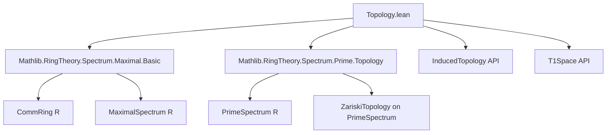
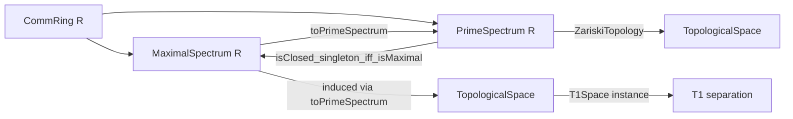

**Technical Brief: `Topology.lean` — Zariski Topology on Maximal Spectrum**

---

### 1. **Key Definitions & Theorems**

| Name | Type / Statement | Purpose |
|------|------------------|---------|
| `toPrimeSpectrum` | `MaximalSpectrum R → PrimeSpectrum R` | Canonical inclusion of maximal ideals into prime ideals. |
| `zariskiTopology` | `TopologicalSpace (MaximalSpectrum R)` | Defines the Zariski topology on `MaximalSpectrum R` as the *induced* topology via `toPrimeSpectrum`. |
| `toPrimeSpectrum_range` | `Set.range toPrimeSpectrum = {x | IsClosed ({x} : Set (PrimeSpectrum R))}` | Characterizes the image of `toPrimeSpectrum` as the set of *closed points* in `PrimeSpectrum R`, i.e., maximal ideals. |
| `T1Space` instance | `T1Space (MaximalSpectrum R)` | Proves the maximal spectrum is a $T_1$ space under the Zariski topology. |

---

### 2. **Naming Conventions**

- **Prefixes**:
  - `toPrimeSpectrum_`: for maps/properties related to the canonical inclusion into the prime spectrum.
  - `isClosed_`: for properties about closedness (e.g., `isClosed_singleton_iff_isMaximal`).
  - `zariski_`: for topology-related constructions (e.g., `zariskiTopology`).
- **Suffixes**:
  - `_induced`: for induced topologies (e.g., `induced` in `zariskiTopology` definition).
  - `_continuous`: for continuity lemmas (e.g., `toPrimeSpectrum_continuous`).

---

### 3. **Tactic Stack**

- `simp only [...]` — for rewriting using equivalence lemmas.
- `ext` — extensionality for set equality.
- `rw`, `exact`, `apply`, `simpa` — standard proof scripting.
- `mpr` — used with iff-elimination (e.g., `isClosed_induced_iff_isMaximal.mpr`).
- `cases` — implicit in `⟨x, _⟩` destructuring.

No heavy automation (e.g., `aesop`, `ring`, `linarith`) is used — proofs are mostly *manual* and rely on algebraic geometry API.

---

### 4. **Proof Logic**

- **Structure**: Direct, case-free reasoning using set-theoretic and topological characterizations.
- **Typical Flow**:
  1. Use `ext` to reduce set equality to element-wise equivalence.
  2. Apply `isClosed_singleton_iff_isMaximal` to translate closedness of singletons to maximality.
  3. Use `preimage_image_eq` and injectivity of `toPrimeSpectrum` to handle induced topology properties.
  4. For $T_1$ proof: apply `isClosed_induced_iff_isMaximal`, then use singleton closedness + injectivity.

No induction or case analysis on terms — relies on algebraic properties of ideals and topological lemmas about induced topologies.

---

### 5. **Imports**

- `Mathlib.RingTheory.Spectrum.Maximal.Basic`  
  → Defines `MaximalSpectrum R`, its points (maximal ideals), and basic constructions.
- `Mathlib.RingTheory.Spectrum.Prime.Topology`  
  → Defines `PrimeSpectrum R`, its Zariski topology, and induced topology machinery.

These imports indicate the module sits at the intersection of:
- **Commutative algebra** (ideals, maximality),
- **Point-set topology** (induced/subspace topology, $T_1$ separation),
- **Scheme theory foundations** (prime/maximal spectra, Zariski topology).

---

### 6. **Mermaid Diagrams**

#### Dependency Graph (Module-Level)

#### Overview of Theory Flow

---

### 7. **Summary**

This module formalizes the **Zariski topology on the maximal spectrum** of a commutative ring by leveraging the *induced topology* from the prime spectrum. It avoids duplication by reusing the prime spectrum’s topology and zero-locus API. Key results include:
- A set-theoretic description of the image of `toPrimeSpectrum`,
- Proof that the maximal spectrum is $T_1$ under this topology.

The formalization is minimal, clean, and highly aligned with standard algebraic geometry practice — emphasizing categorical and topological naturality over ad-hoc constructions.
