### Technical Brief: Chevalley’s Theorem in Lean 4 (Chevalley.lean)

---

#### **1. Key Definitions & Theorems**

| Name | Type / Signature | Purpose |
|------|------------------|---------|
| `isConstructible_comap_C` | `{s : Set (PrimeSpectrum (Polynomial R))} → IsConstructible s → IsConstructible (comap Polynomial.C '' s)` | Proves constructibility of image under `comap Polynomial.C`, a key base case in induction. |
| `ChevalleyThm.chevalley_polynomialC` | (Imported from `ChevalleyComplexity`) | Provides the Chevalley property for polynomial extension: image of constructible set under `Spec(Polynomial R) → Spec R` is constructible. |
| `isConstructible_comap_image` | `{f : R →+* S} → f.FinitePresentation → IsConstructible s → IsConstructible (comap f '' s)` | **Main theorem**: Image of constructible set under `Spec(S) → Spec(R)` is constructible if `f` is of finite presentation. |
| `isConstructible_range_comap` | `{f : R →+* S} → f.FinitePresentation → IsConstructible (Set.range (comap f))` | Special case: range of `comap f` is constructible. |
| `isOpenMap_comap_of_hasGoingDown_of_finitePresentation` | `[Algebra R S] → [Algebra.HasGoingDown R S] → [Algebra.FinitePresentation R S] → IsOpenMap (comap (algebraMap R S))` | Consequence: `comap` of structure map is an open map under Going-Down + finite presentation. |

---

#### **2. Naming Conventions**

- **Prefixes**:
  - `isConstructible_`: predicates constructibility of sets.
  - `comap_`: refers to induced map on prime spectra from ring homomorphism.
  - `image_`: indicates image under a map.
- **Suffixes**:
  - `_C`: for the polynomial extension case (`Polynomial.C`).
  - `_image`: for general finite presentation case.
  - `_range`: for range-specific statements.
- **Other**:
  - `hasGoingDown`, `finitePresentation`, `isOpenMap`: standard algebraic geometry properties.

---

#### **3. Tactic Stack**

- `obtain ⟨…⟩ := …`: destructuring existential/iff proofs.
- `rw [hT]`, `simp only [...]`: rewriting and simplification.
- `exact`, `refine`: constructing proofs via known lemmas or partial proofs.
- `induction` (via `polynomial_induction`): structural induction on finite presentation (via `RingHom.finitePresentation` inductively).
- `rw [range_comap_of_surjective]`, `rw [Set.image_comp]`: set-theoretic rewrites.
- `exact isRetrocompact_zeroLocus_compl_of_fg`: specialized algebraic geometry lemma.
- `simp only [comap_comp]`: simplification of composition of `comap`.

---

#### **4. Proof Logic**

- **Inductive structure** on `f.FinitePresentation`:
  - Base case: polynomial extension (`Polynomial R`), handled by `isConstructible_comap_C`, using `ChevalleyThm.chevalley_polynomialC`.
  - Inductive steps:
    1. **Surjective maps**: image of constructible set under closed embedding is constructible (uses `isClosedEmbedding_comap_of_surjective`, `isRetrocompact_zeroLocus_compl_of_fg`).
    2. **Localization / tensor product**: uses composition of maps and inductive hypotheses (`H₁`, `H₂`) to reduce to earlier cases.
- **Topological arguments**:
  - Constructible sets stable under generalization ⇒ constructible image ⇒ open map (via `isOpen_of_stableUnderGeneralization_of_isConstructible`).
- **Going-Down** used to ensure generalization stability of images of basic opens.

---

#### **5. Imports & Dependencies**

| Module | Role |
|--------|------|
| `Mathlib.RingTheory.Ideal.GoingDown` | Provides `Algebra.HasGoingDown`, key for open mapping result. |
| `Mathlib.RingTheory.Spectrum.Prime.ChevalleyComplexity` | Contains `ChevalleyThm.chevalley_polynomialC`, the core Chevalley property for polynomial rings. |
| `Mathlib.RingTheory.Spectrum.Basic` (via `PrimeSpectrum`) | Prime spectrum, `comap`, constructible sets, basic opens. |
| `Mathlib.RingTheory.FinitePresentation` | `FinitePresentation` class and induction principle (`polynomial_induction`). |
| `Mathlib.Topology.Basic` (via `Topology`) | Open/closed maps, constructible topology, stability under generalization. |

---

#### **6. Mermaid Diagrams**

##### **Dependency Graph (Module Level)**

```mermaid
graph TD
  Chevalley.lean --> Mathlib.RingTheory.Ideal.GoingDown
  Chevalley.lean --> Mathlib.RingTheory.Spectrum.Prime.ChevalleyComplexity
  Chevalley.lean --> Mathlib.RingTheory.Spectrum.Basic
  Chevalley.lean --> Mathlib.RingTheory.FinitePresentation
  Chevalley.lean --> Mathlib.Topology.Basic

  ChevalleyComplexity.lean --> Mathlib.RingTheory.Spectrum.Prime.ChevalleyComplexity.Base
  ChevalleyComplexity.lean --> Mathlib.RingTheory.Localization.Basic
  ChevalleyComplexity.lean --> Mathlib.RingTheory.TensorProduct.Basic
```



##### **Theoretical Overview (Chevalley.lean)**

```mermaid
flowchart LR
  A[Finite Presentation f : R →+* S] --> B[Constructible s ⊆ Spec S]
  B --> C[comap f '' s ⊆ Spec R]
  C --> D[IsConstructible]

  subgraph Induction
    B1[Polynomial Case] -->|ChevalleyThm| C1
    B2[Surjective Case] -->|Closed Embedding| C2
    B3[Localization/Tensor] -->|Inductive Hypotheses| C3
  end

  D --> E[Range of comap f is constructible]
  D --> F[comap f is open map (if Going-Down holds)]
```

---

#### **7. Notes on Formalization Strategy**

- Uses **constructible sets** (`IsConstructible`) as the natural topology for Chevalley’s theorem (coarser than Zariski, closed under images of constructible maps).
- Leverages `polynomial_induction` on `FinitePresentation`, a standard technique in algebraic geometry formalizations (see Stacks Project Tag [00IS](https://stacks.math.columbia.edu/tag/00IS)).
- The proof is **topological**: constructibility + stability under generalization ⇒ openness (via `isOpen_of_stableUnderGeneralization_of_isConstructible`).
- The `isConstructible_range_comap` lemma is a corollary of `isConstructible_comap_image` applied to `s = ⊤`.

---

Let me know if you'd like a formalized proof sketch in natural language or a dependency graph for `ChevalleyComplexity.lean`.
