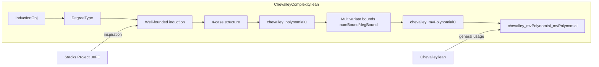

Here is the **technical metadata extraction** for `ChevalleyComplexity.lean`, structured as requested:

---

### 1. KEY DEFINITIONS & THEOREMS

| Name | Type / Signature | Purpose |
|------|------------------|---------|
| `DegreeType` | `abbrev (n : ℕ) → (Fin n → WithBot ℕ) ×ₗ Prop` | Codomain of the well-founded measure used in induction for the `R → R[X]` case. |
| `InductionObj` | `structure (R : Type*) [CommRing R] (n : ℕ) where val : Fin n → R[X]` | Represents a finite family of polynomials over `R`, used as the induction object. |
| `coeffSubmodule` | `def (e : InductionObj R n) : Submodule R₀ R` | Submodule generated by `1` and all coefficients of all polynomials in `e`. Ensures `1 ∈ M` so powers are monotone. |
| `degree` | `def (e : InductionObj R n) : DegreeType n` | Lexicographically ordered pair: degrees of `e`, plus a proposition ensuring minimality of a monic polynomial. Used as the decreasing measure. |
| `degBound` | `def (e : InductionObj R n) : ℕ` | Sum of `degree + 1` over all polynomials in `e`. Upper bound on degrees needed in output constructible set. |
| `powBound` | `def (e : InductionObj R n) : ℕ` | `degBound ^ degBound`. Bound on the power of `coeffSubmodule` needed to contain coefficients of output polynomials. |
| `Statement` | `def (R₀ [Algebra ℤ R]) (n) : Prop` | Inductive statement: for any `f : R[X]`, `comap C '' (Z(e) \ Z(f))` is constructible with bounded complexity. |
| `induction_structure` | `lemma` | General induction principle over `InductionObj` using 4 cases: zero vector, single monic, reduction modulo monic, localization + quotient. |
| `induction_aux` | `lemma` | Instantiates `induction_structure` for `Statement`, handling localization at leading coefficient and quotient by its ideal. |
| `statement` | `lemma` | Main induction proof for `Statement`, establishing the `R → R[X]` case. |
| `chevalley_polynomialC` | `lemma` | Formal statement of complexity-aware Chevalley for `C : R → R[X]`. Outputs `T` with `comap C '' S.toSet = T.toSet` and explicit bounds on `n`, coefficients. |
| `numBound`, `degBound` (in `MvPolynomialC`) | `mutual def` | Tower-type bounds for number and degree of polynomials in the multivariate case `R → R[X₁, ..., Xₘ]`. |
| `degBound_casesOn_succ`, `numBound_casesOn_succ` | `lemma` | Recursive simplifications for bounds under case analysis on `n`. |
| `chevalley_mvPolynomialC` (not shown, but implied) | `lemma` | Multivariate version: `R → R[X₁, ..., Xₘ]`. Built by iterating `chevalley_polynomialC`. |
| `chevalley_mvPolynomial_mvPolynomial` (not shown) | `lemma` | General case: `f : R[Y₁, ..., Yₙ] → R[X₁, ..., Xₘ]`, via factorization through `R[X, Y]`. |

---

### 2. NAMING CONVENTIONS

- **Prefixes**:
  - `coeff_`: operations on coefficient submodules.
  - `degBound`, `powBound`, `numBound`: complexity bounds.
  - `induction_`: structural lemmas for the induction scheme.
  - `statement`: inductive hypothesis.
  - `chevalley_`: final theorems (case-specific).
- **Suffixes**:
  - `_C`: for maps `C : R → R[X]`.
  - `_mvPolynomial`: multivariate polynomial extensions.
  - `_succ`, `_zero`: case analysis on natural numbers.
- **Other**:
  - `ofLex`, `toLex`: for lexicographic ordering.
  - `update`, `%ₘ`: modular reduction by monic polynomial.
  - `Away`, `Ideal.Quotient`: localization/quotient constructions.

---

### 3. TACTIC STACK

| Tactic | Frequency | Purpose |
|--------|-----------|---------|
| `simp` | Very High | Simplification of set-theoretic and module-theoretic expressions (e.g., `zeroLocus`, `coeffSubmodule`, `map_span`). |
| `gcongr` | High | Proving inequalities for sums, powers, and suprema over finite types. |
| `rw` | High | Rewriting using lemmas like `degree_modByMonic_le`, `zeroLocus_union`, `preimage_comap_zeroLocus`. |
| `exact`, `refine`, `apply` | High | Proof construction, especially for existential statements and induction steps. |
| `intro`, `cases`, `obtain` | High | Introducing variables, destructing hypotheses, extracting witnesses. |
| `convert` | Medium | Aligning goals up to definitional equality (e.g., set images under ring maps). |
| `ext`, `funext` | Medium | Extensionality for sets, functions, and polynomials. |
| `lia`, `nlinarith` | Medium | Solving linear/nonlinear arithmetic over `ℕ`. |
| `norm_cast` | Medium | Managing coercion between `ℤ`, `ℕ`, and `R`. |
| `set_option` | Low | Used for internal settings (`backward.privateInPublic`, `linter.flexible`). |

---

### 4. PROOF LOGIC

The proof follows a **double induction** strategy:

1. **Outer induction** on `e.degree : DegreeType n`, a well-founded lexicographic measure combining:
   - Component-wise degrees `(e i).degree`.
   - A proposition asserting existence of a *minimal-degree monic* polynomial.

2. **Inner case analysis** on the structure of `e`:
   - **Case 1**: All `e i = 0`. Trivial (zero locus is whole space).
   - **Case 2**: Exactly one `e i` is monic and nonzero. Use characteristic polynomial of multiplication map.
   - **Case 3**: Non-monic minimal-degree `e i`, with another nonzero `e j`. Replace `e j` with `e j %ₘ e i`, decreasing degree.
   - **Case 4**: Leading coefficient `c` of `e i` is non-invertible. Split into:
     - Localization at `c`: makes `c` invertible → monic case applies.
     - Quotient `R / ⟨c⟩`: reduces degree (since `c = 0` kills leading term).

3. **Lifting arguments**:
   - Use surjectivity of localization/quotient maps to lift constructible data.
   - Control coefficients via `coeffSubmodule` powers and `powBound`.

4. **Multivariate extension**:
   - Iterate the univariate case `m` times.
   - Track coefficient submodules across compositions to avoid degree blowup.

---

### 5. IMPORTS

| Module | Role |
|--------|------|
| `Mathlib.Algebra.Order.SuccPred.WithBot` | `WithBot ℕ` for degrees (handles `⊥ = -∞`). |
| `Mathlib.Algebra.Polynomial.CoeffMem` | Coefficient membership lemmas. |
| `Mathlib.Data.DFinsupp.WellFounded` | Well-foundedness for `DegreeType` (via `WellFoundedLT`). |
| `Mathlib.RingTheory.Spectrum.Prime.ConstructibleSet` | Constructible sets in `Spec R`. |
| `Mathlib.RingTheory.Spectrum.Prime.Polynomial` | `Spec R[X]` and maps like `comap Polynomial.C`. |

---

### 6. MERMAID DIAGRAMS

#### Dependency Graph (High-Level)

```mermaid
graph TD
  A[ConstructibleSetData] --> B[Spec R]
  C[Polynomial R] --> D[Spec R[X]]
  E[InductionObj] --> F[DegreeType]
  F --> G[WellFoundedLT]
  H[coeffSubmodule] --> I[Submodule R]
  I --> J[Power Submodule]
  K[chevalley_polynomialC] --> L[chevalley_mvPolynomialC]
  L --> M[chevalley_mvPolynomial_mvPolynomial]
  N[Localization Away c] --> K
  O[Quotient R/⟨c⟩] --> K
  P[modByMonic] --> Q[degree decrease]
```

#### File Overview



---

Let me know if you'd like the **full dependency graph** (including all imports) or a **proof-term sketch** of `statement`.
