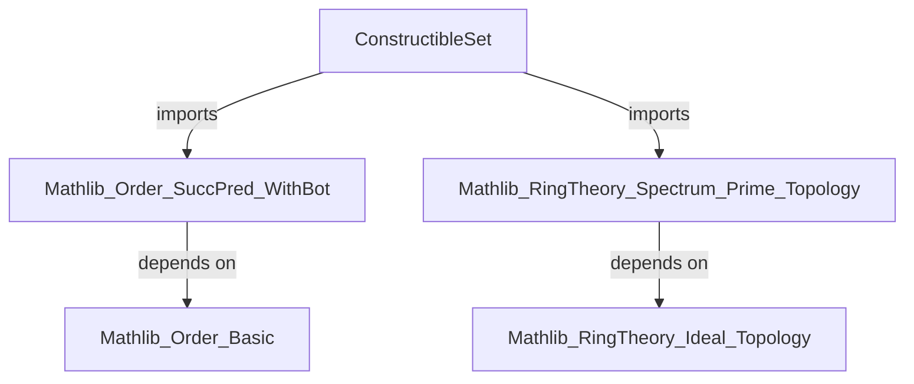

### Technical Brief: Constructible Sets in the Prime Spectrum (Lean 4)

---

#### **1. Key Definitions & Theorems**

| Name | Type / Signature | Purpose |
|------|------------------|---------|
| `BasicConstructibleSetData` | `structure` | Encodes data for a *basic* constructible set: a tuple `(f, n, g : Fin n → R)` representing $V(g_1,\dots,g_n) \setminus V(f)$. |
| `BasicConstructibleSetData.toSet` | `C : BasicConstructibleSetData R → Set (PrimeSpectrum R)` | Maps data to the actual constructible subset of $\operatorname{Spec} R$. |
| `BasicConstructibleSetData.map` | `(φ : R →+* S) → BasicConstructibleSetData R → BasicConstructibleSetData S` | Pushforward of basic constructible data along a ring map $\varphi$. |
| `ConstructibleSetData` | `abbrev ConstructibleSetData := Finset (BasicConstructibleSetData R)` | Represents a *constructible* set as a finite union of basic ones. |
| `ConstructibleSetData.toSet` | `s : ConstructibleSetData R → Set (PrimeSpectrum R)` | Union over `toSet` of each basic component. |
| `ConstructibleSetData.map` | `(φ : R →+* S) → ConstructibleSetData R → ConstructibleSetData S` | Pushforward of constructible data (image under finite set map). |
| `ConstructibleSetData.degBound` | `ConstructibleSetData R[X] → ℕ` | Degree bound used in Chevalley’s theorem for $R \hookrightarrow R[X]$. |
| `ConstructibleSetData.isConstructible_toSet` | `IsConstructible S.toSet` | Proves that any `toSet` of constructible data is constructible. |
| `exists_constructibleSetData_iff` | `∃ S, S.toSet = s ↔ IsConstructible s` | Characterizes constructible sets as exactly those representable by `ConstructibleSetData`. |
| `exists_range_eq_of_isConstructible` | `IsConstructible s ⇒ ∃ S, f: R →+* S, range(comap f) = s` | Constructive version of Chevalley’s theorem: constructible sets are images of $\operatorname{Spec}$ maps. |
| `isClosed_of_stableUnderSpecialization_of_isConstructible` | `StableUnderSpecialization s ∧ IsConstructible s ⇒ IsClosed s` | A constructible set stable under specialization is closed. |
| `isOpen_of_stableUnderGeneralization_of_isConstructible` | `StableUnderGeneralization s ∧ IsConstructible s ⇒ IsOpen s` | Dually, constructible + stable under generalization ⇒ open. |

---

#### **2. Naming Conventions**

- **Prefixes**:
  - `is_`: predicates (e.g., `isConstructible`, `isClosed`, `isOpen`).
  - `toSet`: conversion from data to actual set.
  - `map`: pushforward along ring homomorphism.
  - `degBound`: degree-related bound for polynomial rings.

- **Suffixes**:
  - `Data`: indicates *syntactic* or *finite* representation (e.g., `BasicConstructibleSetData`, `ConstructibleSetData`).
  - `map`/`comp`: compositionality lemmas (`map_id`, `map_comp`, `map_comp'`).

- **Structure fields**:
  - `f`, `n`, `g`: standard tuple components for basic constructible data.
  - `C`, `S`, `s`: typical variables for data (`C` for basic, `S`/`s` for full constructible).

---

#### **3. Tactic Stack**

| Tactic | Usage Frequency | Purpose |
|--------|-----------------|---------|
| `simp` | Very High | Simplification using `@[simp]` lemmas (`map_id`, `toSet_map`, etc.). |
| `rw` | High | Rewriting using lemmas like `set_biUnion_finset_image`, `Set.biUnion_eq_iUnion`. |
| `ext` | Medium | Extensionality for functions/sets. |
| `unfold` | Medium | Unfolding definitions (e.g., `toSet`, `map`). |
| `congr!` | Medium | Congruence reasoning for set equalities. |
| `exact` / `refine` | Medium | Filling in goals using known lemmas. |
| `induction ... using ...` | Low | Structural induction on `IsConstructible` (basis + closure under sdiff/union). |
| `rw [← ...]` | High | Rewriting with contrapositive forms (e.g., `← isClosed_compl_iff`). |

---

#### **4. Proof Logic**

- **Structure of proofs**:
  - **Inductive characterizations**: Proofs about constructible sets often use `IsConstructible.induction_of_isTopologicalBasis`, leveraging the basis of basic opens.
  - **Set-theoretic manipulations**: Heavy use of preimage, image, union, complement, and zero locus identities.
  - **Localization & quotient tricks**: Key step in `exists_range_eq_of_isConstructible` uses:
    - `localization_away_comap_range`
    - `comap_basicOpen`
    - `range_comap_of_surjective`
  - **Stability arguments**: For `isClosed_of_stableUnderSpecialization_of_isConstructible`, combine representation as image of $\operatorname{Spec}$ with topological stability.

- **Typical flow**:
  1. Reduce to basic constructible sets via induction.
  2. Use algebraic constructions (quotients, localizations) to realize the set as $\operatorname{range}(\operatorname{comap} f)$.
  3. Apply topological lemmas (e.g., retrocompactness, closedness of zero loci).

---

#### **5. Imports & Dependencies**

| Module | Purpose |
|--------|---------|
| `Mathlib.Order.SuccPred.WithBot` | For `withBot`-based constructions (possibly for degree bounds or indexing). |
| `Mathlib.RingTheory.Spectrum.Prime.Topology` | Core topology on $\operatorname{Spec} R$: zero loci, basic opens, constructible topology. |
| `Finset`, `Topology`, `Polynomial` (scoped) | Finite unions, topological operations, polynomial ring $R[X]$ for degree bounds. |

---

#### **6. Mermaid Diagrams**

##### **Dependency Graph (Module-Level)**



##### **Overview of File Structure**

```mermaid
flowchart LR
  A[PrimeSpectrum] --> B[BasicConstructibleSetData]
  A --> C[ConstructibleSetData]

  B --> B1[structure: f, n, g]
  B --> B2[toSet: V(g) \ V(f)]
  B --> B3[map: pushforward along R→S]

  C --> C1[Finset of BasicConstructibleSetData]
  C --> C2[toSet: finite union]
  C --> C3[map: image under ring map]
  C --> C4[degBound: for Chevalley]

  A --> D[Theorems]
  D --> D1[exists_constructibleSetData_iff]
  D --> D2[exists_range_eq_of_isConstructible]
  D --> D3[isClosed_of_stableUnderSpecialization]
  D --> D4[isOpen_of_stableUnderGeneralization]
```

##### **Theory Context (Stacks Project Tags)**

- `exists_range_eq_of_isConstructible` corresponds to [Stacks 00F8](https://stacks.math.columbia.edu/tag/00F8) (Chevalley’s theorem).
- `isClosed_of_stableUnderSpecialization_of_isConstructible` and `isOpen_of_stableUnderGeneralization_of_isConstructible` correspond to [Stacks 00I0](https://stacks.math.columbia.edu/tag/00I0), part (1).

---

#### **7. Summary**

This module formalizes the *syntactic* and *semantic* theory of constructible subsets of $\operatorname{Spec} R$, providing:
- A finite, constructive representation (`ConstructibleSetData`) for constructible sets.
- Functorial behavior under ring homomorphisms (`map`).
- Equivalence between semantic constructibility and finite unions of basic constructible sets.
- Applications to Chevalley’s theorem and stability properties (specialization/generalization).

It serves as foundational infrastructure for further algebraic geometry developments in Mathlib, especially descent and constructibility arguments.
