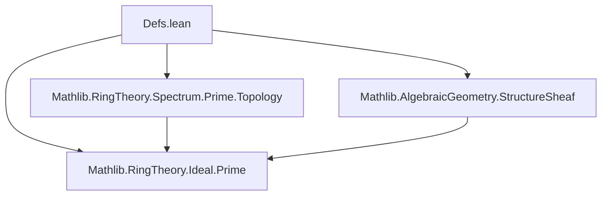
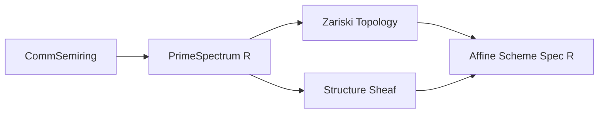

**Technical Metadata Brief: `Defs.lean` (Prime Spectrum of a Commutative (Semi)ring)**

---

### 1. **Key Definitions & Theorems**

| Name | Type / Signature | Purpose |
|------|------------------|---------|
| `PrimeSpectrum R` | `Type u` (for `R : Type u` with `[CommSemiring R]`) | The *type* of prime ideals of a commutative semiring `R`. Defined as a structure with field `asIdeal : Ideal R` and proof `isPrime : asIdeal.IsPrime`. |
| `asIdeal` | `PrimeSpectrum R → Ideal R` | Projection of a prime spectrum point to its underlying ideal. |
| `isPrime` | `∀ x : PrimeSpectrum R, (x.asIdeal).IsPrime` | Instance field asserting primality of the underlying ideal. |
| `instance : PartialOrder (PrimeSpectrum R)` | `PartialOrder (PrimeSpectrum R)` | Induced partial order via `PartialOrder.lift` along `asIdeal`, matching inclusion of ideals. |
| `asIdeal_le_asIdeal` | `∀ x y, x.asIdeal ≤ y.asIdeal ↔ x ≤ y` | Equivalence between ideal inclusion and order in `PrimeSpectrum`. |
| `asIdeal_lt_asIdeal` | `∀ x y, x.asIdeal < y.asIdeal ↔ x < y` | Strict order version of the above. |
| `equivSubtype` | `PrimeSpectrum R ≃o {I : Ideal R // I.IsPrime}` | Order-isomorphism between `PrimeSpectrum R` and the subtype of prime ideals in `Ideal R`. |

---

### 2. **Naming Conventions**

- **Structure fields**: `asIdeal`, `isPrime` — descriptive, no prefix/suffix beyond clarity.
- **Projection theorems**: `asIdeal_*` — prefix `asIdeal_` for lemmas relating `asIdeal` to order/structure.
- **Equivalences**: `equivSubtype` — `equiv*` for bijective constructions; `subtype` indicates equivalence with a subtype.
- **Order-related**: `PartialOrder.lift`, `map_rel_iff'` — standard Lean order-theoretic naming.

---

### 3. **Tactic Stack**

- ` rfl` — used in `map_rel_iff'` and `equivSubtype` to assert definitional equality.
- `ext` — via `@[ext]` attribute on `PrimeSpectrum`, enabling extensionality proofs.
- `simp` — implied by `@[simp]` on `asIdeal_le_asIdeal`, `asIdeal_lt_asIdeal`, and `equivSubtype` (via `@[simps]`).
- `PartialOrder.lift` — not a tactic, but a constructor used in instance declaration.

No heavy automation (e.g., `aesop`, `ring`, `simp_rw`) appears in this file — it is definitional/structural.

---

### 4. **Proof Logic**

- **No proofs are given** in this file — it is purely definitional.
- The structure and instances are defined *by lifting* along the injective map `asIdeal`, using standard order-theoretic constructions (`PartialOrder.lift`, `equivSubtype`).
- The `@[simps]` attribute on `equivSubtype` auto-generates simp lemmas for its components.

---

### 5. **Imports**

- `Mathlib.RingTheory.Ideal.Prime` — provides `Ideal.IsPrime` and related theory.

> **Note**: Topology and sheaf theory are *not* included here — they are deferred to:
> - `Mathlib.RingTheory.Spectrum.Prime.Topology` (Zariski topology)
> - `Mathlib.AlgebraicGeometry.StructureSheaf` (structure sheaf)

---

### 8. **Mermaid Diagrams**

#### **Dependency Graph (Module-Level)**



#### **Overview of `PrimeSpectrum` Construction**

```mermaid
flowchart LR
  R[CommSemiring R] --> PrimeSpectrum[PrimeSpectrum R]
  PrimeSpectrum -->|asIdeal| Ideal[Ideal R]
  PrimeSpectrum -->|isPrime| IsPrime[IsPrime Ideal]
  Ideal -->|≤| IdealOrder[Partial Order on Ideals]
  PrimeSpectrum -->|PartialOrder.lift| PO[PartialOrder on PrimeSpectrum]
  PrimeSpectrum <-->|equivSubtype| SubtypePrime[{I // I.IsPrime}]
```

#### **Theoretical Role in Algebraic Geometry**



---

**Summary**: This file defines the *set-theoretic* and *order-theoretic* foundation of the prime spectrum — a key object in algebraic geometry — as the type of prime ideals, equipped with the inclusion order. All topological and sheaf-theoretic structure is deferred to companion modules.
