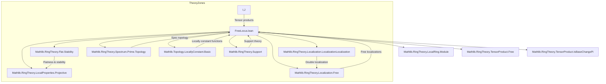
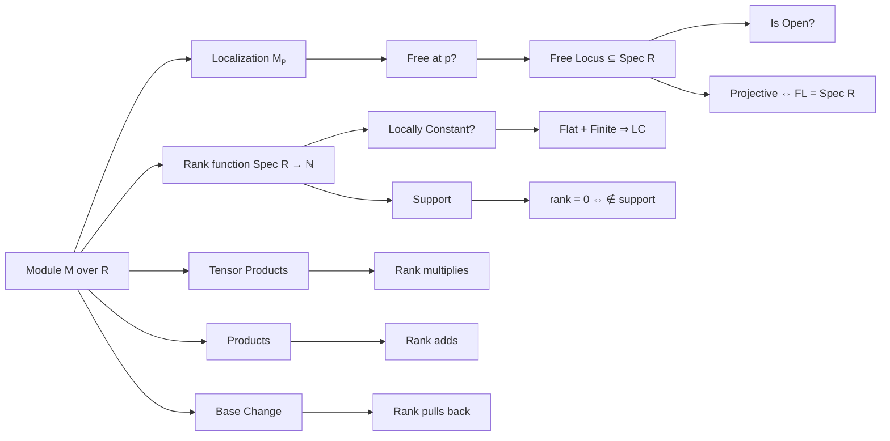

### Technical Brief: `FreeLocus.lean`

---

#### **1. Key Definitions & Theorems**

| Name | Type / Signature | Purpose |
|------|------------------|---------|
| `freeLocus R M` | `Set (PrimeSpectrum R)` | Set of primes `p` where the localization `Mₚ` is free over `Rₚ`. |
| `mem_freeLocus` | `p ∈ freeLocus R M ↔ Module.Free (Localization.AtPrime p.asIdeal) (LocalizedModule p.asIdeal.primeCompl M)` | Membership criterion for the free locus. |
| `mem_freeLocus_of_isLocalization` | `p ∈ freeLocus R M ↔ Module.Free Rₚ Mₚ` (under localization assumptions) | Re-expresses freeness in terms of arbitrary localization. |
| `mem_freeLocus_iff_tensor` | `p ∈ freeLocus R M ↔ Module.Free Rₚ (Rₚ ⊗[R] M)` | Free locus criterion via tensor product with localization. |
| `freeLocus_congr` | `M ≃ₗ[R] M' ⇒ freeLocus R M = freeLocus R M'` | Free locus is invariant under linear isomorphism. |
| `comap_freeLocus_le` | `comap (algebraMap R A) ⁻¹' freeLocus R M ≤ freeLocus A (A ⊗[R] M)` | Behavior under base change (monomorphism of rings). |
| `freeLocus_localization` | `freeLocus (Localization S) (LocalizedModule S M) = comap (algebraMap R _) ⁻¹' freeLocus R M` | Compatibility with localization of the base ring. |
| `freeLocus_eq_univ_iff` | `[FinitePresentation M] ⇒ freeLocus R M = univ ↔ Projective R M` | Global freeness ⇔ projectivity (finitely presented case). |
| `freeLocus_eq_univ` | `[Finite M] [Flat R M] ⇒ freeLocus R M = univ` | Flat + finite ⇒ free locus is all of `Spec R`. |
| `basicOpen_subset_freeLocus_iff` | `[FinitePresentation M] ⇒ D(f) ⊆ freeLocus R M ↔ Projective (Localization.Away f) (LocalizedModule (.powers f) M)` | Local projectivity on basic opens. |
| `isOpen_freeLocus` | `[FinitePresentation M] ⇒ IsOpen (freeLocus R M)` | Free locus is open in `Spec R`. |
| `rankAtStalk M p` | `ℕ` | Rank of `Mₚ` as `Rₚ`-module (finite due to finite presentation). |
| `isLocallyConstant_rankAtStalk_freeLocus` | `[FinitePresentation M] ⇒ IsLocallyConstant (rankAtStalk M |_{freeLocus})` | Rank is locally constant on free locus. |
| `isLocallyConstant_rankAtStalk` | `[FinitePresentation M] [Flat R M] ⇒ IsLocallyConstant (rankAtStalk M)` | Rank is globally locally constant if `M` is flat. |
| `rankAtStalk_eq_zero_iff_notMem_support` | `[Flat M] [Finite M] ⇒ rankAtStalk M p = 0 ↔ p ∉ support R M` | Rank zero ⇔ not in support (flat + finite case). |
| `rankAtStalk_pos_iff_mem_support` | `[Flat M] [Finite M] ⇒ 0 < rankAtStalk M p ↔ p ∈ support R M` | Rank positive ⇔ in support. |
| `rankAtStalk_eq_finrank_of_free` | `[Free R M] ⇒ rankAtStalk M = finrank R M` | Stalk rank agrees with global rank if `M` is free. |
| `rankAtStalk_pi` | `[Finite ι] [∀ i, Flat (M i)] [∀ i, Finite (M i)] ⇒ rankAtStalk (Π i, M i) = ∑ᵢ rankAtStalk (M i)` | Rank of finite product is sum of ranks. |
| `rankAtStalk_tensorProduct` | `[Finite N] [Flat N] ⇒ rankAtStalk (M ⊗ N) = rankAtStalk M * rankAtStalk N` | Rank of tensor product is product of ranks. |
| `rankAtStalk_baseChange` | `rankAtStalk (S ⊗[R] M) p = rankAtStalk M (p.comap (algebraMap R S))` | Base change compatibility. |
| `rankAtStalk_eq` | `rankAtStalk M p = finrank κ(p) (κ(p) ⊗[R] M)` | Rank equals dimension over residue field. |

---

#### **2. Naming Conventions**

- **Prefixes**:
  - `freeLocus_`: properties of the free locus.
  - `rankAtStalk_`: properties of the rank function.
  - `mem_`: membership criteria.
  - `isLocallyConstant_`: local constancy of functions.
- **Suffixes**:
  - `_iff`: equivalence statements.
  - `_of_`: implications under additional assumptions (e.g., `freeLocus_eq_univ_iff`).
  - `_congr`, `_equiv`: invariance under isomorphism.
  - `_pi`, `_prod`, `_tensorProduct`: behavior under categorical constructions.
- **Special**:
  - `basicOpen_subset_`: inclusion of basic opens.
  - `comap_freeLocus_`: behavior under ring maps.

---

#### **3. Tactic Stack**

Frequent tactics used in proofs:
- `simp_rw`, `simp`: simplification with definitional equalities and lemmas.
- `rw`: rewriting using equivalences and lemmas.
- `exact`, `refine`, `apply`: proof construction.
- `ext`: extensionality for sets/functions.
- `convert`: flexible unification for proof goals.
- `cases`, `obtain`, `rintro`: destructuring and existential elimination.
- `letI : ... := ...`: introducing instances.
- `have / show`: intermediate claims.
- `apply ... |>.finrank_eq`: using isomorphisms to transfer finite rank.
- `algebra_simps`, `mul_smul`, `smul_assoc`: ring/module algebra simplifications.
- `ring`, `aesop`: for trivial algebraic goals (less frequent here due to heavy structure).

---

#### **4. Proof Logic**

- **Induction / Localization Strategy**:
  - Prove local properties by reducing to stalks via localization.
  - Use `IsLocalization` and `IsLocalizedModule` infrastructure to relate localizations.
- **Key Logical Flow**:
  1. Reduce to a localization where `M` becomes free (via finite presentation).
  2. Use `mem_freeLocus_of_isLocalization` to switch between localization models.
  3. Apply structural lemmas: `free_of_flat_of_isLocalRing`, `Module.finrank_of_isLocalizedModule_of_free`.
  4. For rank constancy: cover free locus by basic opens where `M` is free; use `isOpen_freeLocus`.
- **Common Patterns**:
  - `have := H ⟨I, hI.isPrime⟩; .of_free`: from local freeness to projectivity.
  - `convert ...; simp`: use equivalence of localized modules to transfer rank.
  - `apply Module.finrank_baseChange`: base change for finite rank.

---

#### **5. Imports**

Core dependencies defining the module’s scope:

```lean
Mathlib.RingTheory.Flat.Stability
Mathlib.RingTheory.LocalProperties.Projective
Mathlib.RingTheory.LocalRing.Module
Mathlib.RingTheory.Localization.Free
Mathlib.RingTheory.Localization.LocalizationLocalization
Mathlib.RingTheory.Spectrum.Prime.Topology
Mathlib.Topology.LocallyConstant.Basic
Mathlib.RingTheory.TensorProduct.Free
Mathlib.RingTheory.TensorProduct.IsBaseChangePi
Mathlib.RingTheory.Support
```

These indicate the theory lies at the intersection of:
- **Localization theory** (local freeness, localization of modules),
- **Flatness & projectivity** (local criteria, stability),
- **Spectral topology** (`Spec R`, basic opens, continuity),
- **Tensor products & base change** (rank behavior under extension of scalars),
- **Support theory** (relation between rank and support).

---

#### **6. Mermaid Diagrams**

##### **Dependency Graph (Module-Level)**



##### **Overview of Theory Flow**



---

#### **7. Summary**

This file formalizes the *free locus* of a finitely presented module — the open subset of `Spec R` where the module becomes free after localization. It establishes foundational properties:
- openness of the free locus,
- equivalence of global projectivity and full free locus,
- local constancy of the rank function under flatness,
- compatibility with tensor products, products, and base change.

It serves as a bridge between *local algebra* (local freeness, localization) and *global algebra* (projectivity, support), with applications in moduli theory and descent.

--- 

Let me know if you'd like a formalized dependency graph (e.g., for LeanDojo), or a summary of proof automation patterns.
