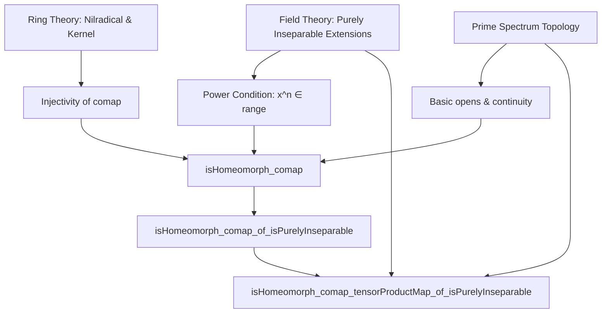
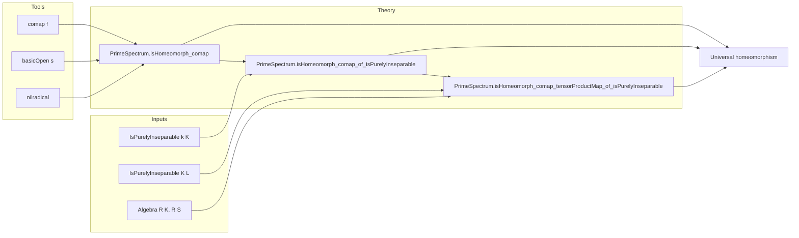

### Technical Brief: `Homeomorph.lean`

---

#### **1. Key Definitions & Theorems**

| Name | Type / Signature | Purpose |
|------|------------------|---------|
| `PrimeSpectrum.isHomeomorph_comap` | `(f : R →+* S) → (∀ x, ∃ n > 0, x^n ∈ f.range) → ker f ≤ nilradical R → IsHomeomorph (comap f)` | Shows that under nilpotent kernel and “eventual surjectivity on powers”, the induced map on spectra is a homeomorphism. |
| `PrimeSpectrum.isHomeomorph_comap_of_isPurelyInseparable` | `[IsPurelyInseparable k K] → IsHomeomorph (comap (algebraMap R (R ⊗[k] K)))` | Special case: purely inseparable field extensions induce universal homeomorphisms on spectra. |
| `PrimeSpectrum.isHomeomorph_comap_tensorProductMap_of_isPurelyInseparable` | `[IsPurelyInseparable K L] → IsHomeomorph (comap (Algebra.TensorProduct.map (Algebra.ofId K L) (.id R S)))` | General base-change version: tensoring a purely inseparable extension with any algebra preserves homeomorphism on spectra. |
| `IsPurelyInseparable.exists_pow_mem_range_tensorProduct` | (implicit hypothesis used in proof) | For $x \in R \otimes_k K$, $\exists n > 0$ s.t. $x^n \in \mathrm{range}(\mathrm{algebraMap})$. Key technical input from purely inseparability. |
| `nilradical R` | Ideal of $R$ | Set of nilpotent elements; used to control kernel behavior. |
| `comap f` | $\mathrm{Spec}(S) \to \mathrm{Spec}(R)$ induced by $f: R \to S$ | Continuous map on prime spectra; main object of study. |

---

#### **2. Naming Conventions**

- **Prefixes**:
  - `isHomeomorph_`: indicates the result asserts that a continuous map is a homeomorphism.
  - `comap_`: refers to the induced map on spectra from a ring homomorphism.
- **Suffixes**:
  - `_of_`: indicates specialization (e.g., `of_isPurelyInseparable`).
  - `_tensorProductMap_of_`: indicates tensor-product-based base change.
- **Other**:
  - `basicOpen s`: standard open subset $D(s) \subseteq \mathrm{Spec}(R)$.
  - `kerLift`: the induced map $R / \ker f \to S$.

---

#### **3. Tactic Stack**

| Tactic | Usage |
|--------|-------|
| `intro`, `ext`, `rw`, `apply`, `refine`, `convert` | Basic proof structure. |
| `have`, `let` | Intermediate lemma introduction. |
| `simp`, `simp only`, `simp_rw` | Simplification using algebraic properties (e.g., `AlgEquiv.toAlgHom_eq_coe`). |
| `aesop` | Not used here — proofs are highly structured and manual. |
| `ring`, `linarith` | Not used — algebraic manipulations are symbolic. |
| `exact`, `assumption` | Used in short subgoals. |
| `convert` + `rw` | For adapting known lemmas to new contexts (e.g., `convert bot_le`). |
| `rw [Set.eq_preimage_iff_image_eq]` | Set-theoretic reasoning about images/preimages. |

---

#### **4. Proof Logic**

- **Structure of `isHomeomorph_comap`**:
  1. **Injectivity**: Use power condition $x^n \in \mathrm{range}(f)$ to lift membership in primes.
  2. **Surjectivity**: Factor through quotient by kernel, use integrality (via powers) and surjectivity of $\mathrm{Spec}(R/\ker f) \to \mathrm{Spec}(S)$ under integral extensions.
  3. **Open map**: Show image of basic open $D(s)$ is $D(r)$ using power condition again.

- **Structure of `isHomeomorph_comap_of_isPurelyInseparable`**:
  - Apply previous lemma with:
    - $f = \mathrm{algebraMap}\ R\ (R \otimes_k K)$,
    - Use `IsPurelyInseparable.exists_pow_mem_range_tensorProduct` for power condition,
    - Show kernel is zero via injectivity of tensor inclusion.

- **Structure of `isHomeomorph_comap_tensorProductMap_of_isPurelyInseparable`**:
  - Reduce to previous case using:
    - Associativity/commutativity of tensor product (`cancelBaseChange`, `comm`),
    - Composition of homeomorphisms,
    - Invertibility of algebra isomorphisms (via `isHomeomorph_comap_of_bijective`).

---

#### **5. Imports & Dependencies**

| Module | Purpose |
|--------|---------|
| `Mathlib.FieldTheory.PurelyInseparable.Basic` | Defines purely inseparable extensions and key properties (e.g., power condition). |
| `Mathlib.RingTheory.Flat.Basic` | Possibly used for flatness-related lemmas (not directly used here, but may support base-change arguments). |
| `Mathlib.RingTheory.Spectrum.Prime.Topology` | Defines `PrimeSpectrum`, `comap`, `basicOpen`, topology, and basic open sets. |

---

#### **6. Mermaid Diagrams**

##### **Dependency Graph (Theoretical)**

##### **Overview of File Structure**

---

#### **7. Summary**

This file formalizes a classical result in commutative algebra and algebraic geometry: **purely inseparable field extensions induce universal homeomorphisms on spectra**. The key insight is that purely inseparable extensions satisfy a “power-surjectivity” condition, which—combined with nilpotent kernel control—ensures the induced map on spectra is a homeomorphism, stable under arbitrary base change.

The proofs are constructive and rely heavily on the interplay between:
- algebraic properties of ring maps (kernel, integrality, powers),
- topological properties of $\mathrm{Spec}$ (basic opens, continuity, openness),
- categorical properties of tensor products (base change, associativity, commutativity).

The formalization is precise, modular, and leverages Lean’s typeclass inference for algebraic structures.
