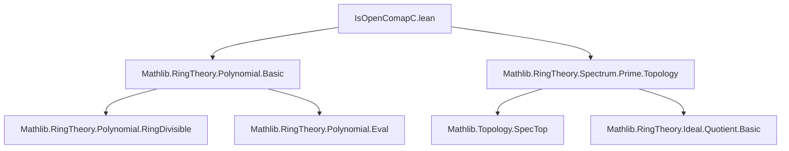

### Technical Brief: `IsOpenComapC.lean`

---

#### **1. Key Definitions & Theorems**

| Name | Type / Signature | Purpose |
|------|------------------|---------|
| `imageOfDf` | `R[X] → Set (PrimeSpectrum R)` | Defines the open subset of `Spec R` where at least one coefficient of `f` is non-vanishing. |
| `isOpen_imageOfDf` | `IsOpen (imageOfDf f)` | Proves that `imageOfDf f` is open in `Spec R`. |
| `comap_C_mem_imageOfDf` | `I ∈ (zeroLocus {f})ᶜ → comap C I ∈ imageOfDf f` | Relates points outside `V(f)` in `Spec R[X]` to `imageOfDf f`. |
| `imageOfDf_eq_comap_C_compl_zeroLocus` | `imageOfDf f = comap C '' (zeroLocus {f})ᶜ` | Shows equality of `imageOfDf f` with the image of the complement of `V(f)` under `Spec R[X] → Spec R`. |
| `isOpenMap_comap_C` | `IsOpenMap (comap C)` | Main theorem: the induced map on spectra is an open map. |

---

#### **2. Naming Conventions**

- **Prefixes**:
  - `imageOfDf`: informal name for the image of a basic open set under `Spec R[X] → Spec R`.
  - `comap_C`: indicates preimage under the ring map `C : R → R[X]`.
- **Suffixes**:
  - `_eq_comap_C_compl_zeroLocus`: equality with image of complement of zero locus.
  - `_mem_imageOfDf`: membership condition into `imageOfDf`.
- **General pattern**: `imageOfDf`, `comap_C_…`, `isOpen_imageOfDf`, `imageOfDf_eq_…`.

---

#### **3. Tactic Stack**

| Tactic | Usage |
|--------|-------|
| `rw` | Rewriting definitions (e.g., `imageOfDf`, `zeroLocus`, `basicOpen`). |
| `simp_rw` | Simplifying with rewrite rules (e.g., `← imageOfDf_eq_comap_C_compl_zeroLocus`). |
| `exact` / `intro` / `rintro` | Straightforward proof steps. |
| `ext` | Extensionality for set equality. |
| `iUnion` / `iInter` | Handling unions/intersections over index types. |
| `isOpen_iUnion` | To conclude openness of a union of opens. |
| `mem_compl_iff`, `mem_zeroLocus`, `singleton_subset_iff`, `coeff_C_zero`, `mem_map_C_iff` | Basic topology/ideal/coeff lemmas used in reasoning. |

---

#### **4. Proof Logic**

- **Structure**:
  1. Define `imageOfDf f` as the union over coefficients of basic opens `D(coeff f i)`.
  2. Prove `imageOfDf f` is open via `isOpen_iUnion`.
  3. Show equivalence of `imageOfDf f` with `comap C '' (zeroLocus {f})ᶜ` using:
     - `exists_C_coeff_notMem` (for forward direction),
     - `mem_map_C_iff` and coefficient extraction (for reverse).
  4. Prove openness of `comap C` by:
     - Expressing any open set `U ⊆ Spec R[X]` as a union of complements of `zeroLocus {f}`.
     - Using the previous equality to rewrite the image as a union of `imageOfDf f`, which are open.

- **Induction / Cases**: Not used; relies on set-theoretic manipulations and basic topology of prime spectra.

---

#### **5. Imports**

| Module | Purpose |
|--------|---------|
| `Mathlib.RingTheory.Polynomial.Basic` | Polynomial ring `R[X]`, coefficients, `C : R → R[X]`. |
| `Mathlib.RingTheory.Spectrum.Prime.Topology` | Prime spectrum, Zariski topology, `zeroLocus`, `basicOpen`, `comap`, `isOpen_basicOpen`. |

---

#### **6. Mermaid Diagrams**

##### **Dependency Graph (Module-Level)**



##### **Overview of Theoretical Flow**

```mermaid
graph LR
  A[Ring R] --> B[Polynomial Ring R[X]]
  B --> C[PrimeSpectrum R[X]]
  A --> D[PrimeSpectrum R]
  C -- comap C --> D
  D --> E[Open Sets]
  C --> F[Zero Locus V(f)]
  Fᶜ --> G[imageOfDf f]
  G --> H[IsOpen]
  C -- image under comap C --> G
  H --> I[IsOpenMap]
```

##### **Proof Outline Flow**

```mermaid
graph TD
  A[Goal: IsOpenMap(comap C)] --> B[Reduce to U = (zeroLocus {f})ᶜ]
  B --> C[Show comap C '' U = imageOfDf f]
  C --> D[Prove imageOfDf f = ⋃ i, D(coeff f i)]
  D --> E[Each D(coeff f i) is open ⇒ union is open]
  E --> F[Conclude IsOpenMap]
```

---

#### **7. Stacks Project Reference**

- **Tag**: [00FB](https://stacks.math.columbia.edu/tag/00FB)
- **Context**: First part of Lemma 00FB: the morphism `Spec R[x] → Spec R` induced by `R → R[x]` is open.

---

#### **8. Summary**

This file formalizes the openness of the structure morphism `Spec R[X] → Spec R` in the Zariski topology, using explicit descriptions of basic opens via coefficient non-vanishing. It leverages:
- The description of `imageOfDf f` as a union of basic opens,
- The correspondence between points in `Spec R[X]` not vanishing on `f` and coefficient non-vanishing in `Spec R`,
- Standard topological manipulations of open sets in the prime spectrum.

The formalization is clean, elementary, and aligns closely with the classical algebraic geometry argument.
