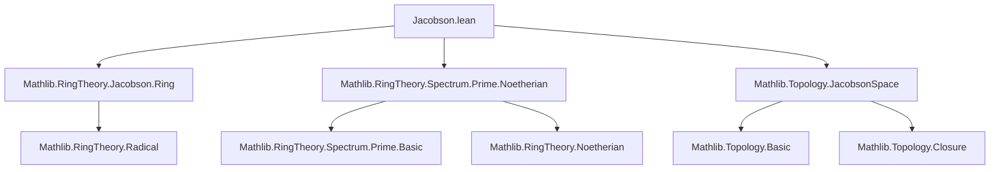

**Technical Brief: `Jacobson.lean` — Prime Spectrum of a Jacobson Ring**

---

### 1. **Key Definitions & Theorems**

| Name | Type / Signature | Purpose |
|------|------------------|---------|
| `exists_isClosed_singleton_of_isJacobsonRing` | `∀ s : Set (PrimeSpectrum R), IsOpen s → s.Nonempty → ∃ x ∈ s, IsClosed {x}` | In a Jacobson ring, every nonempty open set contains a point whose singleton is closed (i.e., a maximal ideal). |
| `instance JacobsonSpace (PrimeSpectrum R)` | `[IsJacobsonRing R] → JacobsonSpace (PrimeSpectrum R)` | Shows that the prime spectrum of a Jacobson ring is a Jacobson space (every closed subset is the intersection of the closures of its isolated points). |
| `isJacobsonRing_iff_jacobsonSpace` | `IsJacobsonRing R ↔ JacobsonSpace (PrimeSpectrum R)` | Equivalence between ring-theoretic Jacobson property and topological Jacobson property on `Spec R`. |
| `isOpen_singleton_tfae_of_isNoetherian_of_isJacobsonRing` | `[IsNoetherianRing R] [IsJacobsonRing R] → List.TFAE [...]` | For `x : Spec R`, equivalence of: <br> (1) `{x}` open (isolated point), <br> (2) `{x}` clopen, <br> (3) `{x}` closed & stable under generalization ⇔ `x` is both minimal prime and maximal ideal. |

**Auxiliary lemmas used:**
- `isClosed_singleton_iff_isMaximal`: `{x}` is closed ⇔ `x.asIdeal` is maximal.
- `isMin_iff`: `x` is minimal prime ⇔ `x.asIdeal` is a minimal prime ideal.
- `stableUnderGeneralization_singleton`: `{x}` stable under generalization ⇔ `x` is minimal.
- `zeroLocus_eq_iff`, `radical_eq_jacobson`, `vanishingIdeal_zeroLocus_eq_radical`: bridge algebraic and topological constructions.

---

### 2. **Naming Conventions**

- **Prefixes:**
  - `is_`: predicate-style (e.g., `isClosed`, `isOpen`, `isJacobsonRing`, `isNoetherianRing`, `isMin`, `isMaximal`).
  - `zeroLocus_`, `vanishingIdeal_`: algebraic–topological dictionary.
  - `jacobson`: relates to Jacobson radical or Jacobson topology.
- **Suffixes:**
  - `_iff_`: equivalence statements (`isJacobsonRing_iff_jacobsonSpace`).
  - `_tfae_`: "the following are equivalent" (`isOpen_singleton_tfae_...`).
  - `_of_`: conditions on the ring (`of_isNoetherian_of_isJacobsonRing`).
- **Variable naming:**
  - `R`: the base commutative ring.
  - `x, y, p, q`: points in `PrimeSpectrum R`.
  - `I, J`: ideals.
  - `s, S, U, Z`: subsets of `Spec R`.

---

### 3. **Tactic Stack**

| Tactic | Frequency | Role |
|--------|-----------|------|
| `simp_rw` | High | Rewriting with definitional equivalences (e.g., `mem_zeroLocus`, `isClosed_singleton_iff_isMaximal`). |
| `rw` | High | Standard rewriting, especially for algebraic identities (`zeroLocus_eq_iff`, `radical_eq_jacobson`). |
| `contrapose!` | Medium | Logical flipping to reduce to existence or contradiction. |
| `exact`, `refine`, `apply` | Medium | Goal-directed proof construction. |
| `tfae_have`, `tfae_finish` | Medium | Structured proof of multiple equivalent conditions. |
| `ext` | Medium | Extensionality for set equality. |
| `suffices ... by` | Medium | Proof by reduction to a stronger hypothesis. |
| `finite_setOf_isMin`, `subset`, `biUnion` | Low | Handling finiteness and unions over minimal primes. |
| `aesop` / `ring` / `linarith` | Not present | Not used in this file. |

---

### 4. **Proof Logic**

- **Structure of proofs:**
  - **Algebra–topology translation**: proofs repeatedly move between ideal-theoretic conditions (e.g., `I ≤ x.asIdeal`, `IsMaximal I`) and topological ones (`x ∈ zeroLocus I`, `IsClosed {x}`).
  - **Indirect reasoning**: many arguments use contrapositive reasoning (`contrapose!`) to reduce to existence of maximal ideals or minimal primes.
  - **Finiteness & minimality**: in the `tfae` proof, the key step uses finiteness of minimal primes in a Noetherian ring (`finite_setOf_isMin R`) to express the complement of `{x}` as a finite union of closures.
  - **Specialization/generalization logic**: uses `stableUnderGeneralization` ↔ `IsMin`, and `specializes_iff_mem_closure` to relate topology and order on `Spec R`.

- **Typical flow in main lemmas:**
  1. Translate topological condition (e.g., openness/closedness of singleton) to algebraic one (maximal/minimal ideal).
  2. Use Jacobson/Noetherian assumptions to control radical/jacobson ideals or minimal primes.
  3. Apply set-theoretic manipulations (`ext`, `compl`, `iUnion`, `iInter`) to conclude.

---

### 5. **Imports & Dependencies**

| Module | Role |
|--------|------|
| `Mathlib.RingTheory.Jacobson.Ring` | Defines `IsJacobsonRing`, Jacobson radical, and basic properties. |
| `Mathlib.RingTheory.Spectrum.Prime.Noetherian` | Provides facts about `Spec R` in Noetherian case (e.g., finiteness of minimal primes). |
| `Mathlib.Topology.JacobsonSpace` | Defines `JacobsonSpace`, locally closed subsets, and key lemmas (e.g., `jacobsonSpace_iff_locallyClosed`). |

**Core dependencies:**
- `CommRing`, `Ideal`, `PrimeSpectrum`, `Topology`, `Set`, `Order`.

---

### 6. **Mermaid Diagrams**

#### **Dependency Graph (Module-Level)**



#### **Overview of Theory Flow**

```mermaid
flowchart LR
  A[CommRing R] --> B[IsJacobsonRing R]
  A --> C[IsNoetherianRing R]
  B --> D[PrimeSpectrum R]
  C --> D
  D --> E[Topological Space]
  E --> F[IsClosed {x} ↔ x.asIdeal.IsMaximal]
  E --> G[StableUnderGeneralization {x} ↔ x.IsMin]
  B --> H[JacobsonSpace (PrimeSpectrum R)]
  B & C --> I[isOpen_singleton_tfae]
  H --> J[Spec R is Jacobson space]
  I --> K[Characterization of isolated points]
```

---

### 7. **Summary**

This file establishes a deep bridge between **commutative algebra** (Jacobson rings, Noetherian rings) and **topology** (Jacobson spaces, specialization order, minimal/maximal points in `Spec R`). It shows:

- Jacobson rings ⇔ `Spec R` is a Jacobson space.
- In the Noetherian + Jacobson case, isolated points in `Spec R` are precisely the points that are both minimal and maximal — i.e., the connected components are points.

The proofs rely heavily on:
- The correspondence between algebraic properties of ideals and topological properties of points in `Spec R`.
- Finiteness of minimal primes in Noetherian rings.
- The Jacobson radical’s role in detecting closed points.

This is foundational for understanding the **Zariski topology** on spectra of rings with finiteness conditions, and appears in contexts like algebraic geometry (e.g., behavior of closed points in Jacobson schemes).
