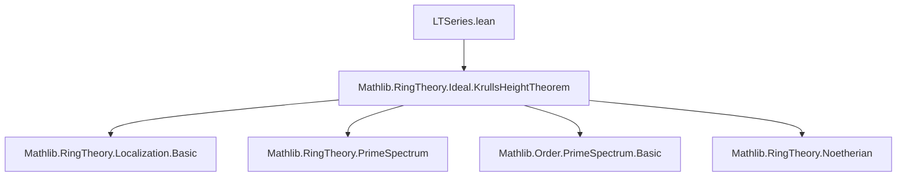
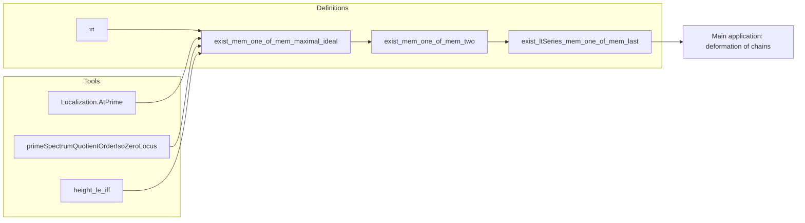

### Technical Brief: `LTSeries.lean`

---

#### **1. Key Definitions & Theorems**

| Name | Type / Signature | Purpose |
|------|------------------|---------|
| `𝔪` | `IsLocalRing.maximalIdeal R` | Notation for the unique maximal ideal in a local ring. |
| `exist_mem_one_of_mem_maximal_ideal` | `{p₁ p₀ : PrimeSpectrum R} → p₀ < p₁ → p₁ < closedPoint R → x ∈ 𝔪 → ∃ q, x ∈ q.asIdeal ∧ p₀ < q ∧ q.asIdeal < 𝔪` | In a *local* Noetherian ring, given a chain $p_0 < p_1 < \mathfrak{m}$ and $x \in \mathfrak{m}$, find a prime $q$ strictly between $p_0$ and $\mathfrak{m}$ containing $x$. |
| `exist_mem_one_of_mem_two` | `{p₁ p₀ p₂ : PrimeSpectrum R} → p₀ < p₁ < p₂ → x ∈ p₂.asIdeal → ∃ q, x ∈ q.asIdeal ∧ p₀ < q < p₂` | Generalizes the previous lemma to arbitrary chains of length 2 (not necessarily ending at $\mathfrak{m}$), using localization at $p_2$. |
| `exist_ltSeries_mem_one_of_mem_last` | `(p : LTSeries (PrimeSpectrum R)) → x ∈ p.last.asIdeal → ∃ q, x ∈ (q 1).asIdeal ∧ p.length = q.length ∧ p.head = q.head ∧ p.last = q.last` | Main result: Given a chain of primes of length $n+1$ and $x$ in the top prime, we can adjust the chain so that $x$ lies in the *second* prime (index 1), while fixing head and tail. |

> **Note**: `LTSeries` denotes *length-indexed strictly increasing series* of primes (i.e., finite chains $p_0 < p_1 < \dots < p_{n-1}$), likely defined in a separate module (not shown here).

---

#### **2. Naming Conventions**

- **Prefixes**:
  - `exist_...`: Existential lemmas (constructive or non-constructive).
  - `mem_...`: Conditions involving membership in ideals/primes.
  - `ltSeries_...`: Related to `LTSeries` (length-indexed series).
- **Suffixes**:
  - `_of_mem`: From membership hypothesis.
  - `_of_isPrime`, `_of_isLocalizationAtPrime`: From structural properties.
  - `_head`, `_last`, `_length`: Reference to series components.
- **Variables**:
  - `p`, `q`, `Q`: Series or primes.
  - `h₀`, `h₁`, `h₂`: Chain inequalities.
  - `hx`, `hxq`: Membership hypotheses.

---

#### **3. Tactic Stack**

Frequently used tactics in proofs:

| Tactic | Role |
|--------|------|
| `by_cases` | Split on membership (e.g., $x \in p_0$). |
| `obtain ⟨...⟩ := ...` | Extract witnesses from existential statements. |
| `rw [← ...]` / `simp_rw` | Rewrite using order isomorphisms or localization maps. |
| `refine` / `exact` | Construct proofs stepwise. |
| `simp only [...]` | Simplify using explicit lemmas (e.g., `RelSeries.singleton_toFun`). |
| `have h : ...` / `suffices ...` | Introduce intermediate claims. |
| `rwa [OrderIso.lt_iff_lt]` | Use order isomorphism properties. |
| `induction ... with | zero | succ` | Induction on natural numbers (length of series). |
| `simpa` / `simp` | Simplify goals using assumptions. |
| `exact` / `assumption` | Close goals via hypotheses. |

---

#### **4. Proof Logic**

- **Structure of `exist_ltSeries_mem_one_of_mem_last`**:
  1. **Induction on `p.length`**:
     - Base case (`n = 0`): Trivial (singleton series).
     - Inductive step (`n+1`):
       - If `n = 0`, use original series.
       - Otherwise, apply `exist_mem_one_of_mem_two` to the last three primes in the chain (indices `n-1`, `n`, `n+1`) to insert a new prime $q$ containing $x$ between $p_{n-1}$ and $p_n$.
       - Apply induction hypothesis to the shortened chain (after removing last two elements and snoccing $q$).
       - Reconstruct full series via `snoc` with original last element.

- **Key ideas**:
  - Use **localization** at the top prime to reduce to local case.
  - Use **height bounds** and **order isomorphisms** (e.g., `primeSpectrumQuotientOrderIsoZeroLocus`, `AtPrime.primeSpectrumOrderIso`) to transfer properties.
  - Control indices via `Fin` arithmetic (`Fin.last`, `castSucc`, etc.).

---

#### **5. Imports & Dependencies**

- **Primary dependency**:
  ```lean
  import Mathlib.RingTheory.Ideal.KrullsHeightTheorem
  ```
  - This import provides foundational results on prime spectra, height, and localization — essential for the localization-based arguments and height estimates (e.g., `map_height_le_one_of_mem_minimalPrimes`, `height_le_iff`).

- **Assumed infrastructure** (from context):
  - `CommRing`, `IsNoetherianRing`, `IsLocalRing`
  - `Ideal`, `PrimeSpectrum`, `Localization.AtPrime`
  - `LTSeries`, `RelSeries`, `Fin`, `OrderTheory.OrderIso`

---

#### **6. Mermaid Diagrams**

##### **Dependency Graph (Module-Level)**



##### **Theoretical Flow (Proof Strategy)**

```mermaid
flowchart LR
  A[Chain p₀ < … < pₙ] --> B{x ∈ pₙ}
  B --> C{Apply localization at pₙ}
  C --> D[Reduce to local case: R_{pₙ}]
  D --> E[Use exist_mem_one_of_mem_maximal_ideal]
  E --> F[Find q with x ∈ q, pₙ₋₁ < q < pₙ]
  F --> G[Apply IH to p₀ < … < pₙ₋₂ < q]
  G --> H[Reconstruct chain with x ∈ q₁]
```

##### **Overview of File Structure**



---

#### **7. Summary**

This file establishes a *deformation lemma* for chains of primes in Noetherian rings: any element in the top prime of a chain can be moved (via a new chain with same endpoints) to lie in the second prime. The proof leverages:
- Localization to reduce to the local case,
- Height estimates from Krull’s Height Theorem,
- Induction on chain length,
- Careful handling of `Fin` indices and `LTSeries` structure.

It serves as a technical stepping stone toward deeper results in dimension theory (e.g., catenarity, equidimensionality), likely in preparation for formalizing parts of the *Krull dimension* theory or *Serre’s conditions*.
