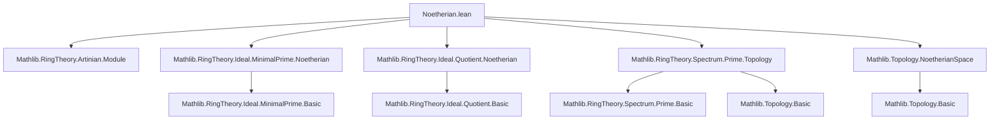

### Technical Brief: `Noetherian.lean` — Prime Spectrum Properties in Lean 4

---

#### **1. Key Definitions & Theorems**

| Name | Type / Signature | Purpose |
|------|------------------|---------|
| `noetherianSpace_TFAE` | `TFAE` (True For All Equivalent) statement for Noetherian space conditions on `PrimeSpectrum R` | Equivalence of multiple characterizations of `PrimeSpectrum R` being a Noetherian space. |
| `instance : NoetherianSpace (PrimeSpectrum R)` | `PrimeSpectrum R` is a Noetherian space when `R` is Noetherian | Proves topological Noetherianity of the prime spectrum under ring-theoretic Noetherian hypothesis. |
| `finite_setOf_isMin` | `{x : PrimeSpectrum R | IsMin x}.Finite` | The set of minimal prime ideals in a Noetherian ring is finite. |
| `instance : Ring.KrullDimLE 0 R` | Krull dimension ≤ 0 for Artinian rings | Standard structural fact: Artinian rings have Krull dimension 0. |
| `instance : DiscreteTopology (PrimeSpectrum R)` | Prime spectrum of an Artinian ring has discrete topology | Follows from Krull dim 0 + finite primes. |
| `IsArtinianRing.exists_not_mem_forall_mem_of_ne` | `∃ r ∉ p, IsIdempotentElem r ∧ ∀ q ≠ p, r ∈ q` | In Artinian rings, for any prime `p`, there exists an idempotent `r` not in `p` but in all other primes — key for decomposition. |

---

#### **2. Naming Conventions**

- **Prefixes**:
  - `isMin_`: predicates minimality (e.g., `isMin_iff`, `IsMin`).
  - `finite_`, `noetherian_`: properties tied to finiteness or ascending chain conditions.
  - `krullDim_`: Krull dimension–related lemmas/instances.
- **Suffixes**:
  - `_of_isNoetherianRing`, `_of_isArtinianRing`: indicate dependency on ring-theoretic hypotheses.
  - `_iff`: biconditional characterizations (e.g., `discreteTopology_iff_finite_and_krullDimLE_zero`).
- **Module-level**:
  - `PrimeSpectrum.mk`, `asIdeal`, `PrimeSpectrum.toPiLocalization`: standard constructions in spectrum theory.

---

#### **3. Tactic Stack**

Frequently used tactics in this file:

| Tactic | Role |
|--------|------|
| `rw`, `simp_rw` | Rewriting using definitions and equivalences (e.g., `isMin_iff`, `funext_iff`). |
| `simp` | Simplification with `PrimeSpectrum`-specific lemmas (e.g., `map_mul`, `Pi.single_mul`). |
| `exact`, `refine`, `apply` | Goal-directed proof construction. |
| `classical` | Enables classical logic for existential witnesses (e.g., idempotent construction). |
| `obtain` / `have` | Intermediate lemma extraction. |
| `inferInstance` | Automatic typeclass resolution (e.g., for `IsMin`, `IsPrime`, `IsArtinianRing`). |
| `funext_iff.mp` | Extensionality for function equality (used with localization maps). |
| `simpa` | Simplify and discharge goal using a hypothesis. |

---

#### **4. Proof Logic**

- **Structure**:
  - **Noetherian case**:
    1. Use equivalence `noetherianSpace_TFAE` to reduce to a known condition.
    2. Leverage `closedsEmbedding R.dual.wellFoundedLT` to get Noetherian space.
    3. For `finite_setOf_isMin`, embed minimal primes into ideals via `asIdeal`, use injectivity, and pull back finiteness from `minimalPrimes.finite_of_isNoetherianRing`.

  - **Artinian case**:
    1. Show Krull dimension ≤ 0 via `Ring.KrullDimLE.mk₀`.
    2. Derive discrete topology using equivalence `discreteTopology_iff_finite_and_krullDimLE_zero`.
    3. For the idempotent separation lemma:
       - Use bijectivity of `PrimeSpectrum.toPiLocalization`.
       - Construct `r` via `Pi.single` at a point.
       - Verify properties using localization map behavior and FaithfulSMul properties.

- **Logical Flow**:
  - Indirect proofs via equivalence chains (`TFAE`, `iff`).
  - Local-to-global arguments via localization.
  - Exploitation of typeclass inference for structural facts (e.g., Artinian ⇒ Krull dim 0).

---

#### **5. Imports & Dependencies**

| Import | Purpose |
|--------|---------|
| `Mathlib.RingTheory.Artinian.Module` | Artinian module theory, foundational for Artinian ring results. |
| `Mathlib.RingTheory.Ideal.MinimalPrime.Noetherian` | Finiteness of minimal primes in Noetherian rings. |
| `Mathlib.RingTheory.Ideal.Quotient.Noetherian` | Noetherian properties of quotients (used implicitly via structure). |
| `Mathlib.RingTheory.Spectrum.Prime.Topology` | Topology on `PrimeSpectrum`, e.g., `asIdeal`, `PrimeSpectrum.mk`. |
| `Mathlib.Topology.NoetherianSpace` | Abstract Noetherian topological space theory (e.g., `NoetherianSpace`, `TFAE`). |

---

#### **6. Mermaid Diagrams**

##### **Dependency Graph (Module-Level)**



##### **Overview of File Content**

```mermaid
flowchart LR
  Start[PrimeSpectrum R] --> IsNoetherianRing[IsNoetherianRing R]
  IsNoetherianRing --> Inst1[NoetherianSpace (PrimeSpectrum R)]
  IsNoetherianRing --> FinMin[finite_setOf_isMin]

  Start --> IsArtinianRing[IsArtinianRing R]
  IsArtinianRing --> KrullDim[Ring.KrullDimLE 0 R]
  IsArtinianRing --> DiscTop[DiscreteTopology (PrimeSpectrum R)]
  IsArtinianRing --> Idempotent[exists_not_mem_forall_mem_of_ne]

  Inst1 -.->|uses| TFAE[noetherianSpace_TFAE]
  FinMin -.->|uses| MinFin[minimalPrimes.finite_of_isNoetherianRing]
  Idempotent -.->|uses| LocMap[PrimeSpectrum.toPiLocalization_bijective]
```

---

#### **7. Summary**

This module establishes foundational topological properties of the prime spectrum under Noetherian and Artinian hypotheses:
- In Noetherian rings, the prime spectrum is a Noetherian space and has finitely many minimal points.
- In Artinian rings, the prime spectrum is discrete and zero-dimensional, and primes can be separated by idempotents — a key step toward structure theorems (e.g., finite product of Artinian local rings).

The proofs rely heavily on:
- Equivalence of definitions (`TFAE`),
- Localization techniques (`toPiLocalization`),
- Typeclass inference for structural ring-theoretic facts.

This file sits at the intersection of commutative algebra and algebraic geometry, formalizing the bridge between ring-theoretic chain conditions and topological Noetherianity.
