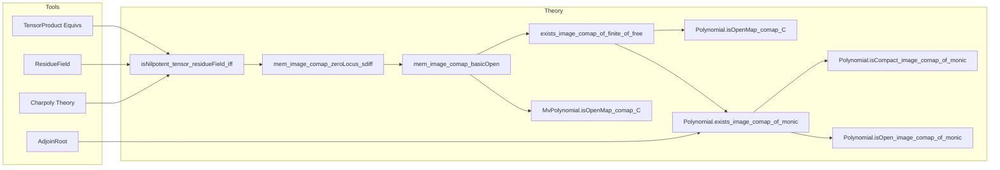

### Technical Brief: Prime Spectrum of (Multivariate) Polynomials — `Polynomial.lean`

---

#### **1. Key Definitions & Theorems**

| Name | Type / Signature | Purpose |
|------|------------------|---------|
| `isNilpotent_tensor_residueField_iff` | `(f : A) (I : Ideal R) [I.IsPrime]`<br>`IsNilpotent (algebraMap A (A ⊗[R] I.ResidueField) f) ↔ ∀ i < finrank R A, (Algebra.lmul R A f).charpoly.coeff i ∈ I` | Relates nilpotence of multiplication by `f` over residue field tensor product to membership of non-leading coefficients of `charpoly(f)` in prime ideal `I`. Core technical lemma for geometric behavior of structure maps. |
| `mem_image_comap_zeroLocus_sdiff` | `(f : A) (s : Set A) (x : PrimeSpectrum R)`<br>`x ∈ comap (algebraMap R A) '' (zeroLocus s \ zeroLocus {f}) ↔ ¬ IsNilpotent (algebraMap A ((A ⧸ Ideal.span s) ⊗[R] x.asIdeal.ResidueField) f)` | Characterizes image of `Z(I) ∩ D(f)` under `Spec A → Spec R` via non-nilpotence on residue field tensor. |
| `mem_image_comap_basicOpen` | `(f : A) (x : PrimeSpectrum R)`<br>`x ∈ comap (algebraMap R A) '' basicOpen f ↔ ¬ IsNilpotent (algebraMap A (A ⊗[R] x.asIdeal.ResidueField) f)` | Special case of above for `D(f)`. |
| `exists_image_comap_of_finite_of_free` | `(f : A) (s : Set A)`<br>`[Module.Finite R (A ⧸ Ideal.span s)] [Module.Free R (A ⧸ Ideal.span s)]`<br>`∃ t : Finset R, comap (algebraMap R A) '' (zeroLocus s \ zeroLocus {f}) = (zeroLocus t)ᶜ` | Shows image of `Z(I) ∩ D(f)` is compact open when quotient is finite free. |
| `mem_image_comap_C_basicOpen` *(Polynomial)* | `(f : R[X]) (x : PrimeSpectrum R)`<br>`x ∈ comap C '' basicOpen f ↔ ∃ i, f.coeff i ∉ x.asIdeal` | Explicit description for univariate polynomial ring: image of `D(f)` is complement of zero locus of coefficients. |
| `image_comap_C_basicOpen` *(Polynomial)* | `comap C '' basicOpen f = (zeroLocus (Set.range f.coeff))ᶜ` | Immediate corollary: image is open (complement of closed). |
| `isOpenMap_comap_C` *(Polynomial)* | `IsOpenMap (comap C)` | Structure map `Spec R[X] → Spec R` is open. |
| `exists_image_comap_of_monic` *(Polynomial)* | `(f g : R[X]) (hg : g.Monic)`<br>`∃ t, comap C '' (Z(g) ∩ D(f)) = (zeroLocus t)ᶜ` | Image of `Z(g) ∩ D(f)` is compact open when `g` is monic (uses `AdjoinRoot.powerBasis'`). |
| `isOpenMap_comap_C` *(MvPolynomial)* | `IsOpenMap (comap (C : R →ₐ[R] MvPolynomial σ R))` | Generalizes openness to multivariate case. |
| `comap_C_surjective` *(Polynomial / MvPolynomial)* | `Function.Surjective (comap C)` | Every prime in `Spec R` lifts to a prime in `Spec R[X]` (or `Spec MvPolynomial σ R`). |

---

#### **2. Naming Conventions**

- **Prefixes**:
  - `isNilpotent_...`: Properties involving nilpotence.
  - `mem_image_comap_...`: Membership in image of `comap` (i.e., projection of basic opens/loci).
  - `image_comap_...`: Explicit description of image sets.
  - `exists_image_comap_...`: Compact-open image existence.
- **Suffixes**:
  - `_iff`: Biconditional characterizations.
  - `_basicOpen`: For `D(f)` (basic open subsets).
  - `_zeroLocus_sdiff`: For `Z(S) \ Z(T)` differences.
  - `_monic`: When monic polynomials are involved (uses algebraic extensions).
- **Other**:
  - `comap_C`: Structure map `Spec R[X] → Spec R` induced by `C : R → R[X]`.
  - `scalarRTensorAlgEquiv`: Equivalence `MvPolynomial σ R ⊗ R' ≅ MvPolynomial σ R'`.

---

#### **3. Tactic Stack**

| Tactic | Usage Frequency | Purpose |
|--------|-----------------|---------|
| `simp` / `simp_rw` | Very High | Simplify algebraic expressions, especially tensor products, quotients, coefficients. |
| `rw` | High | Rewrite using lemmas like `charpoly_baseChange`, `isNilpotent_iff_eq_zero`, `coeff_map`. |
| `congr` | Medium | Prove equality of ring homs / maps by extensionality. |
| `ext` | High | Prove equality of functions/ideals/sets by extensionality. |
| `exact` / `assumption` | Medium | Apply known hypotheses. |
| `cases` | Medium | Split on subsingleton / nontrivial, or `lt_or_gt_of_ne`. |
| `have` / `obtain` | High | Introduce intermediate lemmas (e.g., `e : A ⊗ R' ≅ B`). |
| `refine` | Medium | Partial proof construction (e.g., `refine ⟨_, ⟨_, ?_⟩, ?_⟩`). |
| `apply +allowSynthFailures` | Low | Allow typeclass inference to fail gracefully (used in `exists_image_comap_of_monic`). |
| `aesop` | Not present | — |
| `ring` | Not present | — |

---

#### **4. Proof Logic**

- **General Strategy**:
  1. **Reduce nilpotence to charpoly conditions** via `isNilpotent_iff_charpoly_coeff_mem` and base change.
  2. **Use tensor product equivalences** (`polyEquivTensor`, `scalarRTensorAlgEquiv`) to identify `R[X] ⊗ R' ≅ R'[X]` or `MvPolynomial σ R ⊗ R' ≅ MvPolynomial σ R'`.
  3. **Translate nilpotence on tensor product** to non-vanishing of image of `f` in residue field polynomial ring.
  4. **Relate to coefficients** via `coeff_map`, `ext`, and `Polynomial.ext_iff` / `MvPolynomial.ext_iff`.
  5. **For compact-open images**, construct finite set of coefficients of `charpoly` (or `g` if monic) and apply `exists_image_comap_of_finite_of_free`.

- **Inductive / Case-based Reasoning**:
  - Subsingleton vs. nontrivial base ring (`cases subsingleton_or_nontrivial R`).
  - Index comparison in charpoly coefficients (`eq_or_ne`, `lt_or_gt_of_ne`).
  - Use of `AdjoinRoot.powerBasis'` for finite freeness when `g` is monic.

---

#### **5. Imports & Dependencies**

| Module | Role |
|--------|------|
| `Mathlib.LinearAlgebra.Charpoly.BaseChange` | Base change formula for characteristic polynomials. |
| `Mathlib.LinearAlgebra.Eigenspace.Zero` | Nilpotence ↔ zero eigenvalue over residue fields. |
| `Mathlib.RingTheory.AdjoinRoot` | Power basis for simple algebraic extensions (used for monic polynomials). |
| `Mathlib.RingTheory.LocalRing.ResidueField.Ideal` | Residue field construction `I.ResidueField = R/I localized`. |
| `Mathlib.RingTheory.Spectrum.Prime.Topology` | Topology on `Spec R`, basic opens, zero loci, compact-open sets. |
| `Mathlib.RingTheory.TensorProduct.MvPolynomial` | Equivalence `MvPolynomial σ R ⊗ R' ≅ MvPolynomial σ R'`. |

---

#### **8. Mermaid Diagrams**

##### **Dependency Graph (High-Level)**

```mermaid
graph TD
  A[PrimeSpectrum Topology] --> B[Spec R[X] → Spec R]
  C[Charpoly BaseChange] --> D[isNilpotent_tensor_residueField_iff]
  E[AdjoinRoot PowerBasis] --> F[exists_image_comap_of_monic]
  G[TensorProduct MvPolynomial] --> H[isOpenMap_comap_C (MvPolynomial)]
  D --> B
  F --> B
  H --> B
  A --> B
```

##### **Overview of File Structure**



---

This file establishes foundational geometric properties of polynomial and multivariate polynomial rings over arbitrary base rings, especially concerning openness and compactness of images under `Spec`-projection. It bridges commutative algebra (nilpotence, characteristic polynomials) and algebraic geometry (open maps, compact-open subsets).
