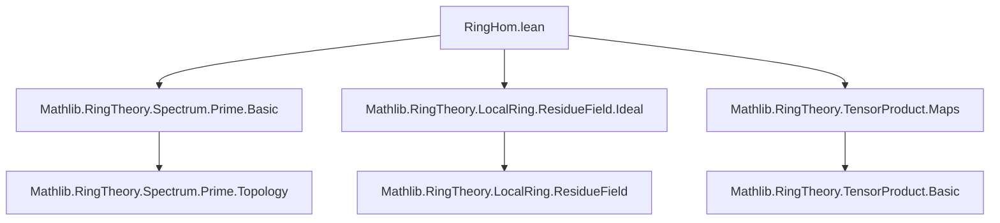

### Technical Brief: `RingHom.lean` — Functoriality of the Prime Spectrum

---

#### **1. Key Definitions & Theorems**

| Name | Type / Signature | Purpose |
|------|------------------|---------|
| `PrimeSpectrum.comap` | `f : R →+* S → p : PrimeSpectrum S ↦ PrimeSpectrum R` | Pullback of a prime ideal along a ring homomorphism; defines the induced continuous map on prime spectra. |
| `comap_asIdeal` | `(comap f y).asIdeal = Ideal.comap f y.asIdeal` | Confirms that `comap` acts as `Ideal.comap` on underlying ideals. |
| `comap_id` | `comap (RingHom.id R) = id` | Identity preservation: identity ring map induces identity on spectra. |
| `comap_comp` | `comap (g.comp f) = comap f ∘ comap g` | Functoriality: composition of ring homs corresponds to composition of induced maps (contravariant). |
| `preimage_comap_zeroLocus` | `comap f ⁻¹' zeroLocus s = zeroLocus (f '' s)` | Describes preimage of basic closed sets under `comap f`. |
| `comap_injective_of_surjective` | `Surjective f → Injective (comap f)` | Surjective ring maps induce injective maps on spectra. |
| `comapEquiv` | `R ≃+* S → PrimeSpectrum R ≃o PrimeSpectrum S` | Ring isomorphisms induce order-isomorphisms of prime spectra. |
| `sigmaToPi` | `(Σ i, PrimeSpectrum (R i)) → PrimeSpectrum (Π i, R i)` | Canonical map from disjoint union of spectra to spectrum of product. |
| `exists_comap_evalRingHom_eq` | For finite products, every prime in `Π R i` is pullback along some projection. | Characterizes primes in finite products. |
| `sigmaToPi_bijective` | For finite index set and commutative rings, `sigmaToPi` is bijective. | Confirms that finite product spectra decompose as disjoint union. |
| `primeSpectrumOrderIsoZeroLocusOfSurj` | `Surjective f : R →+* S` induces `PrimeSpectrum S ≃o zeroLocus (ker f)` | Fundamental correspondence for surjective maps: `Spec S` ≅ closed subset of `Spec R`. |
| `primeSpectrumQuotientOrderIsoZeroLocus` | `PrimeSpectrum (R ⧸ I) ≃o zeroLocus I` | Special case of above for quotient maps. |
| `mem_range_comap_iff` | `p ∈ range (comap f) ↔ (p.map f).comap f = p` | Membership criterion for image of `comap f`. |
| `nontrivial_iff_mem_rangeComap` | `Nontrivial (k(p) ⊗_R S) ↔ p ∈ range (comap (algebraMap R S))` | Fiber nontriviality ⇔ prime lies in image of base change. |
| `IsLocalHom.of_comap_surjective` | `Surjective (comap f) → IsLocalHom f` | Surjectivity of `comap f` implies `f` is a local homomorphism. |

---

#### **2. Naming Conventions**

- **Prefixes**:
  - `comap_`: for maps induced on spectra (contravariant functoriality).
  - `specComap_`: deprecated aliases (to be removed in 2025-12-10+).
  - `primeSpectrum_`, `PrimeSpectrum.`: for definitions/lemmas about spectra.
  - `sigmaToPi_`, `Pi.`: for product/disjoint union constructions.

- **Suffixes**:
  - `_asIdeal`: confirms behavior on underlying ideals.
  - `_of_surjective`: conditions involving surjectivity.
  - `_orderIso_`: order-isomorphisms (e.g., `zeroLocusOfSurj`).
  - `_bijective`, `_injective`, `_surjective`: properties of induced maps.

- **Notable pattern**: `comap` is the canonical name; `specComap` is deprecated.

---

#### **3. Tactic Stack**

Frequently used tactics in proofs:

| Tactic | Usage |
|--------|-------|
| `rfl` | Proving definitional equalities (e.g., `comap_id`, `comap_comp`). |
| `simp` / `simp_rw` | Simplifying using lemmas like `mem_zeroLocus`, `Ideal.mem_comap`, `comap_asIdeal`. |
| `ext` | Extensionality for sets/ideals/functions (e.g., `ext x`, `ext p`). |
| `congr` / `congr_arg` | Equality of structured objects (e.g., ideals). |
| `rw` / `rwa` | Rewriting using equalities or assumptions (e.g., `Ideal.comap_map_of_surjective`). |
| `exact`, `refine`, `apply` | Constructing proofs stepwise. |
| `cases` / `obtain` | Case analysis or existential elimination (e.g., `⟨q, hq⟩`). |
| `simpa` | Simplify and discharge goal using assumptions. |
| `ring` / `abel` | Not used here (commutative semiring arithmetic is mostly definitional). |
| `aesop` | Not present — proofs are mostly manual and ideal-theoretic. |

---

#### **4. Proof Logic**

- **Structure**:
  - Most proofs are *definitional* (`rfl`) or rely on *ideal-theoretic lemmas* (e.g., `Ideal.comap_map_of_surjective`, `Ideal.map_isPrime_of_surjective`).
  - For injectivity/surjectivity results: use `Ideal.comap_injective_of_surjective`, `Ideal.map_isPrime_of_surjective`, etc.
  - For finite product decomposition: use `exists_comap_evalRingHom_eq` + `sigmaToPi_injective` ⇒ `sigmaToPi_bijective`.
  - For maximal ideals outside the image of `sigmaToPi` in infinite products: construct the ideal of finitely supported functions (`DFinsupp`), extend to maximal ideal, and show it cannot be a pullback.

- **Common pattern**:
  ```lean
  -- Prove p ∈ range(comap f)
  obtain ⟨q, hq⟩ := hf p
  exact ⟨q, PrimeSpectrum.ext hq⟩
  ```
  or
  ```lean
  -- Prove equality of primes
  ext; rw [comap_asIdeal, Ideal.mem_comap, ...]
  ```

- **Key logical flow**:
  - **Functoriality**: `comap_id`, `comap_comp` → `comap` is a contravariant functor.
  - **Topological behavior**: `preimage_comap_zeroLocus` → continuity (proved elsewhere).
  - **Surjective case**: `range_comap_of_surjective`, `primeSpectrumOrderIsoZeroLocusOfSurj`.
  - **Product case**: finite vs infinite distinction; infinite case uses `DFinsupp` ideal.

---

#### **5. Imports**

| Import | Purpose |
|--------|---------|
| `Mathlib.RingTheory.Spectrum.Prime.Basic` | Core definitions: `PrimeSpectrum`, `zeroLocus`, `asIdeal`. |
| `Mathlib.RingTheory.LocalRing.ResidueField.Ideal` | Residue fields, tensor products over local rings. |
| `Mathlib.RingTheory.TensorProduct.Maps` | Tensor product maps, especially `includeRight`, `lift`. |

---

#### **6. Mermaid Diagrams**

##### **Dependency Graph (Module-Level)**



##### **Overview of Theory Flow**

```mermaid
graph LR
  RingHom[f : R →+* S] --> comap[comap f : Spec S → Spec R]
  comap --> functoriality[Functoriality: comap_id, comap_comp]
  comap --> topology[Continuity: preimage zeroLocus = zeroLocus image]
  comap --> surj_case[Surjective f ⇒ Spec S ≅ Z(ker f)]
  comap --> iso_case[R ≃+* S ⇒ Spec R ≃o Spec S]
  comap --> tensor_fiber[Tensor product criterion for image membership]
  comap --> local_hom[Surjective comap f ⇒ f is local]
  
  product[Product case] --> finite[Finite ι: sigmaToPi bijective]
  product --> infinite[Infinite ι: maximal ideal outside range]
```

---

#### **7. Summary**

This file formalizes the **contravariant functoriality** of the prime spectrum in the category of commutative semirings (or rings). It establishes:

- `comap f` as the induced map on spectra,
- its behavior under identity, composition, surjectivity, and isomorphism,
- explicit descriptions of its image (via `zeroLocus(ker f)`),
- decomposition of spectra of finite products,
- and connections to local homomorphisms and residue field tensor products.

The proofs rely heavily on ideal-theoretic lemmas (especially from `Mathlib.RingTheory.Ideal`) and are mostly constructive or definitional, with occasional use of Zorn’s Lemma (for maximal ideals in infinite product case).
