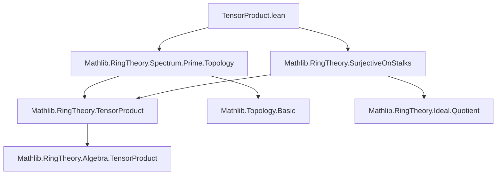

**Technical Brief: TensorProduct.lean (Prime Spectrum of Tensor Products)**  
*Formalization by Andrew Yang (2024), Apache 2.0 licensed*

---

### 1. KEY DEFINITIONS & THEOREMS

| Name | Type / Signature | Purpose |
|------|------------------|---------|
| `tensorProductTo` | `PrimeSpectrum (S ⊗[R] T) → PrimeSpectrum S × PrimeSpectrum T` | Canonical map sending a prime ideal `p ⊆ S ⊗_R T` to the pair `(comap(algebraMap R S) p, comap(includeRight) p)` — i.e., pullbacks along the two structure maps. |
| `continuous_tensorProductTo` | `Continuous (tensorProductTo R S T)` | Continuity of the canonical map (product of two continuous comaps). |
| `isEmbedding_tensorProductTo_of_surjectiveOnStalks_aux` | `p₁ = p₂ ⇔ p₁ ≤ p₂` under hypothesis `hRT` | Shows injectivity *and* order-reflection (hence equality) of `tensorProductTo` using stalk-surjectivity. |
| `isEmbedding_tensorProductTo_of_surjectiveOnStalks` | `IsEmbedding (tensorProductTo R S T)` | Main theorem: under `algebraMap R T` surjective on stalks, `Spec(S ⊗_R T) → Spec S × Spec T` is a **topological embedding** (i.e., homeomorphism onto its image with subspace topology). |

---

### 2. NAMING CONVENTIONS

- **Prefixes**:
  - `tensorProductTo`: canonical map from tensor product spectrum.
  - `isEmbedding_...`: indicates a proof that a map is an embedding (homeomorphism onto image).
  - `continuous_...`: continuity lemmas.
- **Suffixes**:
  - `_of_surjectiveOnStalks`: condition on the base map `R → T`.
  - `_aux`: auxiliary lemmas used in main proof.
- **Notation**:
  - `comap f p` for prime ideal pullback along ring map `f`.
  - `algebraMap _ _`, `includeRight`, `includeLeft`: standard tensor product algebra maps.
  - `tmul`, `mul`, `t_mul`: tensor product multiplication and scalar action.

---

### 3. TACTIC STACK

| Tactic | Usage Frequency | Role |
|--------|-----------------|------|
| `intro`, `intro x hxp₁`, `by_contra` | High | Standard intro + contradiction for prime ideal membership. |
| `obtain ⟨t, r, a, ht, e⟩ := hRT.exists_mul_eq_tmul ...` | High | Extract witness from stalk-surjectivity hypothesis. |
| `rw [← ...] at h₁ h₂` | High | Rewriting using tensor product identities (`tmul_mul_tmul`, `mul_one`, `one_mul`). |
| `rwa [...]` | Medium | Rewrite + assumption, especially for equality of comaps. |
| `exact`, `replace`, `have`, `show` | High | Local reasoning about ideals and membership. |
| `antisymm` | Medium | Prove equality from `≤` in both directions. |
| `le_induced.antisymm`, `isBasis_basic_opens.le_iff.mpr` | Medium | Topological arguments: compare induced vs subspace topology via basis. |
| `rw [isOpen_iff_forall_mem_open]` | Medium | Open set characterization. |
| `simp_rw`, `aesop`, `ring` | Low | Not used heavily — proof is constructive and ideal-theoretic. |

---

### 4. PROOF LOGIC

The proof proceeds in two stages:

1. **Order-theoretic injectivity** (`isEmbedding_tensorProductTo_of_surjectiveOnStalks_aux`):
   - Assume `tensorProductTo p₁ = tensorProductTo p₂`.
   - Want: `p₁ = p₂`.
   - Strategy: Show `p₁ ≤ p₂` and `p₂ ≤ p₁`.
   - Use stalk-surjectivity to write `f = a·r·t` as a tensor `a ⊗ t`.
   - Assume `f ∈ p₁` but `f ∉ p₂`, derive contradiction via ideal primality and comap behavior.
   - Key: comaps of `p₁` and `p₂` along the two inclusions agree (by hypothesis), so membership of `a ⊗ t` in either ideal forces same behavior.

2. **Topological embedding** (`isEmbedding_tensorProductTo_of_surjectiveOnStalks`):
   - Need: `tensorProductTo` is a homeomorphism onto its image.
   - Break into:
     - Continuity (already given by `continuous_tensorProductTo`).
     - Openness onto image: show image of basic opens `basicOpen(f)` is intersection of image with open set in product.
   - Use stalk-surjectivity again to lift `f = a ⊗ t` and express `basicOpen(f)` as intersection:
     ```
     basicOpen(a ⊗ t) = basicOpen(a ⊗ 1) ∩ basicOpen(1 ⊗ t)
     ```
   - Verify inclusion both ways using primality and the identity `a⊗t = (a⊗1)(1⊗t)`.

---

### 5. IMPORTS & DEPENDENCIES

| Module | Role |
|--------|------|
| `Mathlib.RingTheory.Spectrum.Prime.Topology` | Defines `PrimeSpectrum`, its topology, `basicOpen`, `comap`, continuity. |
| `Mathlib.RingTheory.SurjectiveOnStalks` | Defines `SurjectiveOnStalks` and key lemma `exists_mul_eq_tmul`. |
| `TensorProduct` (from `Mathlib.RingTheory.TensorProduct`) | Provides `algebraMap`, `includeLeft`, `includeRight`, `tmul`, multiplication laws. |
| `Topology` | Product topology, continuity, induced topology, basis arguments. |

---

### 6. MERMAID DIAGRAMS

#### Dependency Graph (Module-Level)



#### Proof Structure Overview

```mermaid
graph LR
  H[Stalk-surjectivity: algebraMap R T] --> I[exists_mul_eq_tmul]
  I --> J[isEmbedding_tensorProductTo_of_surjectiveOnStalks_aux]
  J --> K[Injectivity + order-reflection]
  K --> L[isEmbedding_tensorProductTo_of_surjectiveOnStalks]
  L --> M[Spec(S ⊗_R T) ↪ Spec S × Spec T]
  N[continuous_tensorProductTo] --> L
  O[Basic open basis] --> L
```

---

### 7. SUMMARY

This file establishes a **topological embedding** of the prime spectrum of a tensor product into the product of prime spectra, under the condition that the structure map `R → T` is *surjective on stalks* — a condition weaker than surjectivity of the ring map itself. The proof is constructive and ideal-theoretic, leveraging:
- Stalk-surjectivity to decompose elements as tensors,
- Primality to control membership,
- Basis of open sets in Zariski topology to lift openness.

This result is foundational for descent theory and fiber product constructions in algebraic geometry formalized in `Mathlib`.
