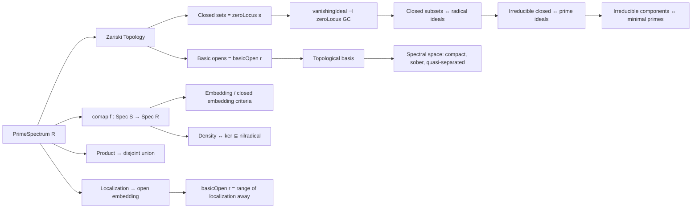

Here is the **technical metadata extraction** for the `Topology.lean` file, focusing on definitions, theorems, naming conventions, proof logic, imports, and theory structure.

---

### **1. KEY DEFINITIONS & THEOREMS**

#### **Definitions**
| Name | Type / Signature | Purpose |
|------|------------------|---------|
| `zariskiTopology` | `TopologicalSpace (PrimeSpectrum R)` | Defines the Zariski topology via closed sets = zero loci of subsets. |
| `zeroLocus (s : Set R)` | `Set (PrimeSpectrum R)` | Zero locus of a subset: primes containing `s`. |
| `vanishingIdeal (t : Set (PrimeSpectrum R))` | `Ideal R` | Ideal of functions vanishing on `t`. |
| `basicOpen (r : R)` | `Opens (PrimeSpectrum R)` | Open set where `r` does not vanish: complement of `Z({r})`. |
| `comap (f : R →+* S)` | `PrimeSpectrum S → PrimeSpectrum R` | Continuous map induced by ring homomorphism `f`. |
| `closedsEmbedding` | `(Closeds (PrimeSpectrum R))ᵒᵈ ↪o Ideal R` | Antitone embedding of closed subsets into radical ideals. |
| `primeSpectrumProdHomeo` | `PrimeSpectrum (R × S) ≃ₜ PrimeSpectrum R ⊕ PrimeSpectrum S` | Homeomorphism between spectrum of product and disjoint union. |
| `localization_comap_range` | `Set.range (comap (algebraMap R S)) = {p | Disjoint M p.asIdeal}` | Description of image of localization map on spectra. |
| `localization_away_comap_range` | `Set.range (comap (algebraMap R S)) = basicOpen r` | Image of localization away from `r` is `basicOpen r`. |
| `isIdempotentElemEquivClopens` | `R ≃ₜ Clopens (PrimeSpectrum R)` (if `R` is a ring) | Clopen subsets ↔ idempotent elements. |
| `mulZeroAddOneEquivClopens` | `(r, s : R) // r * s = 0 ∧ r + s = 1` ↔ `Clopens (PrimeSpectrum R)` | Clopen subsets ↔ complementary idempotent-like pairs. |

#### **Theorems**
| Name | Statement (summary) |
|------|---------------------|
| `isClosed_iff_zeroLocus_radical_ideal` | Closed subsets ↔ zero loci of radical ideals. |
| `isClosed_singleton_iff_isMaximal` | `{x}` closed ⇔ `x.asIdeal` is maximal. |
| `isIrreducible_iff_vanishingIdeal_isPrime` | `s` irreducible ⇔ `vanishingIdeal s` is prime. |
| `vanishingIdeal_isIrreducible` | Image of irreducible closed subsets under `vanishingIdeal` = set of prime ideals. |
| `discreteTopology_iff_finite_and_krullDimLE_zero` | `Spec R` discrete ⇔ finite & Krull dim ≤ 0 (or trivial). |
| `denseRange_comap_iff_minimalPrimes` | `range (comap f)` dense ⇔ contains all minimal primes ⇔ `ker f ⊆ nilradical`. |
| `isClosedMap_comap_of_isIntegral` | If `f` is integral, then `comap f` is a closed map. |
| `isIntegral_of_isClosedMap_comap_mapRingHom` | If `comap (Polynomial.mapRingHom f)` is closed, then `f` is integral. |
| `primeSpectrumProdHomeo` | `Spec(R × S) ≅ Spec R ⊔ Spec S`. |
| `localization_comap_isEmbedding` | Localization induces an embedding on spectra. |
| `isClosedEmbedding_comap_of_surjective` | Surjective ring maps induce closed embeddings on spectra. |

---

### **2. NAMING CONVENTIONS**

- **Prefixes**:
  - `is*`: predicates (e.g., `isClosed`, `isCompact`, `isIdempotentElemEquivClopens`)
  - `zeroLocus`: closed sets defined by vanishing
  - `vanishingIdeal`: ideal of functions vanishing on a set
  - `basicOpen`: basic opens in Zariski topology
  - `comap`: induced map on spectra from ring homomorphism
  - `localization_*`: properties of localization-induced maps
  - `primeSpectrum*`: constructions on `PrimeSpectrum`

- **Suffixes**:
  - `_iff`: characterizations (↔)
  - `_range`: description of image/range
  - `_embedding`, `_closed_embedding`, `_homeomorph`: categorical properties
  - `_equiv_*`: bijections/equivalences (e.g., `equivClopens`, `equivIrreducibleComponents`)

- **Notation**:
  - `Z(s)` for `zeroLocus s`
  - `basicOpen r` for open set where `r ≠ 0`

---

### **3. TACTIC STACK**

Frequently used tactics in proofs:
- `simp` / `simp_rw`: simplification with definitional lemmas (especially `zeroLocus_*`, `vanishingIdeal_*`)
- `rw`: rewriting using equivalences like `isClosed_iff_zeroLocus`, `vanishingIdeal_anti_mono_iff`
- `ext`: extensionality for ideals/sets/functions
- `aesop`: automated reasoning for set-theoretic and order-theoretic goals
- `rcases` / `obtain`: case analysis on existential quantifiers
- `convert`: flexible equality chaining (e.g., using `zeroLocus_vanishingIdeal_eq_closure`)
- `exact` / `assumption`: closing simple goals
- `apply`: applying lemmas (e.g., `isClosed_zeroLocus`, `isCompact_range`)
- `convert'`: for structured conversion with leeway
- `interval_cases`, `induction`: for natural number arguments (e.g., powers, nilpotency)

---

### **4. PROOF LOGIC**

**Typical proof patterns**:
1. **Characterization via zero loci**:
   - Use `isClosed_iff_zeroLocus` or variants to reduce closed-set questions to ideal-theoretic ones.
   - Apply `zeroLocus_radical`, `vanishingIdeal_zeroLocus_eq_radical`, `gc R` (Galois connection).

2. **Galois connection (`gc R`)**:
   - `vanishingIdeal ⊣ zeroLocus` is used repeatedly to translate between sets of points and ideals.

3. **Localization arguments**:
   - Use `IsLocalization.isPrime_iff_isPrime_disjoint` to relate primes in localization to disjointness with submonoid.
   - `localization_comap_range` and `localization_away_comap_range` describe images.

4. **Spectral space properties**:
   - Prove quasi-compactness via finite subfamily criterion (`compactSpace_of_finite_subfamily_closed`).
   - Prove sobriety via `QuasiSober` instance using irreducible closed subsets ↔ prime ideals.

5. **Embedding/closed embedding criteria**:
   - Use `isEmbedding_iff`, `isClosedEmbedding_iff`, `isInducing` + injectivity + closed range.

6. **Discrete topology**:
   - Reduce to maximal ideals and Krull dimension via `isClosed_singleton_iff_isMaximal`.

---

### **5. IMPORTS**

**Core dependencies**:
- `Mathlib.Algebra.Order.Ring.Idempotent`
- `Mathlib.Order.Heyting.Hom`
- `Mathlib.RingTheory.Finiteness.Ideal`
- `Mathlib.RingTheory.Ideal.GoingUp`
- `Mathlib.RingTheory.Ideal.MinimalPrime.Localization`
- `Mathlib.RingTheory.KrullDimension.Basic`
- `Mathlib.RingTheory.Localization.Algebra`
- `Mathlib.RingTheory.Spectrum.Maximal.Localization`
- `Mathlib.Topology.Constructible`
- `Mathlib.Topology.KrullDimension`
- `Mathlib.Topology.Spectral.Basic`

→ These indicate the file sits at the intersection of **commutative algebra**, **order theory**, and **topology**, especially **spectral spaces**.

---

### **6. MERMAID DIAGRAMS**

#### **Dependency Graph (Module-Level)**

```mermaid
graph TD
  A[Topology.lean] --> B[Mathlib.Algebra.Order.Ring.Idempotent]
  A --> C[Mathlib.Order.Heyting.Hom]
  A --> D[Mathlib.RingTheory.Finiteness.Ideal]
  A --> E[Mathlib.RingTheory.Ideal.GoingUp]
  A --> F[Mathlib.RingTheory.Ideal.MinimalPrime.Localization]
  A --> G[Mathlib.RingTheory.KrullDimension.Basic]
  A --> H[Mathlib.RingTheory.Localization.Algebra]
  A --> I[Mathlib.RingTheory.Spectrum.Maximal.Localization]
  A --> J[Mathlib.Topology.Constructible]
  A --> K[Mathlib.Topology.KrullDimension]
  A --> L[Mathlib.Topology.Spectral.Basic]
```

#### **Overview of Theory Flow**

---

Let me know if you'd like a **dependency graph of definitions/theorems**, or a **proof dependency DAG** for a specific theorem (e.g., `discreteTopology_iff_finite_and_krullDimLE_zero`).
