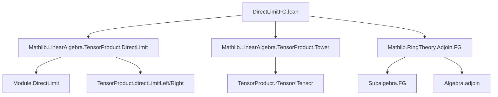

### Technical Brief: `DirectLimitFG.lean`

---

#### **1. Key Definitions & Theorems**

| Name | Type / Signature | Purpose |
|------|------------------|---------|
| `Submodule.FG.directedSystem` | `DirectedSystem (ι := {P : Submodule R M // P.FG}) (F := fun P ↦ P.val) (f := fun h ↦ Submodule.inclusion h)` | Constructs the directed system of finitely generated (FG) submodules of $M$, ordered by inclusion. |
| `Submodule.FG.directLimit` | `Module.DirectLimit ... ≃ₗ[R] M` | Shows any module $M$ is the direct limit of its FG submodules. |
| `DirectedSystem.rTensor` | `DirectedSystem (fun i ↦ F i ⊗[R] N)` | Tensoring a directed system on the right yields a directed system. |
| `Submodule.FG.rTensor.directedSystem` | `DirectedSystem (fun P ↦ P.val ⊗[R] N)` | FG submodules of $M$ induce a directed system via $P \mapsto P \otimes N$. |
| `Submodule.FG.rTensor.directLimit` | `Module.DirectLimit ... ≃ₗ[R] M ⊗[R] N` | Tensor product $M \otimes N$ is the direct limit of $P \otimes N$ over FG $P \le M$. |
| `DirectedSystem.lTensor` | `DirectedSystem (fun i ↦ M ⊗[R] F i)` | Tensoring a directed system on the left yields a directed system. |
| `Submodule.FG.lTensor.directedSystem` | `DirectedSystem (fun Q ↦ M ⊗[R] Q.val)` | FG submodules of $N$ induce a directed system via $Q \mapsto M \otimes Q$. |
| `Submodule.FG.lTensor.directLimit` | `Module.DirectLimit ... ≃ₗ[R] M ⊗[R] N` | Tensor product $M \otimes N$ is the direct limit of $M \otimes Q$ over FG $Q \le N$. |
| `TensorProduct.exists_of_fg` | `∃ P : Submodule R M, P.FG ∧ u ∈ range (rTensor N P.subtype)` | Every tensor $u \in M \otimes N$ factors through some $P \otimes N$ with $P$ FG. |
| `TensorProduct.eq_of_fg_of_subtype_eq` | `rTensor N P.subtype t = rTensor N P.subtype t' ⇒ ∃ Q ≥ P, Q.FG, ...` | Equality in $M \otimes N$ of images from $P \otimes N$ descends to some common FG overmodule. |
| `TensorProduct.Algebra.exists_of_fg` | `∃ A : Subalgebra R S, A.FG ∧ u ∈ range (rTensor N A.val.toLinearMap)` | Analogous to `exists_of_fg`, but for algebras: elements of $S \otimes N$ factor through FG subalgebras. |
| `TensorProduct.Algebra.eq_of_fg_of_subtype_eq` | Equality in $S \otimes N$ of images from $A \otimes N$ descends to a common FG over-subalgebra. |
| `Submodule.exists_fg_of_baseChange_eq_zero` | `f.baseChange S t = 0 ⇒ ∃ A.FG, u : A ⊗ M, f.baseChange A u = 0 ∧ ...` | Lifts kernel elements across base change to a finite-type subalgebra. |

---

#### **2. Naming Conventions**

- **Prefixes**:
  - `Submodule.FG.*`: Pertains to finitely generated submodules.
  - `DirectedSystem.*`: Constructs or uses directed systems.
  - `TensorProduct.*`: General tensor product lemmas.
  - `TensorProduct.Algebra.*`: Tensor products over algebras.
- **Suffixes**:
  - `directedSystem`: Constructs a directed system.
  - `directLimit`: Constructs the equivalence with the tensor product.
  - `apply` / `apply'`: Explicit formula for the direct limit map on `of` elements.
  - `eq_of_fg_of_subtype_eq`: Equality lifting lemma (FG submodules/algebras).
  - `exists_of_fg`: Existence of factorization through FG submodule/algebra.

---

#### **3. Tactic Stack**

- **Core tactics**:
  - `simp`, `rw`, `ext`, `apply`, `congr`
  - `cases`, `obtain`, `let`, `set`
  - `have`, `suffices`, `exact`, `refl`, `rfl`
- **Domain-specific**:
  - `Module.DirectLimit.lift_injective`, `Module.DirectLimit.exists_of`, `Module.DirectLimit.exists_eq_of_of_eq`
  - `TensorProduct.directLimitLeft`, `TensorProduct.directLimitRight`
  - `Submodule.injective_subtype`, `Submodule.mem_span_singleton_self`
  - `Subalgebra.fg_adjoin_finset`, `Algebra.subset_adjoin`
- **Automation**:
  - `aesop` not used (manual proofs dominate).
  - `ring` not used (no polynomial ring reasoning).
  - Heavy use of `simp only [...] at h` for targeted simplification.

---

#### **4. Proof Logic**

- **Structure**:
  1. **Induction / Direct limit machinery**: Use `Module.DirectLimit.lift`, `of`, and universal properties.
  2. **Factorization**: Prove existence of FG submodules/algebras via `Span`/`Adjoin`.
  3. **Equality lifting**: Use `Module.DirectLimit.exists_eq_of_of_eq` to lift equalities from colimit to some stage.
  4. **Suprema / joins**: For two submodules/algebras $P, P'$, pass to $P \vee P'$ (sup) to get a common overobject.
  5. **Algebraic lifting**: Use `Algebra.adjoin` to construct FG subalgebras from finite sets.

- **Typical flow**:
  > Given $u \in M \otimes N$, pull back via `directLimit.symm` to some $P \otimes N$, then use properties of `of` and `directLimit_apply` to relate back.

---

#### **5. Imports**

- `Mathlib.LinearAlgebra.TensorProduct.DirectLimit`: Direct limits of modules and tensor product interaction.
- `Mathlib.LinearAlgebra.TensorProduct.Tower`: Tensor product associativity/tower laws.
- `Mathlib.RingTheory.Adjoin.FG`: Finitely generated subalgebras via `adjoin`.

---

#### **8. Mermaid Diagrams**

##### **Dependency Graph (Module-Level)**



##### **Overview of Theory Flow**

```mermaid
flowchart LR
  A[Module M] -->|FG submodules| B[DirectedSystem {P // P.FG}]
  B --> C[DirectLimit ⨉ P ⊗ N]
  C -->|directLimit| D[M ⊗ N]

  A -->|FG submodules| E[DirectedSystem {Q // Q.FG}]
  E --> F[DirectLimit ⨉ M ⊗ Q]
  F -->|directLimit| D

  D -->|elements| G[exists factor through FG]
  G --> H[eq lifting to common FG overobject]

  I[Algebra S] -->|FG subalgebras| J[DirectedSystem {A // A.FG}]
  J --> K[DirectLimit ⨉ A ⊗ N]
  K -->|directLimit| L[S ⊗ N]
```

---

This file formalizes a foundational result in homological algebra: **tensor products commute with direct limits**, specialized to the case of finitely generated submodules/algebras. It is essential for reducing proofs about arbitrary modules/algebras to the finitely generated case — a standard technique in commutative algebra and algebraic geometry.
