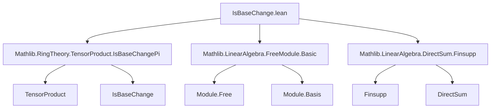

### Technical Brief: `IsBaseChange.lean`

---

#### **1. Key Definitions & Theorems**

| Name | Type / Signature | Purpose |
|------|------------------|---------|
| `basis` | `Module.Basis ι S W` | Constructs the natural $S$-basis of $W$ (the base change of $V$) from a given $R$-basis $b$ of $V$ and an `IsBaseChange` structure `ibc`. |
| `basis_apply` | `ibc.basis b i = ε (b i)` | Shows that the constructed basis vectors are the image under $\varepsilon$ of the original basis vectors. |
| `basis_repr_comp_apply` | `(ibc.basis b).repr (ε v) i = algebraMap R S (b.repr v i)` | Describes the coordinate function of the new basis: coordinates are base-changed coordinates from the original basis. |
| `basis_repr_comp` | `(ibc.basis b).repr (ε v) = Finsupp.mapRange.linearMap (Algebra.linearMap R S) (b.repr v)` | Global coordinate map version: the representation w.r.t. the new basis is the base change of the old representation. |
| `free` | `Module.Free S W` | Proves that a base change of a free module is free (constructively, via `of_basis`). |
| `of_basis` | `IsBaseChange R (Finsupp.linearCombination A b)` | Shows that any module with an $R$-basis is a base change of a free $A$-module (via $A \to R$), for any under-ring $A$. |
| `of_fintype_basis` | `IsBaseChange R (Fintype.linearCombination A b)` | Finite version of `of_basis`, for modules with finite basis. |
| `of_fintype_basis_eq` | `(Fintype.linearCombination A b) a = v ↔ algebraMap A R ∘ a = b.equivFun v` | Characterizes the linear combination map in terms of the basis equivalence. |

---

#### **2. Naming Conventions**

- **Prefixes**:
  - `basis_`: properties of the constructed basis.
  - `of_`: constructions showing a module *is* a base change.
  - `repr`: representation / coordinate functions.
- **Suffixes**:
  - `_apply`: pointwise evaluation version.
  - `_comp`: composition with a linear map (e.g., `repr ∘ ε`).
  - `_eq`: equivalence/characterization (often bi-implication).
- **General**:
  - `linearCombination`: generic linear combination map (finsupp or fintype).
  - `mapRange`, `piScalarRight`, `finsuppScalarRight`: tensor-related isomorphisms.

---

#### **3. Tactic Stack**

- **Core tactics**:
  - `simp` (heavily used, with `only`, `congr`, `ext`, `generalize_proofs`)
  - `rw` (especially for rewriting definitions and equivalences)
  - `conv` (for equational reasoning in subterms)
  - `refine` (for constructing proofs with holes)
  - `have` / `suffices` (for intermediate lemmas)
  - `classical` (for existence of bases in finite case)
- **Domain-specific**:
  - `LinearEquiv.*` lemmas (`symm_apply_eq`, `trans_apply`, `coe_toLinearMap`, etc.)
  - `TensorProduct.*` lemmas (`tmul`, `piScalarRight_apply`, etc.)
  - `Finsupp.*`, `Fintype.*` lemmas (`sum_apply`, `linearCombination_apply`, etc.)

---

#### **4. Proof Logic**

- **Structure**:
  - **Inductive/constructive**: Definitions are noncomputable but explicit (e.g., `basis` uses `repr`, `baseChange`, `finsuppPow`).
  - **Equivalence-based reasoning**: Many proofs go via `LinearEquiv.ofBijective` or `of_equiv`, reducing to bijectivity or surjectivity/injectivity of composite maps.
  - **Coordinate-wise verification**: Proofs of basis properties often reduce to checking on basis elements or using `ext i` + `simp`.
  - **Tensorial isomorphisms**: Key lemmas (`of_basis`, `of_fintype_basis`) construct explicit linear equivalences using tensor product universal properties and scalar restriction/extension.

- **Typical flow**:
  1. Introduce tensor-based isomorphism (e.g., `j : R ⊗[A] (ι → A) ≃ ι → R`).
  2. Show composite map (e.g., `linearCombination ∘ j`) is bijective.
  3. Conclude `IsBaseChange` via `of_equiv`.
  4. For basis properties, compute coordinates using `repr`, `map_smul`, and `algebraMap_smul`.

---

#### **5. Imports & Dependencies**

| Module | Role |
|--------|------|
| `Mathlib.RingTheory.TensorProduct.IsBaseChangePi` | Core theory of base change via tensor product; defines `IsBaseChange` and its basic properties. |
| `Mathlib.LinearAlgebra.FreeModule.Basic` | Free modules, bases, `chooseBasis`, `of_basis`. |
| `Mathlib.LinearAlgebra.DirectSum.Finsupp` | Finitely supported functions, linear combinations, `Finsupp.linearCombination`, `finsuppPow`. |

---

#### **6. Mermaid Diagrams**

##### **Dependency Graph (Module-Level)**



##### **Theoretical Overview (Conceptual Flow)**

```mermaid
flowchart LR
  R[CommSemiring R] -->|algebra| S[CommSemiring S]
  V[Module R V] -->|basis b| ι[ι]
  W[Module S W] <--|ε : V →ₗ[R] W| V
  ibc[IsBaseChange S ε] -->|constructs| basis[Module.Basis ι S W]
  basis -->|free| free[Module.Free S W]

  A[CommSemiring A] -->|algebra| R
  A -->|base change| S
  V <--|of_basis| A[Module A V]
  V <--|of_fintype_basis| A[Module A V]([Fintype ι])
```

##### **Proof Strategy Skeleton**

```mermaid
flowchart LR
  A[Goal: IsBaseChange R ε] --> B[Construct j : R ⊗[A] (ι → A) ≃ ι → R]
  B --> C[Show ε ∘ Finsupp.linearCombination A b = Finsupp.linearCombination R b ∘ j]
  C --> D[Prove bijectivity of composite]
  D --> E[Apply LinearEquiv.ofBijective]
  E --> F[Conclude IsBaseChange]
```

---

#### **7. Summary**

This file formalizes the fundamental fact that **base change preserves freeness**, and more generally, that **any module with a basis is a base change of a free module over any under-ring**. It leverages tensor products, `Finsupp`/`Fintype` linear combinations, and explicit coordinate computations. The proofs are highly structured, relying on linear equivalences and careful simplification of tensorial and functional representations.

The module is part of a larger effort to formalize descent and base change phenomena in homological algebra and algebraic geometry (e.g., in the context of projective modules, vector bundles, or Galois descent).
