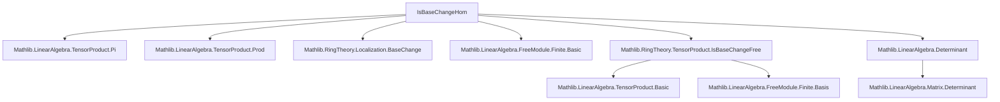

### Technical Brief: `IsBaseChangeHom.lean`

---

#### **1. Key Definitions & Theorems**

| Name | Type / Signature | Purpose |
|------|------------------|---------|
| `linearMapRightBaseChangeHom` | `(ε : N →ₗ[R] P) → (S ⊗[R] (M →ₗ[R] N)) →ₗ[S] (M →ₗ[R] P)` | Constructs the base change *homomorphism* (not yet iso) for right-linear maps, using tensor product and `compRight`. |
| `linearMapRightBaseChangeEquiv` | `IsBaseChange S ε → S ⊗[R] (M →ₗ[R] N) ≃ₗ[S] (M →ₗ[R] P)` | Shows the above is an isomorphism when `ε` is a base change and `M` is finite free. |
| `linearMapRight` | `IsBaseChange S ε → IsBaseChange S (LinearMap.compRight R ε)` | Main theorem: if `ε : N →ₗ[R] P` is a base change and `M` is finite free, then precomposition `M →ₗ[R] N ↦ M →ₗ[R] P` is a base change. |
| `linearMapLeftRightHom` | `IsBaseChange S α → (N →ₗ[R] Q) → (M →ₗ[R] N) →ₗ[R] (P →ₗ[S] Q)` | Base change map for *bilinear* linear maps: source and target both base-changed. |
| `linearMapLeftRight` | `IsBaseChange S α → IsBaseChange S β → IsBaseChange S (linearMapLeftRightHom α β)` | Main theorem: if both source and target are base changes, then `Hom`-space base changes accordingly. |
| `endHom` | `IsBaseChange S α → (M →ₗ[R] M) →ₗ[R] (P →ₗ[S] P)` | Special case of `linearMapLeftRightHom` where source = target = `M`, i.e., endomorphisms. |
| `endHom_one` | `endHom j 1 = 1` | Preserves identity endomorphism under base change. |
| `end` | `IsBaseChange S α → IsBaseChange S (endHom j)` | Main theorem: endomorphism module base changes. |
| `linearMapLeftRightHom_toMatrix` | `toMatrix (ibcM.basis b) (ibcN.basis c) = (f.toMatrix b c).map (algebraMap R S)` | Matrix representation commutes with base change (entries mapped via `algebraMap R S`). |
| `endHom_toMatrix` | Same as above for endomorphisms. |
| `det_endHom` | `LinearMap.det (endHom j f) = algebraMap R S (LinearMap.det f)` | Determinant commutes with base change (requires `CommRing`). |

---

#### **2. Naming Conventions**

- **Prefixes**:
  - `linearMapRight*`, `linearMapLeftRight*`, `end*`: denote constructions for linear maps with fixed right/left argument or endomorphisms.
  - `*BaseChangeHom`, `*BaseChangeEquiv`: distinguish non-isomorphism maps (`Hom`) from isomorphisms (`Equiv`).
- **Suffixes**:
  - `*Hom`: underlying linear map (not necessarily iso).
  - `*Equiv`: linear equivalence (iso).
  - `*toMatrix`, `*det`: matrix/determinant compatibility results.
- **Variables**:
  - `α`, `β`, `ε`: denote base change maps (`IsBaseChange S α` etc.).
  - `j`, `k`, `ibcM`, `ibcN`: proofs of `IsBaseChange`.
  - `b`, `c`: bases (used for matrix computations).

---

#### **3. Tactic Stack**

- **Core tactics**:
  - `simp`, `ext`, `rw`, `apply`, `intro`, `induction`, `cases`
- **Specialized**:
  - `TensorProduct.induction_on`: for proving properties of tensor products.
  - `aesop`: for routine simplification and algebraic reasoning.
  - `ring`, `linarith`: for module/algebraic identities.
  - `congr`, `congr_left`, `congr_right`: for congruence of equivalences.
  - `equiv_tmul`, `equiv_symm_apply`, `equiv_trans`: for manipulating `LinearEquiv`.
  - `finitePow`: used in `linearMapRightBaseChangeEquiv` proof (likely from `IsBaseChangeFree`).
  - `subsingleton_or_nontrivial`: case analysis on ring structure (used in `det_endHom`).

---

#### **4. Proof Logic**

- **Structure**:
  1. **Construct a candidate linear map** (`*Hom`).
  2. **Prove it’s an equivalence** (`*Equiv`) using:
     - Basis expansion (via `Free.chooseBasis`, `repr`, `Finsupp.llift`).
     - Reduction to known equivalences (`finitePow`, `liftBaseChangeEquiv`, `congrLeft`).
     - `of_equiv` to lift equivalence to `IsBaseChange`.
  3. **Verify naturality/simp lemmas** (`apply`, `ext`, `simp`).
  4. **Matrix/determinant results**: reduce to known `toMatrix`/`det` lemmas and use `map_det`, `RingHom.mapMatrix_apply`.

- **Induction patterns**:
  - Tensor product: `TensorProduct.induction_on`.
  - Base change elements: `j.inductionOn` (from `IsBaseChange` inductive structure).
  - Ring case analysis: `subsingleton_or_nontrivial`.

- **Key logical flow**:
  > *Given finite freeness of `M`, use basis to identify `M →ₗ[R] N` with `ι → N` (finitely supported functions), then apply known base change for `ι → -` (i.e., finite products/powers), and transport via equivalences.*

---

#### **5. Imports & Dependencies**

| Module | Role |
|--------|------|
| `Mathlib.LinearAlgebra.TensorProduct.Pi` | Tensor product with products (`Π`), used for `ι → N ≅ Π i, N`. |
| `Mathlib.LinearAlgebra.TensorProduct.Prod` | Tensor product with finite products. |
| `Mathlib.RingTheory.Localization.BaseChange` | General base change theory (localization case). |
| `Mathlib.LinearAlgebra.FreeModule.Finite.Basic` | Finite free modules, bases, `Free`, `chooseBasis`, `repr`. |
| `Mathlib.RingTheory.TensorProduct.IsBaseChangeFree` | `IsBaseChange` for free modules, `finitePow`, `liftBaseChangeEquiv`. |
| `Mathlib.LinearAlgebra.Determinant` | Determinant, `det_toMatrix`, `map_det`. |

---

#### **6. Mermaid Diagrams**

##### **Dependency Graph (Module-Level)**



##### **Overview of Theory Flow**

```mermaid
flowchart LR
  subgraph BaseChangeTheory
    IBC[IsBaseChange S α] -->|finite free M| BC_Hom[IsBaseChange S (compRight ε)]
    IBC -->|finite free M, N| BC_Lift[IsBaseChange S (linearMapLeftRightHom)]
    IBC -->|endomorphisms| BC_End[IsBaseChange S (endHom)]
  end

  BC_Hom --> Mat[Matrix representation = mapped entries]
  BC_End --> Det[det commutes with algebraMap]

  subgraph Tools
    TB[TensorProduct.lift]
    BE[LinearEquiv.ofBijective]
    FB[Free.chooseBasis]
    FP[finitePow]
  end

  BC_Hom -.->|basis expansion| BE
  BC_Lift -.->|compose equivalences| BE
  BC_End -.->|specialize| BE
```

---

#### **7. Summary**

This file formalizes **functoriality of linear maps under base change**, especially for **finite free modules**. It shows that:
- Precomposition (`compRight`) preserves base change.
- Hom-spaces `M →ₗ[R] N` base change to `P →ₗ[S] Q` when both `M, N` do.
- Endomorphism rings and determinants behave naturally under base change.

The proofs rely heavily on **basis expansions**, **tensor product universal properties**, and **transport along equivalences**, with matrix/determinant results as corollaries. The structure reflects a *categorical* perspective: base change is a strong monoidal functor on the category of finite free modules.
