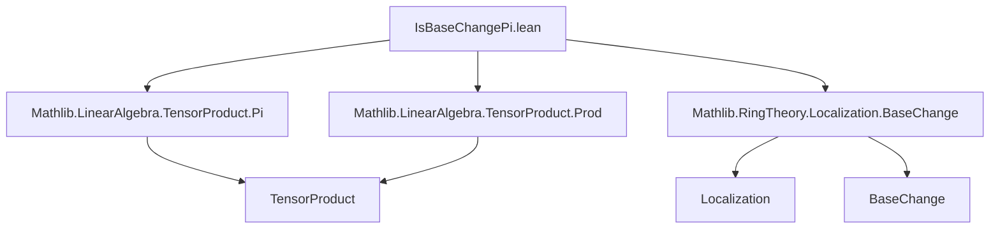
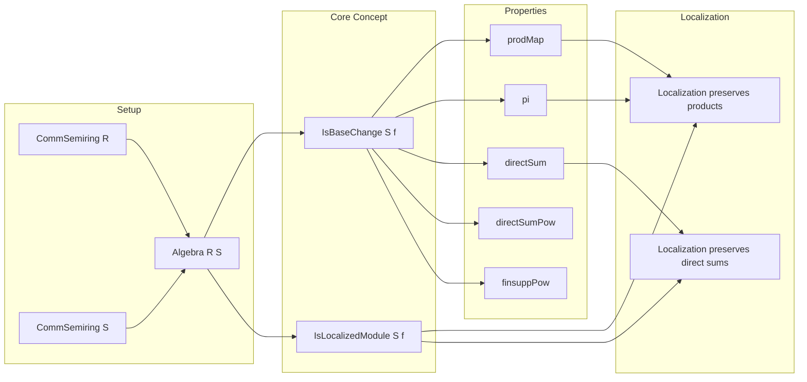

### Technical Brief: `IsBaseChangePi.lean`

---

#### **1. Key Definitions & Theorems**

| Name | Type / Signature | Purpose |
|------|------------------|---------|
| `IsBaseChange` | `class IsBaseChange (S : Algebra R S) (f : M →ₗ[R] N) : Prop` | Expresses that a linear map `f` arises as the base change of a map over `R` along `S`. |
| `IsBaseChange.equiv` | `hf.equiv : S ⊗_R M ≃ₗ[S] N` | The equivalence witnessing that `f` is a base change. |
| `IsBaseChange.of_equiv` | `(h : ∃ e : S ⊗_R M ≃ₗ[S] N, ... ) → IsBaseChange S f` | Constructs `IsBaseChange` from an explicit equivalence. |
| `prodMap` | `IsBaseChange S f → IsBaseChange S g → IsBaseChange S (f.prodMap g)` | Base change commutes with binary product of linear maps. |
| `pi` | `(∀ i, IsBaseChange S (f i)) → IsBaseChange S (.pi fun i ↦ f i ∘ₗ .proj i)` | Base change commutes with finite product (`Π`) of linear maps. |
| `finitePow` | `IsBaseChange S f → IsBaseChange S (f.compLeft ι)` | Base change commutes with finite powers (`M^ι ≅ M^ι`). |
| `directSum` | `(∀ i, IsBaseChange S (ε i)) → IsBaseChange S (lmap ε)` | Base change commutes with direct sum of linear maps. |
| `directSumPow` | `IsBaseChange S ε → IsBaseChange S (lmap fun _ ↦ ε)` | Base change commutes with constant direct sum (`⊕_ι M`). |
| `finsuppPow` | `IsBaseChange S ε → IsBaseChange S (Finsupp.mapRange.linearMap ε)` | Base change commutes with finitely supported functions (`ι →₀ M`). |
| `IsLocalizedModule` | `class IsLocalizedModule (S : Submonoid R) (f : M →ₗ[R] N) : Prop` | Expresses that `f` is the localization map at `S`. |
| `IsLocalizedModule.module` | `Module (Localization S) N` | Induced module structure on the localized target. |
| `prodMap` (instance) | `[IsLocalizedModule S f] → [IsLocalizedModule S g] → IsLocalizedModule S (f.prodMap g)` | Localization commutes with binary products. |
| `pi` (instance) | `[∀ i, IsLocalizedModule S (f i)] → IsLocalizedModule S (.pi f)` | Localization commutes with finite products. |

---

#### **2. Naming Conventions**

- **Prefixes**:
  - `isBaseChange_`: for lemmas about `IsBaseChange`.
  - `isLocalizedModule_`: for lemmas/instances about `IsLocalizedModule`.
- **Suffixes**:
  - `Map`: for maps on products (`prodMap`), direct sums (`directSum`), etc.
  - `Pow`: for powers (`finitePow`, `directSumPow`, `finsuppPow`).
- **Congruence patterns**:
  - `congrLinearEquiv`, `prodCongr`, `piCongrRight`: for constructing equivalences from component-wise equivalences.
  - `trans`, `symm`: used in equivalence chaining.

---

#### **3. Tactic Stack**

- **Core tactics**:
  - `intro`, `ext`, `simp`, `rw`, `apply`, `exact`
- **Specialized**:
  - `cases nonempty_fintype ι`: handles finiteness of index type.
  - `classical`: used to enable classical choice for finite types.
  - `infer_instance`: to discharge typeclass goals.
  - `simp [equiv_tmul]`, `simp [coe_directSumRight', ...]`: simplification using tensor product and direct sum coercion lemmas.
  - `ring`: likely used implicitly in module algebra manipulations (not explicit here, but standard in such contexts).
  - `aesop`: not used in this file.

---

#### **4. Proof Logic**

- **General pattern**:
  1. Reduce to constructing an equivalence `S ⊗_R X ≃ₗ[S] Y`.
  2. Use `of_equiv` to conclude `IsBaseChange`.
  3. Construct the equivalence via composition of known equivalences:
     - `prodRight`, `piRight`, `directSumRight'`, `finsuppLEquivDirectSum`, `congrLinearEquiv`.
     - Combine using `≪≫ₗ` (tensor product of equivalences).
  4. Verify equality on generators (e.g., simple tensors, basis elements) via `simp` and extensionality.

- **Inductive/structural reasoning**:
  - For `pi`, use finiteness to reduce to finite cases (via `nonempty_fintype`).
  - For `directSum`, use the universal property of direct sums (`lmap ε`) and verify on components.
  - For `finsuppPow`, reduce to `directSum` via `finsuppLEquivDirectSum`.

---

#### **5. Imports**

- `Mathlib.LinearAlgebra.TensorProduct.Pi`: defines `piRight`, `prodRight`, and finite product tensor equivalences.
- `Mathlib.LinearAlgebra.TensorProduct.Prod`: defines binary product tensor equivalences.
- `Mathlib.RingTheory.Localization.BaseChange`: defines `IsBaseChange`, `IsLocalizedModule`, and their relation.

---

#### **6. Mermaid Diagrams**

##### **Dependency Graph (Module-Level)**

##### **Theoretical Overview (Concept Flow)**

---

#### **7. Summary**

This file formalizes that several standard constructions in linear algebra (products, finite powers, direct sums, finitely supported functions) commute with base change — and hence with localization. The proofs rely on constructing explicit linear equivalences between tensor products and target modules, leveraging known equivalences from `TensorProduct.Pi` and `DirectSum`, and verifying correctness on generators. The `IsLocalizedModule` instances follow immediately via the equivalence `IsLocalizedModule S f ↔ IsBaseChange (Localization S) f`.
