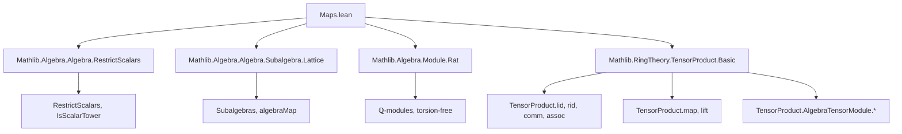

Here is the structured technical metadata extracted from `Maps.lean`:

---

### **1. Key Definitions & Theorems**

| Name | Type | Purpose |
|------|------|---------|
| `lTensorAlgHom` | `Module.End R M →ₐ[R] Module.End R (N ⊗[R] M)` | Bundled algebra homomorphism sending $f \mapsto 1 \otimes f$ |
| `rTensorAlgHom` | `Module.End R M →ₐ[R] Module.End R (M ⊗[R] N)` | Bundled algebra homomorphism sending $f \mapsto f \otimes 1$ |
| `algHomOfLinearMapTensorProduct` | `(A ⊗[R] B →ₗ[S] C) → (h_mul, h_one) → A ⊗[R] B →ₐ[S] C` | Constructs an algebra homomorphism from a linear map preserving multiplication and unit on pure tensors |
| `algEquivOfLinearEquivTensorProduct` | `(A ⊗[R] B ≃ₗ[S] C) → (h_mul, h_one) → A ⊗[R] B ≃ₐ[S] C` | Constructs an algebra equivalence from a linear equivalence preserving multiplication and unit on pure tensors |
| `algEquivOfLinearEquivTripleTensorProduct` | `(A ⊗[R] B ⊗[R] C ≃ₗ[R] D) → (h_mul, h_one) → A ⊗[R] B ⊗[R] C ≃ₐ[R] D` | Same as above for triple tensor products |
| `lift` | `{f : A →ₐ[S] C} → {g : B →ₐ[R] C} → (∀ x y, Commute (f x) (g y)) → A ⊗[R] B →ₐ[S] C` | Universal property: factorizes commuting algebra maps through tensor product |
| `liftEquiv` | `{fg : (A →ₐ[S] C) × (B →ₐ[R] C) // ∀ x y, Commute (fg.1 x) (fg.2 y)} ≃ ((A ⊗[R] B) →ₐ[S] C)` | Equivalence version of the universal property |
| `lid` | `R ⊗[R] A ≃ₐ[R] A` | Left identity isomorphism for tensor product of algebras |
| `rid` | `A ⊗[R] R ≃ₐ[S] A` | Right identity isomorphism (with base change) |
| `comm` | `A ⊗[R] B ≃ₐ[R] B ⊗[R] A` | Symmetry (braiding) isomorphism |
| `assoc` | `(A ⊗[S] C) ⊗[R] D ≃ₐ[S] A ⊗[S] (C ⊗[R] D)` | Associator isomorphism |
| `map` | `(A →ₐ[S] C) → (B →ₐ[R] D) → A ⊗[R] B →ₐ[S] C ⊗[R] D` | Tensor product of algebra morphisms |
| `congr` | `(A ≃ₐ[S] C) → (B ≃ₐ[R] D) → A ⊗[R] B ≃ₐ[S] C ⊗[R] D` | Congruence for tensor product of equivalences |
| `leftComm` | `A ⊗[R] (B ⊗[R] C) ≃ₐ[R] B ⊗[R] (A ⊗[R] C)` | Algebraic version of `mul_left_comm` |
| `tensorTensorTensorComm` | `A ⊗[R'] B ⊗[S] (C ⊗[R] D) ≃ₐ[T] A ⊗[S] C ⊗[R'] (B ⊗[R] D)` | Generalized commutativity for 4-fold tensor products |
| `mapOfCompatibleSMul` | `A ⊗[S] B →ₐ[S] A ⊗[R] B` | Canonical map when $R$- and $S$-actions are compatible |
| `equivOfCompatibleSMul` | `A ⊗[S] B ≃ₐ[S] A ⊗[R] B` | Isomorphism when compatibility holds both ways |
| `lidOfCompatibleSMul` | `S ⊗[R] A ≃ₐ[S] A` | Special case of identity when $S$ and $A$ are compatible |
| `lmul''`, `lmul'` | `S ⊗[R] S →ₐ[S] S`, `S ⊗[R] S →ₐ[R] S` | Multiplication maps as algebra homomorphisms |
| `lmulEquiv` | `S ⊗[R] S ≃ₐ[S] S` | Multiplication isomorphism under compatibility |
| `productMap` | `A ⊗[R] B →ₐ[R] S` | Product of two algebra maps into a commutative algebra |
| `tensorProduct` | `A ⊗[R] (M →ₗ[R] N) →ₗ[A] (A ⊗[R] M) →ₗ[A] (A ⊗[R] N)` | Linear map induced by extension of scalars |
| `tensorProductEnd` | `A ⊗[R] End R M →ₐ[A] End A (A ⊗[R] M)` | Algebra homomorphism version of `tensorProduct` |

---

### **2. Naming Conventions**

- **Prefixes**:
  - `lTensor*`, `rTensor*`: Left/right tensoring with identity.
  - `map*`: Tensoring algebra morphisms.
  - `lift*`: Universal property constructions.
  - `algEquivOfLinearEquiv*`, `algHomOfLinearMap*`: Building algebra maps from linear maps.
  - `comm`, `assoc`, `leftComm`, `tensorTensorTensorComm`: Structural isomorphisms (symmetry, associativity, braiding).
  - `lid`, `rid`: Identity laws.
  - `congr`: Congruence for equivalences.
  - `product*`: Product maps into a common codomain.
  - `lmul*`: Multiplication maps.

- **Suffixes**:
  - `*Hom`: Algebra homomorphism.
  - `*Equiv`: Algebra equivalence.
  - `*LinearMap`: Linear map version.
  - `*TensorProduct`: Tensor product-specific variants.

- **Variables**:
  - `R`, `S`, `T`, `R'`: Base rings.
  - `A`, `B`, `C`, `D`, `E`, `F`: Algebras over respective base rings.
  - `M`, `N`: Modules.

---

### **3. Tactic Stack**

Frequently used tactics in proofs:

| Tactic | Usage |
|--------|-------|
| `ext` | Extensionality for functions, algebra homomorphisms, linear maps. |
| `simp` / `simp only` | Simplification using definitional equalities and lemmas like `tmul`, `map_one`, `map_mul`. |
| `rw` | Rewriting using lemmas like `map_mul`, `smul_tmul`, `mul_comm`. |
| `dsimp` | Definitional simplification, often before `ext`. |
| `rfl` | Reflexivity for definitional equalities (e.g., `tmul` definitions). |
| `induction_on` | Induction on tensor product elements (pure tensors generate the whole). |
| `convert_to` + `exact` | Adjusting goals to match known lemmas. |
| `apply` / `exact` | Applying lemmas or hypotheses directly. |
| `have` / `suffices` | Intermediate claims, especially for multiplicativity. |
| `norm_cast` | For rational scalars and torsion-free arguments. |
| `aesop` | Not explicitly used here, but `simp`-based automation dominates. |

---

### **4. Proof Logic**

- **Structure**: Most proofs follow a pattern:
  1. **Define** a linear map (e.g., via `TensorProduct.lift`, `TensorProduct.map`).
  2. **Verify** multiplicativity on pure tensors (using `h_mul` conditions).
  3. **Verify** unit preservation (`h_one`).
  4. **Bundled** as algebra homomorphism/equivalence using `algHomOfLinearMapTensorProduct` or variants.
  5. **Simplify** using `@[simp]` lemmas (`tmul`, `lid_tmul`, etc.).
  6. **Prove inverse properties** (for equivalences) by checking on pure tensors.

- **Induction**: Tensor product elements are handled via `induction_on`, reducing to pure tensors.

- **Commutativity**: Often reduced to checking `Commute` conditions on generators, then extended.

- **Compatibility**: `CompatibleSMul` and `SMulCommClass` are used to justify scalar swapping.

---

### **5. Imports**

| Module | Purpose |
|--------|---------|
| `Mathlib.Algebra.Algebra.RestrictScalars` | Base change and restriction of scalars. |
| `Mathlib.Algebra.Algebra.Subalgebra.Lattice` | Subalgebra lattice structure (used implicitly via `algebraMap`, `adjoin`). |
| `Mathlib.Algebra.Module.Rat` | Rational vector spaces, torsion-freeness, `ℚ`-module structure. |
| `Mathlib.RingTheory.TensorProduct.Basic` | Core tensor product constructions (pure tensors, `lid`, `rid`, `comm`, `assoc`, `map`, etc.). |

---

### **6. Mermaid Diagrams**

#### **Dependency Graph (High-Level)**



#### **Overview of Theory Flow**

```mermaid
flowchart LR
  subgraph "Tensor Product Structure"
    L[TensorProduct.lid] -->|Left identity| T1[A ⊗ R]
    R[TensorProduct.rid] -->|Right identity| T1
    C[TensorProduct.comm] -->|Symmetry| T2[A ⊗ B ↔ B ⊗ A]
    A[TensorProduct.assoc] -->|Associativity| T3[(A ⊗ B) ⊗ C ↔ A ⊗ (B ⊗ C)]
  end

  subgraph "Universal Property"
    U[liftEquiv] -->|Factorization| F[A ⊗ B → C]
    L2[lift] --> U
  end

  subgraph "Morphism Construction"
    M[map] -->|Tensor of maps| M2[A ⊗ B → C ⊗ D]
    C1[congr] -->|Congruence| M2
  end

  subgraph "Compatibility & Base Change"
    B1[equivOfCompatibleSMul] -->|Base change iso| B2[A ⊗S B ≃ A ⊗R B]
    B3[lidOfCompatibleSMul] -->|Special case| B2
  end

  subgraph "Endomorphism Extension"
    E1[tensorProductEnd] -->|Extension of scalars| E2[A ⊗ End_R M → End_A (A ⊗ M)]
  end

  T1 -->|Used in| U
  T2 -->|Used in| C1
  T3 -->|Used in| B1
```

---

Let me know if you'd like a formalized dependency graph in Lean or a more detailed proof sketch for any specific theorem.
