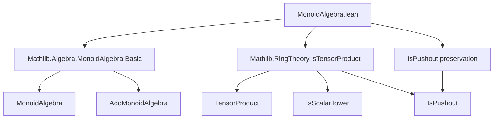
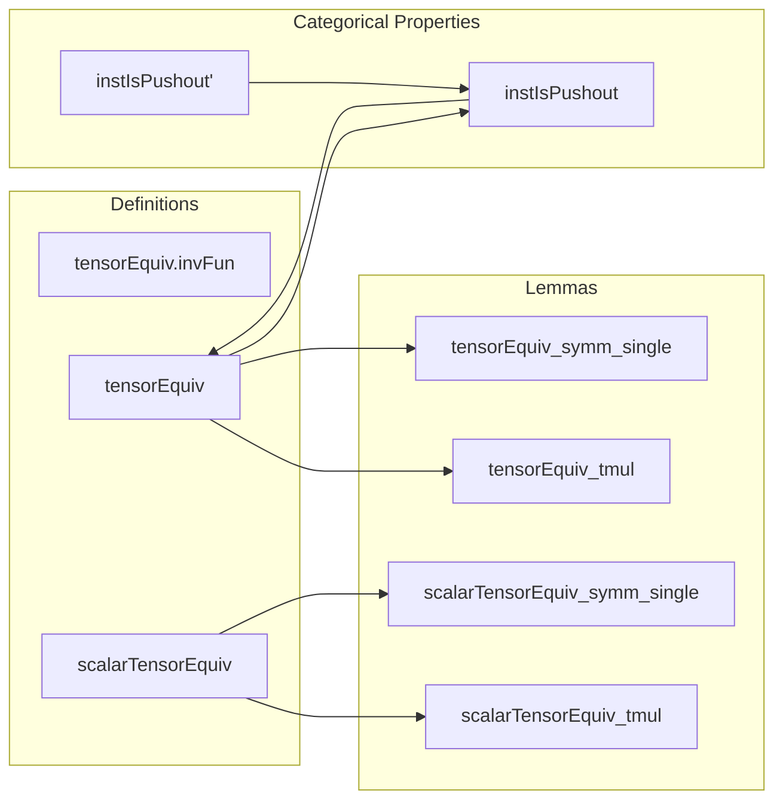

### Technical Brief: `MonoidAlgebra.lean`

---

#### **1. Key Definitions & Theorems**

| Name | Type / Signature | Purpose |
|------|------------------|---------|
| `tensorEquiv.invFun` | `(A ⊗[R] B)[M] →ₐ[A] A ⊗[R] B[M]` | Inverse direction of the base-change isomorphism for monoid algebras; constructed via `liftNCAlgHom`. |
| `tensorEquiv` | `A ⊗[R] B[M] ≃ₐ[A] (A ⊗[R] B)[M]` | Main theorem: monoid algebra commutes with base change (i.e., pushout stability). |
| `tensorEquiv_tmul` | `tensorEquiv (a ⊗ₜ p) = a • mapRangeAlgHom ... p` | Action of `tensorEquiv` on simple tensors. |
| `tensorEquiv_symm_single` | `(tensorEquiv).symm (single m (a ⊗ₜ b)) = a ⊗ₜ single m b` | Explicit description of inverse on generators. |
| `scalarTensorEquiv` | `A ⊗[R] R[M] ≃ₐ[A] A[M]` | Special case of base change when the base ring is extended from `R` to `A`. |
| `scalarTensorEquiv_symm_single` | `(scalarTensorEquiv).symm (single m a) = a ⊗ₜ single m 1` | Inverse on generators for scalar extension. |
| `instIsPushout` | `[IsPushout R S A B] → IsPushout R S A[M] B[M]` | Monoid algebra preserves pushouts (i.e., is stable under base change in the categorical sense). |
| `instIsPushout'` | `[IsPushout R A S B] → IsPushout R A[M] S B[M]` | Variant using symmetry of pushout. |

---

#### **2. Naming Conventions**

- **Prefixes**:
  - `tensorEquiv_`, `scalarTensorEquiv_`: for isomorphisms involving tensor products and monoid algebras.
  - `instIsPushout`: for typeclass instances establishing categorical properties.
- **Suffixes**:
  - `_tmul`: for lemmas about behavior on simple tensors (`⊗ₜ`).
  - `_single`: for lemmas about behavior on `single m x` (basis elements).
  - `_symm`: for properties of the inverse of an equivalence.
- **Modifiers**:
  - `to_additive`: indicates that an additive version exists or is intended (with `AddMonoidAlgebra`).
  - `dont_translate := ...`: suppresses automatic translation to additive notation.

---

#### **3. Tactic Stack**

Frequently used tactics in proofs:
- `simp`: for simplification using definitional equalities and lemmas like `tensorEquiv_tmul`, `tensorEquiv_symm_single`.
- `ext`: extensionality for functions/linear maps/algebra homs.
- `induction x using induction_linear`: structural induction on linear combinations (used in `instIsPushout`).
- `simp_all [ ... ]`: simplifies all goals using given lemmas.
- `apply AlgHom.toLinearMap_injective`: to prove equality of algebra homs by linearity.
- `refine .ofAlgHom ...`: constructing algebra homs via universal property.
- `trans`: chaining equivalences (e.g., `tensorEquiv ... .trans ...`).

---

#### **4. Proof Logic**

- **Main proof strategy**:
  1. Construct `tensorEquiv` as an algebra isomorphism using `ofAlgHom`, defining forward and inverse maps.
  2. Prove mutual inverses via extensionality (`ext`) and simplification (`simp`).
  3. Derive special cases (e.g., `scalarTensorEquiv`) by composing with known equivalences (`mapRangeAlgEquiv`, `rid`).
  4. For categorical stability (`instIsPushout`):
     - Use `tensorEquiv` to reduce to known pushout `IsPushout R S A B`.
     - Transport structure along equivalence.
     - Use induction on linear combinations to verify algebra homomorphism and pushout diagrams.

- **Inductive reasoning**:
  - Used in `instIsPushout` to verify that the equivalence respects the pushout diagram on all elements (not just generators).

---

#### **5. Imports**

- `Mathlib.Algebra.MonoidAlgebra.Basic`: core definitions and properties of `MonoidAlgebra`.
- `Mathlib.RingTheory.IsTensorProduct`: tensor product of algebras, `IsScalarTower`, `IsPushout`, etc.

---

#### **6. Mermaid Diagrams**

##### **Dependency Graph (High-Level)**

##### **Overview of File Structure**

---

#### **7. Theory Context**

This file formalizes a foundational result in *commutative algebra* and *homological algebra*:  
> **Monoid algebras commute with base change**, i.e., for a commutative diagram of commutative rings  
> $$
R \to S,\quad R \to A,
$$  
> the canonical map  
> $$
A \otimes_R B[M] \xrightarrow{\sim} (A \otimes_R B)[M]
$$  
> is an isomorphism of $A$-algebras.

This is used to show that the operation $M \mapsto B[M]$ preserves pushouts in the category of commutative rings — a key step in proving descent properties or constructing moduli stacks.

The `TODO` note indicates future work to generalize to *additive* monoids (i.e., `AddMonoidAlgebra`), which would require handling `Multiplicative` coercion carefully.

--- 

Let me know if you'd like a formalized summary in Lean syntax or a diagram of the pushout square.
