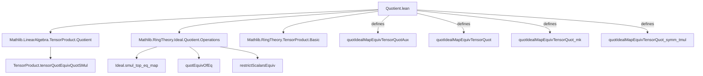

**Technical Brief: `Quotient.lean` (Algebra.TensorProduct Module)**  
*Domain: Commutative Algebra / Homological Algebra (Tensor Products & Quotients)*  
*Source File: `Quotient.lean` (Mathlib-style Lean 4 formalization)*  

---

### 1. KEY DEFINITIONS & THEOREMS

| Name | Type / Signature | Purpose |
|------|------------------|---------|
| `quotIdealMapEquivTensorQuotAux` | `(B ⧸ (I.map algebraMap A B)) ≃ₗ[B] B ⊗[A] (A ⧸ I)` | Linear equivalence (over `B`) between the quotient of `B` by the extended ideal and the tensor product. Constructed via composition of known equivalences: `tensorQuotEquivQuotSMul`, `quotEquivOfEq`, and `restrictScalarsEquiv`. |
| `quotIdealMapEquivTensorQuot` | `(B ⧸ (I.map algebraMap A B)) ≃ₐ[B] B ⊗[A] (A ⧸ I)` | **Main theorem**: Algebra isomorphism over `B` (i.e., `B`-algebra isomorphism). Proven by showing the linear equivalence preserves multiplication. |
| `quotIdealMapEquivTensorQuot_mk` | `∀ b : B, quotIdealMapEquivTensorQuot b = b ⊗ₜ 1` | Action of the isomorphism on representatives: maps class of `b` to simple tensor `b ⊗ 1`. |
| `quotIdealMapEquivTensorQuot_symm_tmul` | `∀ b : B, a : A, (quotIdealMapEquivTensorQuot).symm (b ⊗ₜ a) = ⟦a • b⟧` | Action of the inverse on simple tensors: pulls scalar `a` back into `B` via the algebra action, then projects to the quotient. |

> **Notation**:  
> - `I.map algebraMap A B` = ideal generated by `I` in `B`, often denoted `I·B` or `IB`.  
> - `⟦x⟧` = `Submodule.Quotient.mk x`, the class of `x` in the quotient module.  
> - `⊗ₜ[A]` = tensor product over `A`.  
> - `≃ₐ[B]` = isomorphism of `B`-algebras.

---

### 2. NAMING CONVENTIONS

- **Prefixes**:
  - `quotIdealMap_`: indicates construction involving quotient by image of an ideal under algebra map.
  - `quotIdealMapEquivTensorQuotAux`: auxiliary (linear) equivalence; suffix `Aux` for intermediate step.
  - `quotIdealMapEquivTensorQuot`: final algebra isomorphism.
- **Suffixes**:
  - `_mk`: lemma about behavior on `Ideal.Quotient.mk` (i.e., representatives).
  - `_symm_tmul`: behavior of inverse on simple tensors (`tmul` = tensor product of two elements).
- **General pattern**: `_<description>_<variant>` where variant = `Aux`, `mk`, `symm_tmul`, etc.

---

### 3. TACTIC STACK

| Tactic | Usage Frequency | Role |
|--------|-----------------|------|
| `obtain ⟨u, rfl⟩ := Ideal.Quotient.mk_surjective x` | High | Eliminates quotient elements by surjectivity of `Ideal.Quotient.mk`. |
| `rfl` | Very High | Used for definitional equalities (e.g., `quotIdealMapEquivTensorQuotAux_mk`). |
| `simp_rw [← map_mul, quotIdealMapEquivTensorQuotAux_mk]` | Medium | Rewriting with multiplicative property and definition of the equivalence on generators. |
| `simp` | Medium | Simplification after rewriting; relies on `@[simp]` lemmas. |
| `intro c x` | Low | In `AddEquiv.toLinearEquiv`, to verify linearity condition. |
| `by` (tactic block) | High | Used in `AlgEquiv.ofLinearEquiv` to prove multiplicative property. |

> **Note**: No heavy automation (e.g., `ring`, `linarith`, `aesop`) — proofs are mostly definitional or rely on structural properties of tensor products and quotients.

---

### 4. PROOF LOGIC

- **Structure**:  
  1. **Construct auxiliary linear equivalence** (`quotIdealMapEquivTensorQuotAux`) via composition of known equivalences:  
     - `TensorProduct.tensorQuotEquivQuotSMul`: relates tensor with quotient and scalar restriction.  
     - `Submodule.quotEquivOfEq`: equivalence when submodules are equal (here, `I.smul ⊤ = I.map algebraMap B`).  
     - `Submodule.Quotient.restrictScalarsEquiv`: change of scalars for quotients.  
  2. **Upgrade to algebra isomorphism** (`quotIdealMapEquivTensorQuot`) using `AlgEquiv.ofLinearEquiv`, requiring verification of:  
     - Preservation of multiplication: `quotIdealMapEquivTensorQuot (x * y) = quotIdealMapEquivTensorQuot x * quotIdealMapEquivTensorQuot y`.  
     - Proven by surjectivity of `Ideal.Quotient.mk` (reduce to `b₁, b₂ ∈ B`) and simplification using `quotIdealMapEquivTensorQuotAux_mk`.  
  3. **Simp lemmas** (`quotIdealMapEquivTensorQuot_mk`, `quotIdealMapEquivTensorQuot_symm_tmul`) follow definitionally (`rfl`).

- **Key logical flow**:  
  `def (aux) → def (main) + proof (multiplicativity) → simp lemmas`.

---

### 5. IMPORTS & DEPENDENCIES

| Import | Role |
|--------|------|
| `Mathlib.LinearAlgebra.TensorProduct.Quotient` | Provides `tensorQuotEquivQuotSMul`, foundational equivalence for tensor + quotient. |
| `Mathlib.RingTheory.Ideal.Quotient.Operations` | Contains `Ideal.smul_top_eq_map`, `quotEquivOfEq`, and operations on ideal quotients. |
| `Mathlib.RingTheory.TensorProduct.Basic` | Basic tensor product theory: `⊗ₜ`, `tensorProduct`, module/tensor structure. |

> **Core theory scope**: Commutative algebra over rings, with emphasis on interaction between base change (tensor product) and quotient constructions.

---

### 6. MERMAID DIAGRAMS

#### Dependency Graph (Module-Level)



#### Overview of Theoretical Flow

```mermaid
flowchart LR
  subgraph Setup
    A[CommRing A] --> B[Algebra A B]
    A --> C[Ideal I]
    B --> D[I.map algebraMap A B]
    D --> E[B ⧸ I·B]
  end

  subgraph TensorSide
    A --> F[A ⧸ I]
    B --> G[B ⊗[A] (A ⧸ I)]
  end

  subgraph Equivalence
    E -->|quotIdealMapEquivTensorQuot| G
  end

  E -->|quotIdealMapEquivTensorQuot_mk| G
  G -->|quotIdealMapEquivTensorQuot_symm_tmul| E
```

> **Interpretation**: The theorem formalizes the *base change of quotients*: extending scalars along `A → B` commutes with modding out by an ideal `I ⊆ A`. This is the algebraic analog of `Mathlib/LinearAlgebra/TensorProduct/Quotient.lean`, but now in the context of algebras.

--- 

**End of Technical Brief**
