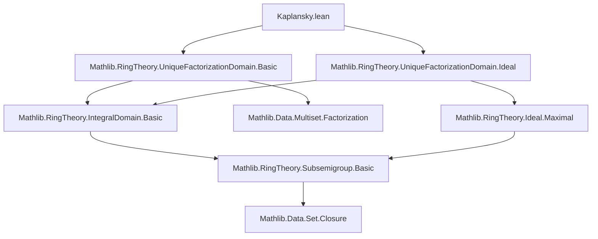

### Technical Brief: Kaplansky Criterion for Factoriality (Lean 4)

---

#### **1. Key Definitions & Theorems**

| Name | Type / Signature | Purpose |
|------|------------------|---------|
| `kaplanskySet` | `Semiring R → Subsemigroup R → Set (Ideal R)` | Defines the set of ideals disjoint from a subsemigroup `S`. Used to apply Zorn’s Lemma. |
| `mem_kaplanskySet_iff` | `P ∈ kaplanskySet S ↔ (P : Set R) ∩ S = ∅` | Characterizes membership in `kaplanskySet`. |
| `exists_mem_kaplanskySet_le` | Chain upper bound existence under `0 ∉ S` | Ensures chains in `kaplanskySet S` have upper bounds, enabling Zorn’s Lemma. |
| `exists_mem_kaplanskySet_eq_of_le` | Maximal element existence in `kaplanskySet S` | Produces a maximal ideal disjoint from `S`, key to constructing prime elements. |
| `span_notMem_kaplanskySet` | `a ≠ 0 → (∀ I ≠ ⊥, I.IsPrime → ∃ x ∈ I, Prime x) → span {a} ∉ kaplanskySet (closure {r : Prime r})` | Shows that if all nonzero primes contain a prime element, then principal ideals generated by nonzero elements cannot be disjoint from the subsemigroup of primes. |
| `of_exists_prime_mem_of_isPrime` | `(∀ I ≠ ⊥, I.IsPrime → ∃ x ∈ I, Prime x) → UniqueFactorizationMonoid R` | Proves the nontrivial direction: the prime-containing condition implies UFD. |
| `iff_exists_prime_mem_of_isPrime` | `UniqueFactorizationMonoid R ↔ ∀ I ≠ ⊥, I.IsPrime → ∃ x ∈ I, Prime x` | **Main theorem**: Kaplansky’s criterion — equivalence between being a UFD and every nonzero prime ideal containing a prime element. |

---

#### **2. Naming Conventions**

- **Prefixes**:
  - `kaplanskySet`: Named after Kaplansky; used for constructions central to the proof.
  - `mem_...`: Membership lemmas (e.g., `mem_kaplanskySet_iff`).
  - `exists_...`: Existence lemmas (e.g., `exists_mem_kaplanskySet_le`).
  - `of_...`: Implication direction (e.g., `of_exists_prime_mem_of_isPrime`).
- **Suffixes**:
  - `_iff`: Biconditional characterizations.
  - `_le`, `_eq_of_le`: Order-theoretic properties (upper bounds, maximality).
  - `_pri`, `_mul`: Used in induction steps for multiset factorization.

---

#### **3. Tactic Stack**

Frequently used tactics in this file:

| Tactic | Role |
|--------|------|
| `rcases` / `obtain` | Destructure existential/universal hypotheses. |
| `rw [mem_kaplanskySet_iff]` | Rewrite membership using definition. |
| `simp` / `simpa` | Simplify goals using known equivalences. |
| `grind` | Custom simplifier for ring/ideal theory (likely from Mathlib’s `Grind` tactic). |
| `induction ... using closure_induction` | Structural induction on closure (used for multiset factorization). |
| `exact`, `refine`, `apply` | Goal-directed proof construction. |
| `mul_comm`, `span_singleton_eq_bot`, `divisor_closure_eq_closure` | Rewrites using algebraic identities. |
| `nonempty_iff_ne_empty` | Bridge between set-theoretic nonemptiness and multiset existence. |

---

#### **4. Proof Logic**

The proof follows a **Zorn’s Lemma + closure induction** strategy:

1. **Setup**: Fix a nonzero element `a ∈ R`. Assume all nonzero prime ideals contain a prime element.
2. **Zorn’s Lemma Application**:
   - Define `S = closure {r : R | Prime r}` (subsemigroup of products of primes).
   - Consider `kaplanskySet S`: ideals disjoint from `S`.
   - Show chains in `kaplanskySet S` have upper bounds (using `0 ∉ S`).
   - Obtain a maximal element `T ∈ kaplanskySet S`.
3. **Maximal ⇒ Prime**:
   - Prove `T` is prime via maximality and disjointness.
   - By hypothesis, `T` contains a prime element `x`.
   - But then `x ∈ T ∩ S`, contradicting `T ∈ kaplanskySet S`, unless `T = ⊥`.
   - Conclude `span {a} ∉ kaplanskySet S`, i.e., `a` divides a product of primes.
4. **Closure Induction**:
   - Use `closure_induction` on the fact that `a` lies in the closure of primes.
   - Inductively build a multiset of primes whose product divides `a`.
5. **UFD Criterion**:
   - Apply `UniqueFactorizationMonoid.of_exists_prime_factors` to conclude `R` is a UFD.

The reverse direction (`UFD ⇒ prime ideals contain primes`) is immediate from existing theory (`exists_mem_prime_of_ne_bot`).

---

#### **5. Imports & Dependencies**

| Module | Purpose |
|--------|---------|
| `Mathlib.RingTheory.UniqueFactorizationDomain.Basic` | Core UFD definitions and basic lemmas (e.g., `UniqueFactorizationMonoid`, `of_exists_prime_factors`). |
| `Mathlib.RingTheory.UniqueFactorizationDomain.Ideal` | Ideal-theoretic properties in UFDs (e.g., `exists_mem_prime_of_ne_bot`). |
| `Mathlib.Data.Set.Subset` (implicit via `Set`) | Set operations, disjointness, closure. |
| `Mathlib.Data.Multiset.Basic` (implicit via `Multiset`) | Multiset arithmetic, used in factorization. |
| `Mathlib.RingTheory.Subsemigroup.Basic` | Subsemigroups, closures, disjointness. |
| `Mathlib.RingTheory.Ideal.Basic` | Ideal theory: `span`, `IsPrime`, `sSup`, maximality. |

---

#### **6. Mermaid Diagrams**

##### **Dependency Graph (Module-Level)**



##### **Overview of Proof Structure**

```mermaid
flowchart LR
  A[Assume: ∀ I ≠ ⊥, I.IsPrime → ∃ x ∈ I, Prime x] --> B[Define S = closure{primes}]
  B --> C[Consider kaplanskySet S]
  C --> D[Apply Zorn’s Lemma]
  D --> E[Obtain maximal T ∈ kaplanskySet S]
  E --> F[Show T is prime]
  F --> G[T contains prime x]
  G --> H[Contradiction unless T = ⊥]
  H --> I[span{a} ∉ kaplanskySet S]
  I --> J[a divides product of primes]
  J --> K[Use closure_induction to build multiset]
  K --> L[Conclude: UniqueFactorizationMonoid R]
  L --> M[iff_exists_prime_mem_of_isPrime]
```

---

#### **7. Summary**

This file formalizes **Kaplansky’s criterion** for unique factorization domains:  
$$
R \text{ is a UFD} \iff \forall I \neq (0),\ I \text{ prime} \Rightarrow \exists x \in I,\ \text{Prime}(x).
$$

The proof leverages:
- **Order-theoretic tools** (Zorn’s Lemma via `kaplanskySet`),
- **Ideal-theoretic properties** (maximal disjointness ⇒ primality),
- **Closure induction** to lift divisibility by primes to full factorization.

It is a canonical example of *algebraic logic* in Lean: combining classical analysis (Zorn) with constructive multiset reasoning.
