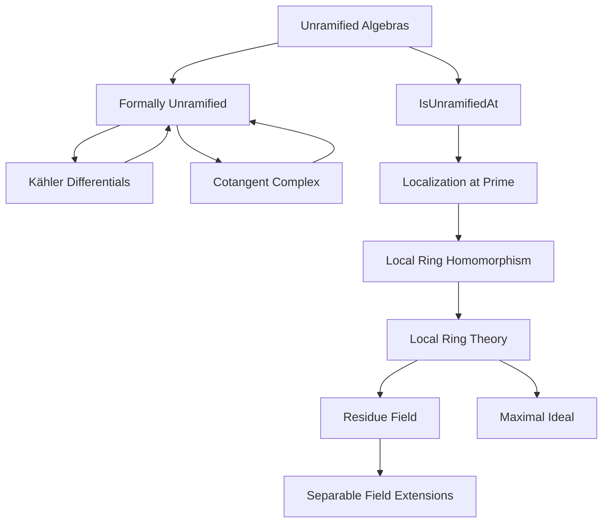
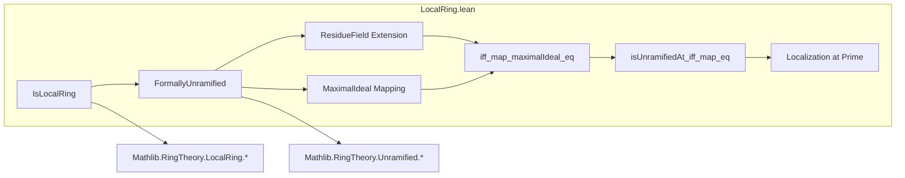

### Technical Brief: `LocalRing.lean` — Unramified Algebras over Local Rings

---

#### **1. Key Definitions & Theorems**

| Name | Type / Signature | Purpose |
|------|------------------|---------|
| `FormallyUnramified S T` | `Class` | $S \to T$ is formally unramified: $\mathrm{Hom}_S(T, -)$ preserves pushouts along nilpotent extensions. |
| `IsUnramifiedAt R q` | `Def` | $R \to S$ is unramified at prime $q \subseteq S$: localization $R_p \to S_q$ is formally unramified. |
| `ResidueField R` | `Def` | $R / \mathfrak{m}_R$, the residue field of a local ring $R$. |
| `maximalIdeal R` | `Def` | The unique maximal ideal of a local ring $R$. |
| `EssFiniteType R S` | `Class` | $S$ is essentially of finite type over $R$: localization of a finitely generated $R$-algebra. |
| `Algebra.IsSeparable K L` | `Class` | Field extension $K \to L$ is separable. |
| `FormallyUnramified.iff_map_maximalIdeal_eq` | `Lemma` | For local $R$, local $S$, essentially f.t., $S/R$ unramified ⇔ residue field extension separable **and** $\mathfrak{m}_R S = \mathfrak{m}_S$. |
| `Algebra.isUnramifiedAt_iff_map_eq` | `Lemma` | $R \to S$ unramified at $q$ ⇔ $\kappa(q)/\kappa(p)$ separable **and** $p S_q = q S_q$. |
| `FormallyUnramified.map_maximalIdeal` | `Lemma` | If $S/R$ formally unramified (local, ess. f.t.), then $\mathfrak{m}_R S = \mathfrak{m}_S$. |
| `FormallyUnramified.of_map_maximalIdeal` | `Lemma` | Converse: if residue field extension separable and $\mathfrak{m}_R S = \mathfrak{m}_S$, then $S/R$ formally unramified. |
| `FormallyUnramified.isField_quotient_map_maximalIdeal` | `Lemma` | Under same hypotheses, $S / \mathfrak{m}_R S$ is a field (hence local Artinian). |

---

#### **2. Naming Conventions**

- **Prefixes**:
  - `FormallyUnramified.` — for properties of formal unramifiedness.
  - `isUnramifiedAt_` — for local/unramified-at-a-prime conditions.
  - `map_` — for ideal/image maps (e.g., `map_maximalIdeal`).
  - `isField_`, `isReduced_`, `isArtinian_` — for structural properties of rings/modules.

- **Suffixes**:
  - `_eq` — equivalence with equality condition (e.g., `iff_map_maximalIdeal_eq`).
  - `_of_` — converse implication (e.g., `of_map_maximalIdeal`).
  - `_at` — local condition at a prime (e.g., `isUnramifiedAt`).

- **Other**:
  - `ResidueField` — residue field construction.
  - `local_hom_TFAE` — equivalence of local ring homomorphism conditions (TFAE: "the following are equivalent").

---

#### **3. Tactic Stack**

| Tactic | Usage Frequency | Purpose |
|--------|-----------------|---------|
| `rw` | High | Rewriting definitions (e.g., `maximalIdeal`, `ResidueField`, `map_map`). |
| `simp` / `simp only` | High | Simplifying homological/algebraic expressions (e.g., tensor products, quotients). |
| `exact` / `refine` | Medium | Constructing proofs using known lemmas. |
| `induction` | Medium | Induction on ideal membership (via `Submodule.span_induction`). |
| `rwa` | Medium | Rewrite + assume new hypothesis. |
| `convert` / `congr!` | Medium | Congruence reasoning (especially in `isUnramifiedAt_iff_map_eq`). |
| `aesop` / `tauto` | Low | Not used here — proofs are highly algebraic, not propositional. |
| `ring` / `abel` | Low | Not needed — no arithmetic simplifications. |
| `apply` / `intro` | Low | Manual proof steps, but mostly automated via `exact`, `refine`. |

---

#### **4. Proof Logic**

- **Structure**:
  - **Local case** (`IsLocalRing` section):
    - Use `FormallyUnramified` to deduce structural properties (Artinian, reduced, field).
    - Prove $\mathfrak{m}_R S = \mathfrak{m}_S$ via quotient being a field (`isField_quotient_map_maximalIdeal`).
    - Converse uses **Kähler differentials** and cotangent complex exact sequence:
      - Reduce to showing $\Omega_{S/R} = 0$.
      - Use surjectivity of `toCotangent`, membership in $\mathfrak{m}_R S$, and tensor product properties.
  - **General case** (`IsUnramifiedAt` section):
    - Reduce to local case via localization at primes $p \subseteq R$, $q \subseteq S$.
    - Use `Localization.localRingHom` to get a local map $R_p \to S_q$.
    - Apply `iff_map_maximalIdeal_eq` to the localized map.
    - Translate back using `map_map`, `Localization.map_eq_maximalIdeal`, and `IsScalarTower`.

- **Key Logical Flow**:
  ```
  [FormallyUnramified R S]
    ⇒ [ResidueField S / ResidueField R separable] ∧ [m_R S = m_S]
    ⇐ [ResidueField S / ResidueField R separable] ∧ [m_R S = m_S]
  ```

---

#### **5. Imports**

| Module | Purpose |
|--------|---------|
| `Mathlib.RingTheory.LocalRing.Module` | Modules over local rings, residue fields. |
| `Mathlib.RingTheory.LocalRing.ResidueField.Ideal` | Residue field as quotient by maximal ideal. |
| `Mathlib.RingTheory.Unramified.Field` | Unramified field extensions, separability. |
| `Mathlib.RingTheory.Unramified.Locus` | Locus of unramifiedness, `IsUnramifiedAt`. |

---

#### **6. Mermaid Diagrams**

##### **Dependency Graph (Theoretical)**



##### **File Overview**



---

#### **7. Theory Context**

This file formalizes a foundational characterization of unramified morphisms in algebraic geometry over local rings:

- It connects **formal unramifiedness** (a derived condition) to **classical conditions** on residue fields and maximal ideals.
- It serves as a stepping stone for:
  - Étale morphisms (unramified + flat),
  - Smoothness criteria,
  - Descent properties of unramified maps.

The results are modeled after Stacks Project tags:
- [00UW](https://stacks.math.columbia.edu/tag/00UW): Unramified ⇔ separable residue field + equality of maximal ideals.
- [02FM](https://stacks.math.columbia.edu/tag/02FM): Converse direction.

---

#### **8. Summary**

This module provides a clean equivalence between formal unramifiedness and classical algebraic conditions for local algebras essentially of finite type. It leverages:
- Residue field separability,
- Maximal ideal behavior under pushforward,
- Localization techniques,
- Kähler differentials for the converse.

The formalization is highly structured, with clear separation between local and global (prime-localized) cases, and uses Lean’s typeclass inference to manage algebraic structure automatically.
