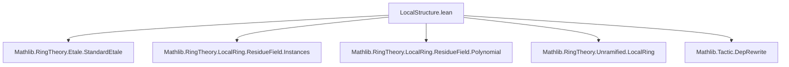

### Technical Brief: `LocalStructure.lean`

---

#### **1. Key Definitions & Theorems**

| Name | Type / Signature | Purpose |
|------|------------------|---------|
| `HasStandardEtaleSurjectionOn R f` | `Prop` | Predicate asserting existence of a **standard étale** $R$-algebra $A$ and an $R$-algebra map $A \to S[1/f]$ that is surjective. |
| `HasStandardEtaleSurjectionOn.mk` | Lemma | Constructs a witness for `HasStandardEtaleSurjectionOn` when given a surjection from a known standard étale algebra. |
| `HasStandardEtaleSurjectionOn.of_dvd` | Lemma | Monotonicity: if surjection exists for $f$, then also for any multiple $g$ of $f$. |
| `HasStandardEtaleSurjectionOn.isStandardEtale` | Lemma | If $S[1/f]$ is étale over $R$ and admits a surjection from some algebra, then it is *standard* étale. |
| `Algebra.IsUnramifiedAt.exists_hasStandardEtaleSurjectionOn_of_exists_adjoin_singleton_eq_top` | Theorem | Main result: If $S$ is finite over $R$, generated by one element (`adjoin R {x} = ⊤`), and unramified at prime $Q$, then $\exists f \notin Q$ such that `HasStandardEtaleSurjectionOn R f`. |

---

#### **2. Naming Conventions**

- **Predicates**: `Has*`, `Is*`, `Exists*` — e.g., `HasStandardEtaleSurjectionOn`, `IsUnramifiedAt`.
- **Maps / Homomorphisms**:
  - `mapRingHom`, `algEquiv`, `toAlgHom`, `comp`, `restrictScalars`.
  - `aeval` — evaluation map $R[X] \to S$, $p \mapsto p(x)$.
- **Localization / Away**:
  - `Localization.Away`, `awayMapₐ`, `IsLocalization.Away`.
- **Polynomial / Minimal Polynomial**:
  - `minpoly`, `derivative`, `natDegree`, `monic`.
- **Tensor / Fiber**:
  - `TensorProduct`, `P.Fiber S`, `1 ⊗ₜ x`.
- **Ideal operations**:
  - `Ideal.span`, `Ideal.map`, `Ideal.mk_ker`, `ker`, `adjoin`.

Prefixes/suffixes:
- `*_aux₁`, `*_aux₂`: auxiliary lemmas in main proof.
- `*_of_*`: implication or restriction lemmas (e.g., `of_dvd`, `of_isLocalizationAway`).
- `*_surjective`: often used for surjectivity lemmas.

---

#### **3. Tactic Stack**

Frequently used tactics in this file:

| Tactic | Role |
|--------|------|
| `simp` / `simp_all` | Simplification using definitional equalities, algebra laws, and local lemmas. |
| `grind` | Custom tactic (likely from `Mathlib.Tactic`) for solving polynomial identities. |
| `rw` / `convert` | Rewriting and congruence-based proof construction. |
| `obtain ⟨...⟩ := ...` | Destructuring existential or product hypotheses. |
| `refine` / `exact` | Constructing proofs with holes or exact terms. |
| `dsimp`, `ext`, `congr` | Extensionality and definitional simplification. |
| `grw` | Graded rewriting (used for degree comparisons). |
| `lia` | Linear integer arithmetic solver. |
| `infer_instance` | Typeclass inference. |
| `aesop` | Not present here — this file is heavily manual and algebraic. |

---

#### **4. Proof Logic**

The proof follows a **constructive algebraic strategy**:

1. **Reduction to cyclic case**: Assume $S = R[x]$ (via `adjoin R {x} = ⊤`).
2. **Localize at prime $P = Q \cap R$** and pass to residue fields $\kappa(P), \kappa(Q)$.
3. **Use PID structure of $\kappa(P)[X]$** to lift a generator $p$ of the kernel of $\kappa(P)[X] \to \kappa(Q)$.
4. **Apply unramified condition**: ensures minimal polynomial $m$ divides $p$ only once (via `not_minpoly_sq_dvd`).
5. **Correct non-monicness**: define $q = \operatorname{minpoly}_R(x)^{d+2} + p$, ensuring $q$ is monic and still satisfies $q(x)=0$, while preserving simple divisibility of $m$.
6. **Verify derivative condition**: show $q'(x) \notin Q$, using separability and properties of minimal polynomials.
7. **Construct standard étale algebra**: $A = R[X]/(q)$ with $q'$ inverted → surjects onto $S[1/q'(x)]$.

**Induction / recursion**: None — purely algebraic construction.

**Key logical flow**:
- Use `adjoin_singleton_eq_range_aeval` to get surjectivity of evaluation map.
- Use `fiberEquivQuotient` to relate kernels over $R$ and $\kappa(P)$.
- Use `minpoly.dvd_iff` and `not_minpoly_sq_dvd` to control factorization.
- Use `IsLocalization.Away.mapₐ_surjective_of_surjective` to lift surjectivity after localization.

---

#### **5. Imports & Dependencies**

| Module | Purpose |
|--------|---------|
| `Mathlib.RingTheory.Etale.StandardEtale` | Standard étale algebras and presentations. |
| `Mathlib.RingTheory.LocalRing.ResidueField.Instances` | Basic residue field constructions. |
| `Mathlib.RingTheory.LocalRing.ResidueField.Polynomial` | Polynomial rings over residue fields, minimal polynomials. |
| `Mathlib.RingTheory.Unramified.LocalRing` | Local characterizations of unramified maps. |
| `Mathlib.Tactic.DepRewrite` | Dependent rewriting support. |

**Core theory areas**:  
- Étale and unramified morphisms  
- Localization and localization away from elements  
- Minimal polynomials and separability  
- Tensor products and fiber rings  
- Adjoin roots / cyclic algebras  

---

#### **6. Mermaid Diagrams**

##### **Dependency Graph (Module-Level)**



##### **Overview of Theoretical Flow**

```mermaid
graph LR
  S[Finite R-algebra S] -->|unramified at Q| U[UnramifiedAt R Q]
  U -->|adjoin R {x} = ⊤| C[Cyclic case]
  C -->|Pass to κ(P)[X]| K[Kernel generated by p]
  K -->|PID structure| M[Minimal polynomial m]
  M -->|Unramified ⇒ m ∥ p, m² ∤ p| D[Simple root condition]
  D -->|Construct q = minpoly^{d+2} + p| Q[Monic q with q'(x) ∉ Q]
  Q -->|Standard étale A = R[X]/q[1/q']| S1[S[1/q'(x)] ← A]
  S1 -->|surjection| H[HasStandardEtaleSurjectionOn R f]
```

##### **Proof Structure (High-Level)**

```mermaid
graph TD
  Main[Main Theorem] --> Aux1[aux₁: kernel lift]
  Main --> Aux2[aux₂: m² ∤ p]
  Aux1 --> PID[PID in κ(P)[X]]
  Aux2 --> Unram[Unramified ⇒ separable]
  PID --> Surj[aeval surjective ⇒ range = ⊤]
  Surj --> Minpoly[Minimal polynomial m]
  Unram --> Deriv[q'(x) ∉ Q]
  Deriv --> Construct[Construct q]
  Construct --> Standard[Standard étale algebra]
  Standard --> Main
```

---

#### **7. Summary**

This file formalizes a **local structure theorem** for unramified algebras:  
> *If $S$ is a finite $R$-algebra unramified at $Q$, and $S = R[x]$, then locally at $Q$, $S$ is a quotient of a standard étale algebra.*

It bridges **unramified geometry** (étale covers, closed embeddings) with **explicit algebraic constructions**, using minimal polynomials, residue fields, and localization. The proof is highly technical and algebraic, relying on PID structure of polynomial rings over fields and careful manipulation of derivatives and divisibility.

**Next steps (TODO)**: Extend to arbitrary finite-type algebras — likely via Zariski’s Main Theorem or patching arguments.

--- 

Let me know if you'd like a **dependency graph of definitions** or a **proof-term extraction** for automation.
