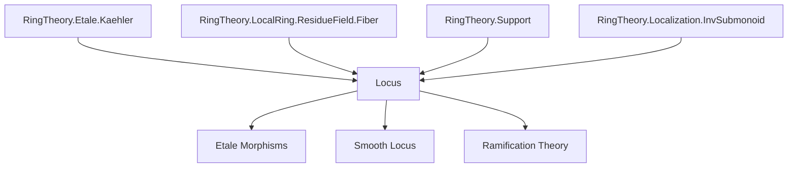

**Technical Brief: `Locus.lean` — Unramified Locus of an Algebra**

---

### 1. KEY DEFINITIONS & THEOREMS

| Name | Type / Signature | Purpose |
|------|------------------|---------|
| `IsUnramifiedAt R q` | `q : Ideal A → [q.IsPrime] → Prop` | States that the localization $A_q$ is *formally unramified* over $R$. |
| `unramifiedLocus R A` | `Set (PrimeSpectrum A)` | The subset of $\operatorname{Spec} A$ consisting of primes $p$ where $A_p$ is unramified over $R$. |
| `IsUnramifiedAt.comp` | `IsUnramifiedAt R p → IsUnramifiedAt A P → IsUnramifiedAt R P` | Transitivity of unramifiedness along a tower $R → A → B$. |
| `IsUnramifiedAt.of_restrictScalars` | `IsUnramifiedAt R P → IsUnramifiedAt A P` | Base change restriction: if $B$ is unramified over $R$, then it's unramified over $A$. |
| `IsUnramifiedAt.residueField` | `IsUnramifiedAt R Q → IsUnramifiedAt P.ResidueField Q'` | Descends unramifiedness to residue field extensions: $\kappa(P) \otimes_R A$ is unramified at $Q'$. |
| `unramifiedLocus_eq_compl_support` | `unramifiedLocus R A = (Module.support A Ω[A/R])ᶜ` | Identifies the unramified locus as the complement of the support of the module of Kähler differentials $\Omega_{A/R}$. |
| `basicOpen_subset_unramifiedLocus_iff` | `D(f) ⊆ unramifiedLocus ↔ FormallyUnramified R A_f` | Characterizes when a basic open $D(f)$ lies in the unramified locus via formal unramifiedness of the localization. |
| `unramifiedLocus_eq_univ_iff` | `unramifiedLocus = ⊤ ↔ FormallyUnramified R A` | Global unramifiedness: the whole spectrum is unramified iff $A$ is formally unramified over $R$. |
| `isOpen_unramifiedLocus` | `[EssFiniteType R A] ⇒ IsOpen (unramifiedLocus R A)` | Under finite type hypothesis, the unramified locus is open. |
| `exists_formallyUnramified_of_isUnramifiedAt` | `[EssFiniteType R A] ⇒ IsUnramifiedAt R p ⇒ ∃ f ∉ p, FormallyUnramified R A_f` | Local-to-global: unramified at $p$ implies unramified at some localization $A_f$ with $f ∉ p$. |
| `exists_unramified_of_isUnramifiedAt` | `[FiniteType R A] ⇒ IsUnramifiedAt R p ⇒ ∃ f ∉ p, Unramified R A_f` | Same as above but for *unramified* (i.e., finitely presented + formally unramified). |

---

### 2. NAMING CONVENTIONS

- **Prefixes**:
  - `isUnramifiedAt_`: properties at a prime (local condition).
  - `unramifiedLocus_`: global or set-theoretic constructions.
  - `basicOpen_subset_`: containment of basic opens in the locus.
- **Suffixes**:
  - `_iff`: equivalence characterizations.
  - `_compl_support`: relation to Kähler differentials.
  - `_residueField`: passage to residue fields.
- **Module-theoretic terms**:
  - `Ω[A/R]`: Kähler differentials.
  - `Module.support`: support of a module.
  - `Localization.AtPrime`, `Localization.Away`: localizations at primes or away from elements.

---

### 3. TACTIC STACK

- `simp only [...]`: heavy use of `simp` with explicit lemmas (e.g., `Set.mem_compl_iff`, `Module.notMem_support_iff`).
- `rw [...]`: rewriting using equivalences like `unramifiedLocus_eq_compl_support`, `formallyUnramified_iff`.
- `exact ...`: for direct proof steps (e.g., `exact .of_restrictScalars ...`).
- `subst hQ'`: substitution in equalities of ideals.
- `have hf₀ : ... := by ...`: intermediate lemmas, often using `funext`, `simp`, or `apply`.
- `apply ...`: e.g., `apply .of_surjective ...`.
- `aesop`, `ring`, `simp_rw`: not explicitly visible here, but `simp` dominates.

---

### 4. PROOF LOGIC

- **Structure**: Most proofs follow a *localization + module-theoretic* pattern:
  1. Reduce to statements about localizations (e.g., at a prime or away from an element).
  2. Use isomorphisms like `IsLocalizedModule.iso` to identify Kähler differentials after localization.
  3. Apply characterizations like `Algebra.formallyUnramified_iff` (which equates formal unramifiedness with $\Omega_{A/R} = 0$).
  4. For openness: use finite type to express support as a zero locus, then take complement.
- **Induction**: Not used directly; proofs rely on localization properties and module theory.
- **Case analysis**: Minimal; mostly rely on ideal-theoretic lemmas (`LiesOver`, `primeCompl`, etc.).

---

### 5. IMPORTS & DEPENDENCIES

| Module | Role |
|--------|------|
| `Mathlib.RingTheory.Etale.Kaehler` | Kähler differentials and their behavior under localization. |
| `Mathlib.RingTheory.LocalRing.ResidueField.Fiber` | Residue fields, fibers, and base change. |
| `Mathlib.RingTheory.Support` | Module support and its topological properties. |
| `Mathlib.RingTheory.Localization.InvSubmonoid` | Localization at multiplicative subsets (e.g., powers of $f$). |

**Core theory**: This file sits at the intersection of:
- **Etale geometry** (formal unramifiedness),
- **Local algebra** (localizations, primes, residue fields),
- **Commutative algebra** (Kähler differentials, support, finite type conditions).

---

### 6. MERMAID DIAGRAMS

#### Dependency Graph (Top-Level)



#### Overview of `Locus.lean`

```mermaid
flowchart LR
  A[IsUnramifiedAt R q] --> B[unramifiedLocus R A]
  B --> C[unramifiedLocus = complement of supp(Ω)]
  C --> D[isOpen_unramifiedLocus]
  C --> E[basicOpen ⊆ unramifiedLocus ↔ A_f formally unramified]
  C --> F[unramifiedLocus = ⊤ ↔ A formally unramified]
  A --> G[IsUnramifiedAt.comp]
  A --> H[IsUnramifiedAt.residueField]
  D --> I[exists_formallyUnramified_of_isUnramifiedAt]
  D --> J[exists_unramified_of_isUnramifiedAt]
```

---

### 7. SUMMARY

This file formalizes the *unramified locus* in relative algebraic geometry: the open subset of $\operatorname{Spec} A$ where the structure map $\operatorname{Spec} A → \operatorname{Spec} R$ is unramified. It leverages:
- Kähler differentials ($\Omega_{A/R}$) to detect failure of unramifiedness,
- Localization techniques to pass between global and local properties,
- Finite type hypotheses to ensure openness.

It serves as a foundational step toward étale morphisms and the étale topology in Lean.
