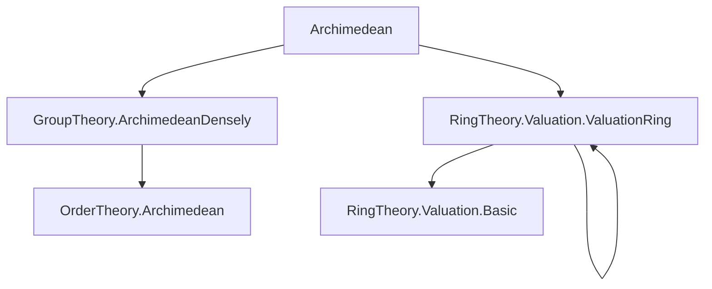

**Technical Brief: `Archimedean.lean` Module**

---

### 1. **Key Definitions & Theorems**

| Name | Type / Signature | Purpose |
|------|------------------|---------|
| `MonoidWithZeroHom.instLinearOrderedCommGroupWithZeroMrange` | `LinearOrderedCommGroupWithZero (MonoidHom.mrange v)` | Equips the multiplicative range of a `→*₀` homomorphism with a linearly ordered commutative group with zero structure. |
| `Valuation.instLinearOrderedCommGroupWithZeroMrange` | `LinearOrderedCommGroupWithZero (MonoidHom.mrange v)` | Inherits the above structure for valuation maps `v : F →*₀ Γ₀`. |
| `wfDvdMonoid_iff_wellFounded_gt_on_v` | `WfDvdMonoid O ↔ WellFounded ((· > ·) on (v ∘ algebraMap O F))` | Relates well-founded divisibility in the integer ring `O` to well-foundedness of the strict > relation on the valuation image of `O`. |
| `wellFounded_gt_on_v_iff_discrete_mrange` | `WellFounded ((· > ·) on (v ∘ algebraMap O F)) ↔ Nonempty (MonoidHom.mrange v ≃*o ℤᵐ⁰)` | Connects well-foundedness of valuation ordering to discreteness of the mrange (i.e., isomorphic to nonzero integers with order). |
| `isPrincipalIdealRing_iff_not_denselyOrdered` | `IsPrincipalIdealRing O ↔ ¬ DenselyOrdered (Set.range v)` | Characterizes when `O` is a PID in terms of non-dense ordering of the valuation image. |
| `isPrincipalIdealRing_iff_not_denselyOrdered_mrange` | `IsPrincipalIdealRing O ↔ ¬ DenselyOrdered (MonoidHom.mrange v)` | Same as above but for the mrange instead of `Set.range v`. |

Notation:  
- `Γ₀` is a linearly ordered commutative group with zero (`LinearOrderedCommGroupWithZero`).  
- `O` is a commutative ring with an algebra map into a field `F`.  
- `v : Valuation F Γ₀` is a valuation on `F` with values in `Γ₀`.  
- `Integers v O` (denoted `hv`) is a predicate asserting that `O` is the valuation ring of `v`.  
- `ℤᵐ⁰` denotes the multiplicative group of nonzero integers, viewed as a `LinearOrderedCommGroupWithZero`.

---

### 2. **Naming Conventions**

- **Prefixes**:
  - `wf_`: well-foundedness (e.g., `wfDvdMonoid`)
  - `wellFounded_`: explicit reference to `WellFounded`
  - `is_`: property of a structure (e.g., `isPrincipalIdealRing`)
  - `dist_`, `mul_`, `dvd_`: operations or relations (e.g., `dvdNotUnit`, `mul_lt_mul_of_pos_left`)
- **Suffixes**:
  - `_iff_`: equivalence (↔) statements
  - `_on_`: restriction to a set (e.g., `gt_on_v`)
  - `_mrange`: referring specifically to `MonoidHom.mrange`
  - `_of_`: construction from data (e.g., `of_integers`, `of_surjective`)
- **Other**:
  - `inst_`: typeclass instance names (e.g., `MonoidWithZeroHom.instLinearOrderedCommGroupWithZeroMrange`)
  - `bijective_`, `surjective_`, `subsingleton_`: properties of maps or types

---

### 3. **Tactic Stack**

Frequent tactics used in proofs:

| Tactic | Usage |
|--------|-------|
| `simp` / `simp only` | Simplification with definitional equalities, especially for subtype coercion, `MonoidHom.mem_mrange`, `Set.mem_range`, etc. |
| `rw` | Rewriting using equivalences or lemmas (e.g., `hv.wfDvdMonoid_iff_wellFounded_gt_on_v`) |
| `refine` / `exact` | Constructing proofs via partial proofs or direct application |
| `intro` / `rintro` | Introducing hypotheses, often with pattern matching (e.g., `rintro ⟨_, x, rfl⟩`) |
| `gcongr` | For proving inequalities under congruence (used in `mul_lt_mul_of_pos_left`) |
| `classical` | Classical reasoning when needed (e.g., for existence of isomorphisms) |
| `cases` / `rcases` | Case analysis on disjunctions or existential quantifiers |
| `mono'` / `mono` | Monotonicity reasoning for relations (e.g., on well-foundedness) |
| `have` / `suffices` | Intermediate lemma introduction |
| `convert` / `congr` | Congruence-based proof refinement (less frequent here) |

---

### 4. **Proof Logic**

The logical flow across the lemmas follows a pattern:

1. **Reduction to known structures**:
   - Use `hv : Integers v O` to identify `O` as a valuation ring.
   - Translate properties of `O` (e.g., `WfDvdMonoid`, `IsPrincipalIdealRing`) into statements about the valuation map `v`.

2. **Equivalence chaining**:
   - Prove equivalences by combining multiple known characterizations:
     - `wfDvdMonoid` ↔ well-foundedness of `v(O)` under `>`.
     - Well-foundedness ↔ discrete mrange (`≃*o ℤᵐ⁰`).
     - Discreteness ↔ non-dense ordering.

3. **Case analysis on units**:
   - Use `subsingleton_or_nontrivial (MonoidHom.mrange v)ˣ` to split into:
     - Subsingleton units → algebra map is bijective → `O` is a field → trivial PID.
     - Nontrivial units → use Bezout domain characterizations.

4. **Use of valuation ring theory**:
   - `ValuationRing.of_integers v hv`: constructs valuation ring from integers.
   - `IsBezout.TFAE`: equivalence of several properties for Bezout domains (used to link PID and Bézout + UFD-like conditions).

---

### 5. **Imports**

| Import | Purpose |
|--------|---------|
| `Mathlib.GroupTheory.ArchimedeanDensely` | Provides tools for Archimedean and densely ordered groups, e.g., `MulArchimedean`, `DenselyOrdered`, `discrete_iff_not_denselyOrdered`. |
| `Mathlib.RingTheory.Valuation.ValuationRing` | Defines valuations, valuation rings, and their basic properties (e.g., `ValuationRing.of_integers`, `Integers`). |

---

### 6. **Mermaid Diagrams**

#### **Dependency Graph (Module-Level)**



#### **Overview of Theoretical Flow**

```mermaid
flowchart LR
  A[Field F] --> B[Valuation v : F →*₀ Γ₀]
  B --> C[Valuation Ring O ⊆ F]
  C --> D[Integers v O (hv)]
  D --> E[MonoidHom.mrange v]
  E --> F[LinearOrderedCommGroupWithZero structure]
  F --> G[WellFounded > on v(O)]
  G --> H[Discrete mrange ≃*o ℤᵐ⁰]
  H --> I[¬ DenselyOrdered(range v)]
  I --> J[IsPrincipalIdealRing O]
```

#### **Proof Dependency Chain (for `isPrincipalIdealRing_iff_not_denselyOrdered`)**

```mermaid
flowchart LR
  hv[Integers v O] --> wfDvd[wfDvdMonoid ↔ WellFounded >]
  hv --> disc[wellFounded > ↔ Discrete mrange]
  hv --> bezout[IsBezout.TFAE]
  disc --> dense[¬ DenselyOrdered(range v)]
  wfDvd --> dense
  bezout --> dense
  dense --> PID[IsPrincipalIdealRing O]
```

---

### 7. **Domain-Specific AI Agent Notes**

- **Key domain**: Valuation theory in algebraic number theory / commutative algebra.
- **Core objects**: Valuations, valuation rings, integer rings, Archimedean/Discrete orders.
- **Typical queries**:
  - “When is the ring of integers of a valuation PID?”
  - “How does Archimedean property of the codomain affect structure of `O`?”
  - “What does `Integers v O` imply about `v(O)`?”
- **Suggested agent capabilities**:
  - Recognize equivalences involving `Integers v O`.
  - Translate between `range v`, `mrange v`, and `v ∘ algebraMap`.
  - Apply `isPrincipalIdealRing_iff_not_denselyOrdered` automatically when `hv` and `MulArchimedean` are present.

--- 

Let me know if you'd like a formalized summary in Lean or a visualization of the `Integers v O` predicate’s implications.
