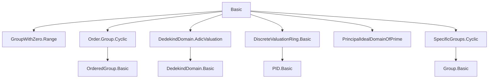
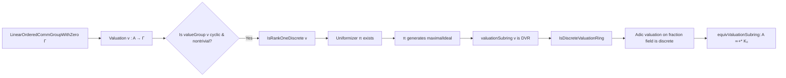

**Technical Brief: Discrete Valuations in Lean 4 (Basic.lean)**  
*Based on the file `Basic.lean` from the Local Class Field Theory project*

---

### 1. KEY DEFINITIONS & THEOREMS

| Name | Type / Signature | Purpose |
|------|------------------|---------|
| `Valuation.IsRankOneDiscrete` | `class Prop` | A valuation `v : A → Γ` is *discrete* if its value group is generated by a unit `γ < 1`. |
| `Valuation.IsRankOneDiscrete.generator` | `Γˣ` | A canonical generator of the value group satisfying `γ < 1`. |
| `Valuation.IsUniformizer` | `π : A → Prop` | `π` is a uniformizer if `v π = generator v`. |
| `Valuation.Uniformizer` | `structure` | Bundles an element `π : A` with a proof that it is a uniformizer. |
| `Valuation.IsUniformizer.of_associated` | `theorem` | If `π₁` is a uniformizer and `π₁ ~ π₂`, then `π₂` is a uniformizer. |
| `Valuation.associated_of_isUniformizer` | `theorem` | Any two uniformizers are associated. |
| `Valuation.Uniformizer.is_generator` | `theorem` | A uniformizer generates the maximal ideal of the valuation subring. |
| `Valuation.IsRankOneDiscrete.mk'` | `instance` | If `valueGroup v` is nontrivial and cyclic, then `v` is discrete. |
| `Valuation.exists_isUniformizer_of_isCyclic_of_nontrivial` | `theorem` | Existence of a uniformizer when value group is nontrivial cyclic (over a field). |
| `Valuation.isUniformizer_of_maximalIdeal_eq_span` | `theorem` | A generator of the maximal ideal is a uniformizer in the discrete case. |
| `Valuation.valuationSubring_isDiscreteValuationRing` | `instance` | Valuation subring of a discrete valuation (cyclic, nontrivial value group) is a DVR. |
| `IsDiscreteValuationRing.isRankOneDiscrete` | `instance` | The adic valuation induced by a DVR on its fraction field is discrete. |
| `IsDiscreteValuationRing.equivValuationSubring` | `noncomputable def` | Isomorphism between a DVR and the valuation subring of its fraction field. |

---

### 2. NAMING CONVENTIONS

- **Predicates**: `is_`, `Is_`, `isUniformizer`, `IsRankOneDiscrete`, `IsNontrivial`, `IsPrincipal`, `IsField`, `IsUnit`, `IsLocalRing`, `IsMaximal`, `IsPrime`, `IsDomain`, `IsDedekindDomain`, `HeightOneSpectrum`.
- **Constructors / Bundled objects**: `Uniformizer`, `maximalIdeal`, `equivValuationSubring`.
- **Generators / Canonical elements**: `generator`, `genLTOne`, `uniformizer`.
- **Valuation-specific**: `valueGroup`, `valuationSubring`, `integers`, `integer`, `K₀` (notation for `valuationSubring`), `of_associated`, `of_isUniformizer`.
- **Properties of elements**: `ne_zero`, `val_lt_one`, `val_pos`, `not_isUnit`, `is_generator`.
- **Structure fields**: `val`, `valuation_gt_one`.

Prefixes like `is_`, `Valuation.`, `IsDiscreteValuationRing.` are used consistently for predicates and instances.

---

### 3. TACTIC STACK

Frequently used tactics in proofs:

| Tactic | Usage |
|--------|-------|
| `simp` / `simp_all` | Simplification of units, valuations, spans, zpowers, ranges, etc. |
| `rw` | Rewriting using lemmas like `generator_zpowers_eq_valueGroup`, `val`, `map_mul`, `map_pow`, `div_eq_mul_inv`. |
| `exact` / `apply` | Direct proof steps, especially for `ne_zero`, `lt`, `mem_` goals. |
| `by_contra` | Contradiction arguments (e.g., to prove `ne_zero`, `not_isUnit`). |
| `obtain ⟨...⟩` / `rcases` | Extracting witnesses from existential quantifiers (e.g., uniformizers, units, powers). |
| `congr` | Congruence steps for equality of spans, zpowers, etc. |
| `aesop` | Automated reasoning for order and algebraic properties (e.g., `lt`, `ne`, `mem`). |
| `zify` | Convert between `ℤ` and `ℤᵐ⁰` (multiplicative integers). |
| `rw [← ...]` | Reverse rewriting to match target form (e.g., `← map_mul`, `← div_eq_mul_inv`). |
| `set ... with h` | Introduce new variables with equations (e.g., `set g := ... with hg`). |
| `ext` | Extensionality for subrings, ideals, sets. |
| `apply_fun` | Apply a function to both sides of an equality. |
| `have`, `replace`, `exact` | Intermediate lemma introduction and substitution. |

---

### 4. PROOF LOGIC

The logical flow in most proofs follows this pattern:

1. **Reduction to value group structure**: Use `valueGroup v = zpowers γ` for some `γ < 1`.
2. **Existence of uniformizer**: Use cyclic + nontrivial ⇒ `genLTOne ∈ valueGroup`, then lift to ring/field element.
3. **Structure of ideals**: Use `maximalIdeal = span {π}` and `π^n` generate all ideals.
4. **Units ↔ valuation = 1**: Key equivalence used repeatedly: `IsUnit x ↔ v x = 1`.
5. **Induction / power decomposition**: For nonzero `r`, write `r = u * π^n` using `zpowers_eq_valueGroup`.
6. **Contradiction arguments**: To prove non-units, non-zero, or maximal ideal properties.
7. **Isomorphism construction**: Via fraction field lifting and subring congruence.

Typical proof skeleton:
```lean
obtain ⟨π, hπ⟩ := exists_isUniformizer_of_isCyclic_of_nontrivial v
have hπ_ne_zero : π ≠ 0 := hπ.ne_zero
obtain ⟨n, ⟨u, hu⟩⟩ := exists_pow_Uniformizer hx₀ ⟨π, hπ⟩
rw [hu, Ideal.span_singleton_eq_span_singleton] at hr
exact hπ.of_associated hr
```

---

### 5. IMPORTS (PRIMARY DEPENDENCIES)

| Module | Purpose |
|--------|---------|
| `Mathlib.Algebra.GroupWithZero.Range` | Value group as range of valuation, `valueGroup`, `valueMonoid`. |
| `Mathlib.Algebra.Order.Group.Cyclic` | Cyclic ordered groups, `genLTOne`, `zpowers`, order properties. |
| `Mathlib.RingTheory.DedekindDomain.AdicValuation` | Adic valuations from height-1 primes. |
| `Mathlib.RingTheory.DiscreteValuationRing.Basic` | DVR definitions and basic properties. |
| `Mathlib.RingTheory.PrincipalIdealDomainOfPrime` | PID from prime ideal conditions. |
| `Mathlib.GroupTheory.SpecificGroups.Cyclic` | Cyclic groups, `zpowers`, `isCyclic_zpowers`. |

---

### 6. MERMAID DIAGRAMS

#### Dependency Graph (Module-Level)



#### Overview of Theory Flow (Valuation → DVR)



#### Proof Dependency (Uniformizer ⇒ DVR)

```mermaid
graph TD
  A[IsCyclic(valueGroup v)] --> B[IsRankOneDiscrete v]
  B --> C[Uniformizer π exists]
  C --> D[π generates maximalIdeal]
  D --> E[maximalIdeal = span{π}]
  E --> F[All ideals = span{π^n}]
  F --> G[valuationSubring is PID]
  G --> H[valuationSubring is local]
  H --> I[valuationSubring not a field]
  I --> J[valuationSubring is DVR]
```

---

### 7. NOTES & CONTEXT

- This file formalizes the *rank-one discrete* case, aligning with classical number theory (Serre’s *Local Fields*).
- The term *discrete* here implies nontriviality and rank one — distinct from more general definitions.
- The `generator` is defined noncomputably via `choose`, relying on classical choice.
- The `Uniformizer` structure is essential for bundling existence proofs and enabling API usage.
- The `equivValuationSubring` is the formal counterpart of the standard identification of a DVR with its valuation ring inside its fraction field.

--- 

Let me know if you'd like a formalization roadmap or a summary of the next steps (e.g., class field theory applications).
