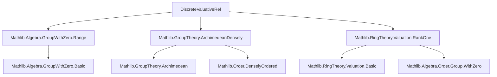
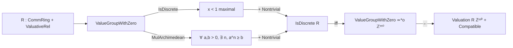

Here is the structured technical metadata extracted from `DiscreteValuativeRel.lean`:

---

### **1. Key Definitions & Theorems**

| Name | Type / Signature | Purpose |
|------|------------------|---------|
| `nonempty_orderIso_withZeroMul_int_iff` | `Nonempty (ValueGroupWithZero R ≃*o ℤᵐ⁰) ↔ IsDiscrete R ∧ IsNontrivial R ∧ MulArchimedean (ValueGroupWithZero R)` | Characterizes when the value group with zero is order-isomorphic to `ℤᵐ⁰` (the multiplicative group of nonzero integers under exponentiation, i.e., `ℤ` under addition via `exp`) in terms of discreteness, nontriviality, and Archimedean property. |
| `IsDiscrete.of_compatible_withZeroMulInt` | `(v : Valuation R ℤᵐ⁰) → [v.Compatible] → IsDiscrete R` | Shows that if a valuation into `ℤᵐ⁰` is compatible, then the ring is discrete valuative. |

**Auxiliary definitions used (implicit):**
- `ValueGroupWithZero R`: The value group of a valuative ring `R`, extended with zero.
- `≃*o`: Order-preserving monoid isomorphism (between `ValueGroupWithZero R` and `ℤᵐ⁰`).
- `IsDiscrete R`: There exists a maximal element $x < 1$ in the value group.
- `MulArchimedean G`: For all $a, b > 0$, there exists $n \in \mathbb{N}$ such that $a^n \ge b$.
- `v.Compatible`: The valuation `v` induces the given valuative structure on `R`.

---

### **2. Naming Conventions**

- **Prefixes:**
  - `nonempty_..._iff`: Biconditional statements involving existence of isomorphisms.
  - `Is...`: Properties of the ring or group (e.g., `IsDiscrete`, `IsNontrivial`).
  - `..._withZero`: Refers to constructions extended with zero (e.g., `ValueGroupWithZero`, `≃*o`).
- **Suffixes:**
  - `_iff`: Logical equivalence.
  - `_of_...`: Implication lemmas (e.g., `of_compatible_withZeroMulInt`).
- **Notable patterns:**
  - `exp`, `log`, `inv`, `mul` used in group-theoretic reasoning.
  - `←` used to rewrite backwards (e.g., `← exp_zero`).
  - `map_...` used to transport inequalities via monotone maps.

---

### **3. Tactic Stack**

Frequent tactics used:
- `intro`, `rcases`, `obtain`: For destructuring hypotheses.
- `simp`, `simp only`, `simp_rw`: Simplification with custom lemmas and rewriting.
- `linarith`: Linear arithmetic over ordered groups.
- `contrapose!`: Contrapositive reasoning with positivity/negativity.
- `push_neg`: Push negations inward in quantified statements.
- `rw [← ...]`: Rewriting using reversed equalities (often with `map_` lemmas).
- `exact`, `refine`, `exfalso`: Proof construction and contradiction handling.
- `by_cases`, `by_contra`: Case analysis and contradiction.

---

### **4. Proof Logic**

- **Main proof strategy:**
  - **Forward direction (`→`)** of `nonempty_orderIso_withZeroMul_int_iff`:
    - Construct a candidate maximal element $x = e^{-1}(\exp(-1))$.
    - Show $x < 1$ and that it bounds all $y < 1$ using monotonicity and properties of `exp`/`log`.
  - **Reverse direction (`←`)**:
    - Assume discreteness, nontriviality, and Archimedean property.
    - Use `has_maximal_element` to get $x < 1$ maximal.
    - Derive contradiction via `exists_between` (densely ordered implies no maximal $x < 1$).
- **`IsDiscrete.of_compatible_withZeroMulInt` proof logic:**
  - Use compatibility to get `IsRankLeOne`.
  - Split on `IsNontrivial R`.
    - If nontrivial: use equivalence with `¬ DenselyOrdered`, then apply previous lemma.
    - If trivial (subsingleton): construct explicit maximal element $0 < 1$, using that all nonzero elements equal 1.

---

### **5. Imports**

| Import | Purpose |
|--------|---------|
| `Mathlib.Algebra.GroupWithZero.Range` | Tools for ranges of homs in `GroupWithZero`, used for `ValueGroupWithZero`. |
| `Mathlib.GroupTheory.ArchimedeanDensely` | Definitions and lemmas about Archimedean and densely ordered groups. |
| `Mathlib.RingTheory.Valuation.RankOne` | Rank-one valuation theory, including `Valuation`, `Compatible`, `ValueGroupWithZero`. |

---

### **6. Mermaid Diagrams**

#### **Dependency Graph (Module-Level)**

#### **Overview of Theory Flow**

---

Let me know if you'd like a formalization of the missing definitions (e.g., `ValuativeRel`, `ValueGroupWithZero`) or a proof sketch in natural language.
